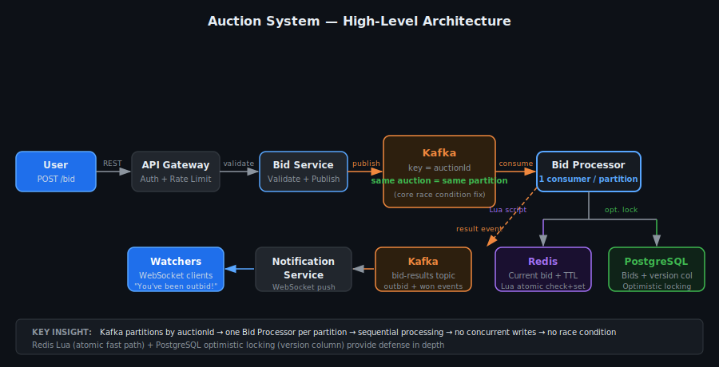
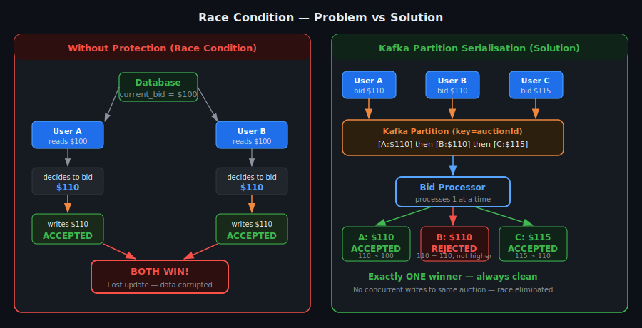
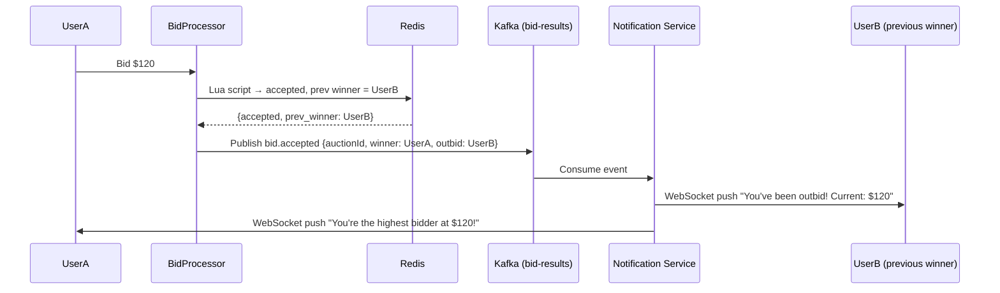
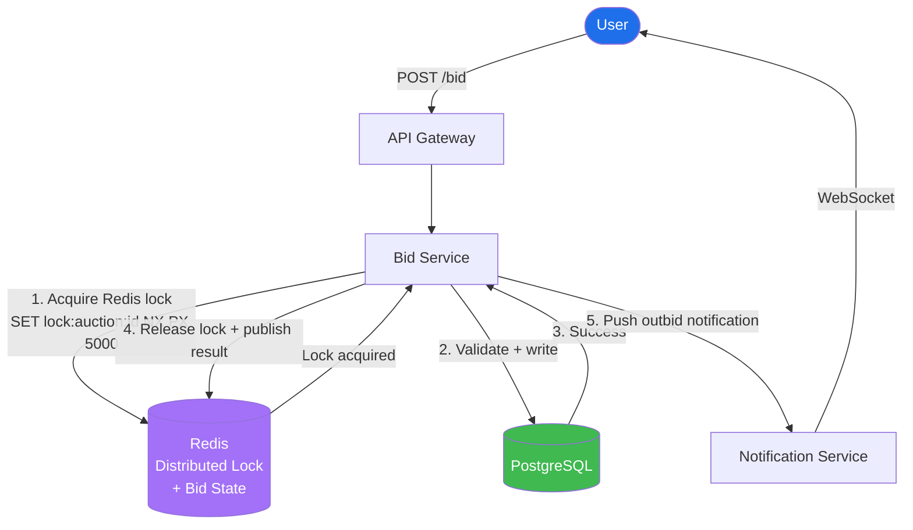

# Auction System — System Design

## TL;DR
* **Core problem**: Race condition — multiple users bid simultaneously, only one should win
* **Primary solution**: Route all bids for the same auction to the **same Kafka partition** → single consumer processes them sequentially → no concurrent writes
* **Defense in depth**: PostgreSQL **optimistic locking** (`version` column) catches any concurrent writes that slip through
* **Atomic bid check**: Redis **Lua script** atomically checks current price + sets new bid in one operation — cannot be interrupted
* **Auction end race**: Same Lua script checks auction TTL atomically — a bid at the last millisecond either beats the timer or loses cleanly
* **Idempotency**: Client-generated `bid_id` deduplicates retries — same bid submitted twice = same result
* **Key insight**: Serialise writes *per auction* (Kafka partition), parallelise reads (Redis + read replicas). Concurrency is fine for reads — the race only happens on writes.

---

## Step 1: Clarify Requirements

### Functional Requirements
- Users place bids on an item during an active auction window
- Each bid must be higher than the current highest bid by a minimum increment
- Only one bid wins at auction close — the highest valid bid
- Users are notified in real time when they are outbid
- Auction closes at a fixed deadline; no bids accepted after close
- Auction host can set a reserve price (minimum winning price)

### Non-Functional Requirements
| Requirement | Target |
|---|---|
| Scale | Thousands of concurrent auctions; millions of bids/day |
| Latency | Bid accepted/rejected < 200ms (p99) |
| Consistency | **Strong** — two users must never both "win" the same auction |
| Availability | 99.99% — downtime = lost bids = user trust destroyed |
| Durability | Every accepted bid must be persisted before confirming to user |
| Fairness | Earliest valid bid at a given price wins (no favouritism) |

### Out of Scope
- Payment processing after auction close
- Item listing / catalogue management
- Fraud detection

---

## Step 2: Capacity Estimation

| Metric | Estimate |
|---|---|
| Concurrent live auctions | 10,000 |
| Bids/sec (normal) | ~5,000/sec |
| Bids/sec (peak — auction closing rush) | ~50,000/sec |
| Users watching a hot auction | Up to 100,000 concurrent |
| Bid record size | ~200 bytes |
| Storage/day | 5,000 × 86,400 × 200B = **~86 GB/day** |
| Real-time feed updates/sec | 50,000 bids × avg 1,000 watchers = complex fan-out |

---

## Step 3: High-Level Architecture



---

## How Each Flow Works

### Flow 1 — Placing a Bid

A user taps "Place Bid" in the app. That HTTP request hits the **API Gateway** first, which checks the user is authenticated and hasn't exceeded their rate limit (e.g. 10 bids/sec per user). If it passes, the request moves to the **Bid Service**.

The Bid Service does a lightweight sanity check — is the auction ID valid, is the bid amount a number, is the user not banned — and then **publishes the bid to Kafka** using `auctionId` as the partition key. It does NOT write to the database yet. The Bid Service immediately returns a `202 Accepted` to the user, meaning "we got your bid, it's being processed."

Because the partition key is `auctionId`, all bids for the same auction always land on the same Kafka partition, in arrival order. This is the core of the race condition fix.

---

### Flow 2 — Processing the Bid

The **Bid Processor** is a single consumer per Kafka partition. It picks up bids one at a time, in order.

For each bid it does three things in sequence:

**Step A — Redis fast check:** It runs a Lua script against Redis that atomically checks two things: is the auction still open (TTL not expired), and is the new bid higher than the current highest bid stored in Redis? If either check fails, the bid is rejected immediately — no database touch needed. This handles the vast majority of invalid bids at microsecond speed.

**Step B — PostgreSQL write:** If Redis accepts it, the Bid Processor writes the bid to PostgreSQL using an `UPDATE` with an optimistic lock (`WHERE version = $read_version`). This is the durable record. If somehow two bids slipped through (e.g. a misconfigured consumer), the version check catches the second one and rejects it.

**Step C — Publish result:** After the DB write, the Bid Processor publishes a `bid.accepted` or `bid.rejected` event to the **`bid-results` Kafka topic**, including who the previous highest bidder was (so they can be notified they were outbid).

---

### Flow 3 — Real-Time Notification

The **Notification Service** consumes from the `bid-results` topic. When it sees a `bid.accepted` event, it does two pushes over **WebSocket**:

- To the **new highest bidder**: "You're the highest bidder at $120."
- To the **previous highest bidder**: "You've been outbid! Current highest is $120."

Every user watching the auction (even those not bidding) also receives a live feed update showing the new price. This fan-out is why Kafka is used for notifications too — one event can be consumed by multiple services (notifications, analytics, audit log) without the Bid Processor knowing about any of them.

---

## Step 4: Deep Dive — The Race Condition

### The Problem

```
Without any protection:

User A reads current bid: $100         User B reads current bid: $100
User A decides to bid: $110            User B decides to bid: $110
User A writes bid: $110 ✓              User B writes bid: $110 ✓  ← BOTH WIN?!

Result: Two users are told they have the highest bid at $110.
        Auction closes — who actually won? 💥
```

This is a **lost update** race condition. Both users read the same state, both compute a valid bid, both write — last writer wins arbitrarily, and the loser was never told they lost.

---

### Why Kafka? (And Could You Avoid It?)

Kafka does **two separate jobs** in this system — don't confuse them:

| Job | How Kafka helps |
|---|---|
| **Race condition fix** | Partition key = `auctionId` → all bids for same auction → same partition → one consumer → sequential processing |
| **Notification fan-out** | Bid result published to `bid-results` topic → Notification Service pushes WebSocket outbid alerts to all watchers |

**The clever part is Job 1.** By setting the Kafka partition key to `auctionId`:
- All bids for auction #42 always land on **partition 7** (same partition, always)
- Each partition has **exactly one consumer** at a time
- That consumer processes bids **one at a time, in arrival order**

Instead of two bids racing to the DB simultaneously, they queue in Kafka and are processed **sequentially**. No locks needed — Kafka's partition model gives you serialisation for free.

> **Mental model**: instead of 10 cashiers fighting over the same till, you have **one dedicated cashier per auction**.

**Could you skip Kafka and still fix the race condition?**

| Alternative | Problem |
|---|---|
| `SELECT FOR UPDATE` (DB pessimistic lock) | Holds a DB lock for the full request duration — serialises all auctions at DB level, crushes throughput under load |
| Redis distributed lock (Redlock) | Works, but adds lock acquire/release latency + risk of lock expiry mid-process → bid lost or double-processed |
| In-process queue per auction (app layer) | Works, but **not durable** — if the server crashes, queued bids are gone |
| **Kafka** ✅ | Durable + ordered + horizontally scalable. Consumer crash → Kafka replays uncommitted messages. No bids ever lost. |

**Kafka wins** because it turns a concurrency problem into a sequencing problem — and gives you durability and replay for free.

---

### Solution 1: Kafka Partition Serialisation (Primary Defence)



**Why this works:**
- Kafka guarantees messages with the same key (auctionId) go to the **same partition**
- Each partition has exactly **one consumer** at a time
- Consumer processes bids **one at a time, in order** — no two bids for the same auction are processed concurrently
- No locks needed inside the consumer — it's inherently single-threaded per auction

```
Kafka key = auctionId
Partitions = 256 (one consumer each)
→ 10,000 auctions spread across 256 consumers
→ Each consumer handles ~40 auctions, all sequentially within each auction
```

---

### Solution 2: Optimistic Locking (Defense in Depth)

Even with Kafka serialisation, we add optimistic locking as a safety net (e.g., if a consumer is accidentally scaled to multiple instances).

```sql
-- Auctions table has a version column
CREATE TABLE auctions (
    id          BIGINT PRIMARY KEY,
    current_bid DECIMAL(12,2),
    current_winner_id BIGINT,
    version     INT NOT NULL DEFAULT 0,   -- ← optimistic lock
    ends_at     TIMESTAMPTZ,
    reserve     DECIMAL(12,2)
);

-- Bid processor attempts this UPDATE:
UPDATE auctions
SET current_bid = $new_bid,
    current_winner_id = $user_id,
    version = version + 1
WHERE id = $auction_id
  AND version = $read_version        -- ← only succeeds if nobody else updated
  AND current_bid < $new_bid         -- ← bid must be higher
  AND ends_at > NOW();               -- ← auction must be active

-- rows_affected = 1 → bid accepted ✅
-- rows_affected = 0 → someone else updated first → retry or reject ❌
```

**Why optimistic over pessimistic locking?**
- `SELECT FOR UPDATE` (pessimistic) holds a DB lock for the entire request duration — serialises all bid attempts at the DB layer, terrible throughput
- Optimistic locking only retries on actual conflict — in normal operation (bids spread across time), conflicts are rare and throughput is high

---

### Solution 3: Redis Lua Script (Fast Path + Atomicity)

Before hitting PostgreSQL, the Bid Processor checks Redis atomically using a Lua script. Redis is single-threaded — Lua scripts execute atomically (no interleaving).

```lua
-- Redis Lua script: atomic bid check + set
local auction_key = KEYS[1]          -- "auction:42"
local end_time_key = KEYS[2]         -- "auction:42:ends_at"
local new_bid     = tonumber(ARGV[1])
local user_id     = ARGV[2]
local now         = tonumber(ARGV[3])

-- Check auction is still active
local ends_at = tonumber(redis.call('GET', end_time_key))
if not ends_at or now >= ends_at then
    return {-1, "AUCTION_ENDED"}      -- auction closed
end

-- Check new bid is higher than current
local current = tonumber(redis.call('HGET', auction_key, 'bid') or '0')
if new_bid <= current then
    return {-2, "BID_TOO_LOW"}        -- bid not high enough
end

-- Atomically set new highest bid
redis.call('HSET', auction_key, 'bid', new_bid, 'winner', user_id)
return {1, "ACCEPTED"}
```

**Why Lua?** A regular `GET` then `SET` in two commands is NOT atomic — another bid could slip in between. A Lua script runs as one atomic unit.

---

### The Auction End Race Condition

```
Timeline:
  09:59:59.990  User A places bid → Bid Processor receives it
  10:00:00.000  Auction timer fires → close auction
  10:00:00.005  Bid Processor reads auction state — is it still active?

Without atomicity: "active" check and "write" are two separate operations.
Timer could fire between the check and the write.
```

**Solution:** The Lua script above checks `ends_at` and writes the bid in a single atomic Redis operation. The timer script (`close auction`) also uses a Lua script that atomically marks the auction closed and reads the final winner simultaneously.

```lua
-- Closing script (runs at ends_at)
local auction_key = KEYS[1]
redis.call('HSET', auction_key, 'status', 'closed')
local winner = redis.call('HGET', auction_key, 'winner')
local bid    = redis.call('HGET', auction_key, 'bid')
return {winner, bid}
-- If a bid Lua script runs concurrently, one of them will observe 'closed' status
-- and reject — they cannot both execute their critical section simultaneously
```

---

### Bid Idempotency (Handling Retries)

```
User bids $110 → network timeout → user's app retries → same bid sent twice

Without idempotency: Two bids for $110 processed → first accepted, second rejected
  (OK in this case, but confusing UX + potential for bugs)

Solution: Client generates a UUID bid_id before sending
  Server: INSERT INTO bids (bid_id, ...) ON CONFLICT (bid_id) DO NOTHING
  Second attempt hits the unique constraint → returns cached result → user sees same response
```

---

### Real-time Outbid Notifications



---

### Auction Closing Flow (Background Job)

```
Background job (Cron every second, or Redis keyspace expiry event):
  1. Detect auctions where ends_at <= NOW and status = ACTIVE
  2. Run closing Lua script atomically → get final {winner, bid}
  3. Check reserve price:
     - bid >= reserve → auction SUCCESS, publish auction.won event
     - bid < reserve  → auction NO_SALE, publish auction.no_sale event
  4. Update PostgreSQL: status = CLOSED, winner_id, final_bid
  5. Trigger payment flow for winner (async, separate system)
  6. Notify all watchers via WebSocket: "Auction closed. Winner: UserA at $120"
```

**Why not rely on Redis TTL expiry alone?**
Redis keyspace notifications can have delays and are fire-and-forget (no delivery guarantee). Always use a cron job as the primary closer with Redis as a fast cache layer.

---

## Alternative Design: Redis Distributed Lock (No Kafka)

If Kafka feels like overkill for your scale, you can solve the race condition with a **Redis distributed lock per auction**. Simpler to reason about, easier to operate.

### How It Works

```
Before processing any bid for auction #42:
  1. Acquire lock:  SET lock:auction:42 {workerId} NX PX 5000
                    NX  = only set if not exists (atomic)
                    PX  = auto-expire in 5000ms (safety net if worker crashes)

  2. If lock acquired → process bid (read current bid, validate, write to DB)

  3. Release lock:  DEL lock:auction:42
                    (only release YOUR lock — use Lua to check workerId first)

  4. If lock NOT acquired → another worker is processing → retry after 50ms
```

### Lock + Bid Flow (Redis Lua — Atomic Acquire + Check + Set)

```lua
-- Single Lua script: acquire lock + validate + update bid atomically
local lock_key    = KEYS[1]   -- "lock:auction:42"
local auction_key = KEYS[2]   -- "auction:42"
local end_key     = KEYS[3]   -- "auction:42:ends_at"
local worker_id   = ARGV[1]
local new_bid     = tonumber(ARGV[2])
local now         = tonumber(ARGV[3])
local ttl_ms      = 5000

-- Step 1: Try to acquire lock
local acquired = redis.call('SET', lock_key, worker_id, 'NX', 'PX', ttl_ms)
if not acquired then
  return {-3, "LOCK_HELD"}      -- another worker has it, retry
end

-- Step 2: Check auction is still active
local ends_at = tonumber(redis.call('GET', end_key) or '0')
if now >= ends_at then
  redis.call('DEL', lock_key)
  return {-1, "AUCTION_ENDED"}
end

-- Step 3: Check bid is higher
local current = tonumber(redis.call('HGET', auction_key, 'bid') or '0')
if new_bid <= current then
  redis.call('DEL', lock_key)
  return {-2, "BID_TOO_LOW"}
end

-- Step 4: Accept bid + release lock
redis.call('HSET', auction_key, 'bid', new_bid, 'winner', ARGV[4])
redis.call('DEL', lock_key)
return {1, "ACCEPTED"}
```

> **Why Lua for this?** `SET NX` + validate + `HSET` + `DEL` is 4 commands. Without Lua, another request can slip between any two. Lua runs all 4 as one atomic unit — Redis is single-threaded.

### Architecture Without Kafka



### Retry on Lock Contention

```
Bid Service tries to acquire lock → fails (another bid in progress)
  → wait 50ms → retry
  → wait 50ms → retry
  → max 3 retries → return 409 Conflict to client
  → client shows "High demand, please try again"

In practice: lock is held for < 10ms (just a DB write)
→ contention window is tiny → retries are rare
```

### What Happens If the Worker Crashes Mid-Bid?

```
Worker acquires lock → crashes before releasing

Without TTL: lock held forever → auction freezes

With PX 5000 (5 second TTL):
  Lock auto-expires after 5s → next bid attempt acquires it
  DB write was not committed → nothing to undo
  Bid is lost (client gets a timeout → retries → new lock → succeeds)
```

> Always set a TTL on the lock. **Never hold a Redis lock without an expiry.**

### Redis Lock vs Kafka — When to Pick Which?

| | Redis Lock | Kafka Partition |
|---|---|---|
| **Complexity** | Low — just Redis (you likely have it already) | High — Kafka infra + consumer management |
| **Latency** | ~1–2ms per bid (lock + DB write) | ~5–20ms (Kafka produce + consume lag) |
| **Durability** | Lock state in Redis — lost on Redis crash (mitigated by TTL) | Kafka is durable — messages survive crashes |
| **Scale** | Fine up to ~10k auctions / high bid rate | Better for massive scale (100k+ auctions) |
| **Retry logic** | Must implement in Bid Service | Kafka handles retry via offset replay |
| **Best for** | Simpler systems, existing Redis infra | High-scale, event-driven architectures |

> **Interview answer**: "At moderate scale I'd use a Redis distributed lock — simpler ops, lower latency, Redis is already in the stack for other things. At large scale (eBay, Alibaba) I'd switch to Kafka partition serialisation for durability and throughput."

---

## Step 5: Key Design Decisions

| Decision | Choice | Alternative | Why |
|---|---|---|---|
| Race condition primary fix | Kafka partition per auctionId | DB-level locking | Serialises per-auction without blocking other auctions |
| Race condition safety net | Optimistic locking (version column) | Pessimistic (SELECT FOR UPDATE) | High throughput; only retries on actual conflict |
| Bid atomicity | Redis Lua script | Redis MULTI/EXEC | Lua is simpler, one round trip, truly atomic |
| Auction end race | Lua script checks TTL + writes atomically | Two-phase commit | Single-system atomic operation is simpler and faster |
| Idempotency | Client-generated bid_id + DB unique constraint | Server dedup map | Stateless server; DB is source of truth |
| Real-time updates | WebSocket + Kafka fan-out | Polling | Push is essential for auction UX; polling misses bids |
| Current bid state | Redis (fast) + PostgreSQL (durable) | PostgreSQL only | Redis absorbs read spike from watchers; DB is truth |

---

## Common Interview Follow-ups

**Q: What if two bids arrive at the exact same millisecond?**
Kafka orders them by arrival time within the partition. The first one processed wins. The second sees the updated bid and is rejected if not higher. Exactly one winner, always.

**Q: What if the Bid Processor crashes mid-processing?**
Kafka consumer does not commit the offset until after the bid is durably written to PostgreSQL. On restart, the consumer re-reads the uncommitted message and reprocesses. Bid idempotency (unique `bid_id`) ensures reprocessing is safe.

**Q: How do you scale to 100,000 concurrent auctions?**
Increase Kafka partition count (e.g., 1024). Each partition handles ~100 auctions. Add more consumer instances — Kafka distributes partitions automatically. Redis and PostgreSQL scale independently with clustering/sharding.

**Q: How do you handle "auction sniping" (bidding in the last second)?**
Add a rule: if a valid bid is placed within the last N seconds, extend the auction by M seconds (e.g., eBay extends by 10 minutes). Implemented in the Bid Processor: after accepting a bid, check `(ends_at - now) < threshold` → `UPDATE auctions SET ends_at = ends_at + interval '10 minutes'`.

**Q: What's the difference between optimistic and pessimistic locking here?**
Pessimistic: lock the row on read, hold until write completes. All other bid attempts queue up waiting for the lock — throughput collapses at peak. Optimistic: no lock on read; write only fails if someone else wrote first (version mismatch). Retry is cheap. Works well when conflicts are rare (which they are, since Kafka already serialises per-auction).
