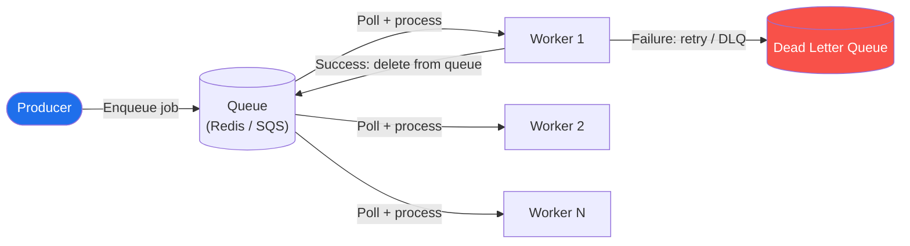
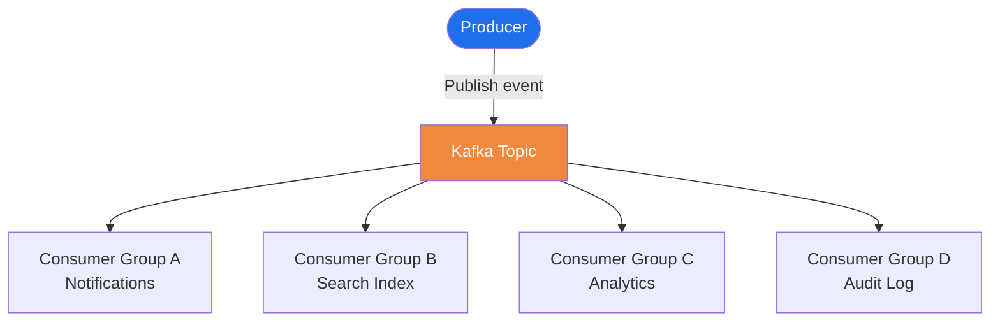
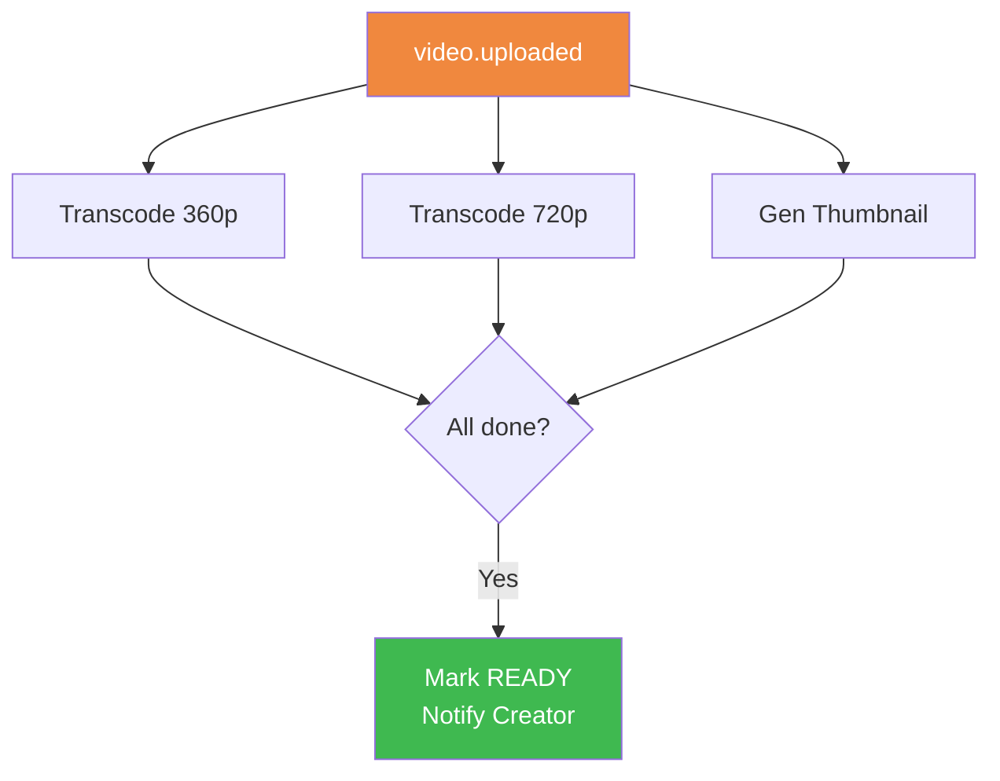
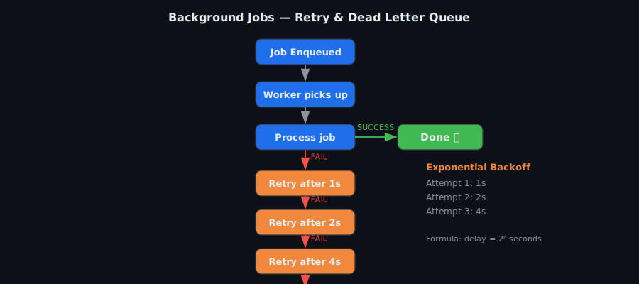
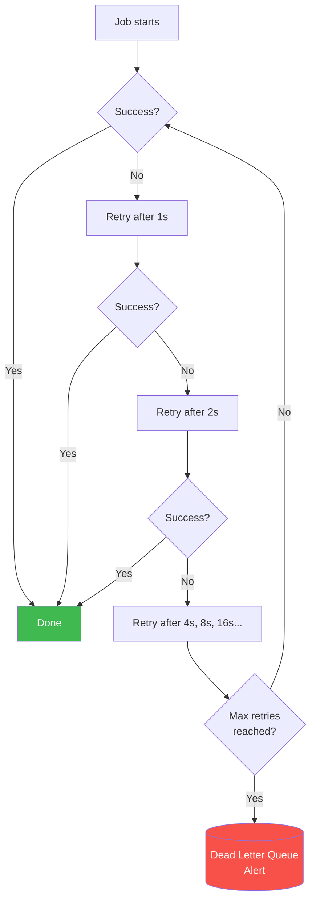
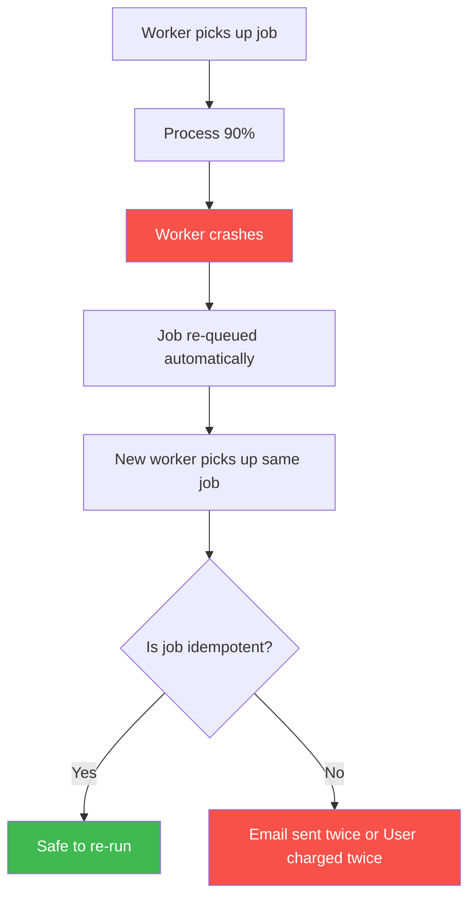
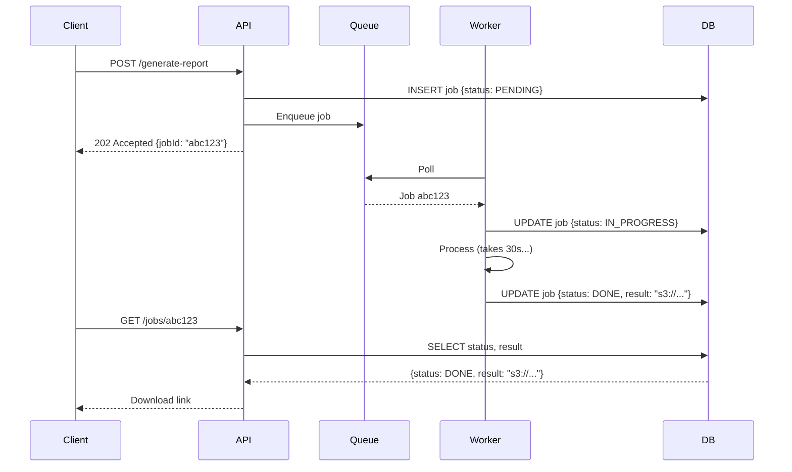

# Background Jobs — Patterns & System Design

## TL;DR
* **What**: Tasks running outside the request-response cycle — async, deferred, or scheduled
* **Why**: Don't make users wait for slow operations (email, transcoding, PDF, webhooks)
* **Core pattern**: Accept request → return 200 immediately → enqueue job → worker processes async
* **Reliability**: Exponential backoff + Dead Letter Queue — never silently drop a failure
* **Idempotency**: Every job must be safe to run twice — workers crash and restart; this is a guarantee
* **Key insight**: If a task takes > 200ms or isn't needed for the immediate API response → background job.

---

## Step 1: When to Use Background Jobs

| Scenario | Why Async? |
|---|---|
| Send email / SMS / push notification | Network call; user doesn't need to wait |
| Generate PDF / report | CPU-heavy; takes seconds |
| Resize / transcode media | Can take minutes |
| Sync to search index | Eventual consistency is fine |
| Charge subscription | Must be retried safely if it fails |
| Aggregate analytics | Not time-critical; batch is cheaper |
| Send webhooks to third parties | External services unreliable; need retry |
| Clean up expired data | Off-peak maintenance |
| ML inference on content | Heavy compute; async result fine |
| Send digest emails | Scheduled; not user-initiated |

---

## Step 2: Core Patterns

### Simple Task Queue


> **Tools**: BullMQ (Redis), Sidekiq, Celery, Amazon SQS
> **Good for**: Moderate volume, single worker type, simple tasks

### Event-Driven Fan-out (Kafka)


> Each consumer group processes independently at its own pace.
> **Good for**: Microservices, multiple downstream actions, high throughput

### Workflow / DAG (Multi-step with Dependencies)


> **Tools**: Apache Airflow, Temporal, AWS Step Functions
> **Good for**: Video pipelines, ETL, ML training workflows

---

## Step 3: Reliability — Retry, Backoff, DLQ

### Exponential Backoff Flow





> Add **jitter** (±20% random) to avoid all workers retrying at the exact same second.

### Dead Letter Queue (DLQ)
```
Normal Queue → [Job fails max retries] → Dead Letter Queue

DLQ purpose:
  Manual inspection: "what is the error?"
  Alert on-call (PagerDuty / Slack) when DLQ depth > 0
  Manual retry after bug fix is deployed
  Discard if job is no longer relevant

Rule: NEVER silently drop a failed job. Always route to DLQ.
```

---

## Step 4: Idempotency — The Most Critical Property



**Techniques to achieve idempotency:**
```
1. Check-before-act:
   "Was this email already sent for orderId=123?"
   Check DB before sending → skip if already done

2. DB upsert:
   INSERT ... ON CONFLICT (job_id) DO NOTHING

3. Redis idempotency key:
   SET processed:{jobId} 1 EX 86400 NX
   NX = only set if not exists → skip if already processed

4. Payment gateways:
   Pass idempotency_key to Stripe → they deduplicate charges
```

---

## Step 5: Job Status Tracking



---

## Step 6: Real-World Examples Across Systems

### WhatsApp
| Job | Trigger | Action |
|---|---|---|
| Offline message delivery | User reconnects | Flush queued messages in order |
| Push notification | User offline, message received | Send FCM/APNs push |
| Media compression | Image/video message sent | Compress + generate thumbnail |

### Orders App
| Job | Trigger | Action |
|---|---|---|
| Order timeout | Cron every 1 min | Cancel orders not paid within 5 min |
| Restaurant timeout | Cron every 1 min | Cancel unaccepted orders > 3 min |
| Invoice generation | order.delivered event | Generate PDF → S3 → email |
| Refund | order.cancelled event | Call payment gateway async |

### Twitter Feed
| Job | Trigger | Action |
|---|---|---|
| Fan-out | tweet.posted Kafka event | Write tweetId to follower Redis timelines |
| Trending topics | Cron every 5 min | Count hashtags in sliding window |
| Spam detection | tweet.posted Kafka event | Run classifier before fan-out |

### YouTube
| Job | Trigger | Action |
|---|---|---|
| Transcode | video.uploaded Kafka event | FFmpeg → HLS at all resolutions |
| View count flush | Cron every 30s | Bulk write Redis counters to DB |
| Content policy | video.uploaded | ML scan before publishing |

---

## Step 7: Monitoring

| Metric | What It Tells You | Alert On |
|---|---|---|
| Queue depth | How far behind workers are | Sudden spike |
| Job processing time (p99) | How long jobs take | Significant increase |
| Error rate | % of jobs failing | Spike > baseline |
| DLQ depth | Permanently failed jobs | Should always be ~0 |
| Worker CPU/memory | Fleet health | High = scale up |
| Consumer lag (Kafka) | How far behind each consumer | Growing lag |

---

## Step 8: Choosing the Right Tool

| Requirement | Tool |
|---|---|
| Simple queue, small-medium scale | Redis + BullMQ / Sidekiq |
| High throughput, event-driven, fan-out | Apache Kafka |
| Managed cloud queue | Amazon SQS |
| Scheduled / cron jobs | Kubernetes CronJob / Celery Beat |
| Complex multi-step workflows | Apache Airflow / Temporal |
| Exactly-once processing | Kafka + idempotent consumers |

---

## Common Interview Follow-ups

**Q: How do you prevent a job from running forever?**
Set a max runtime timeout. If the worker hasn't updated the job's heartbeat within N seconds, the queue marks the job abandoned and re-queues it.

**Q: How do you handle a poison pill (job that always fails)?**
After max retries → DLQ → alert on-call. Inspect payload — often a corrupt input or edge-case bug. Fix, deploy, replay from DLQ.

**Q: How do you prioritise urgent jobs over batch jobs?**
Separate queues: HIGH / MEDIUM / LOW. Workers consume HIGH first, fall through to MEDIUM, then LOW. Payment retries → HIGH. Analytics → LOW.

**Q: How do you replay all Kafka events from the last hour after a bug fix?**
Reset the consumer group offset to 1 hour ago. Kafka retains messages for the configured retention period (default 7 days). Workers re-process from that offset forward.
