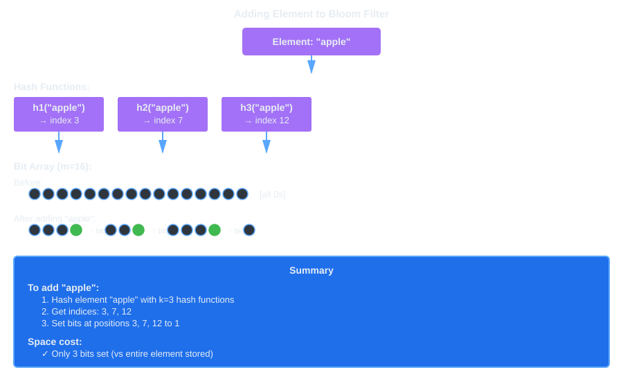
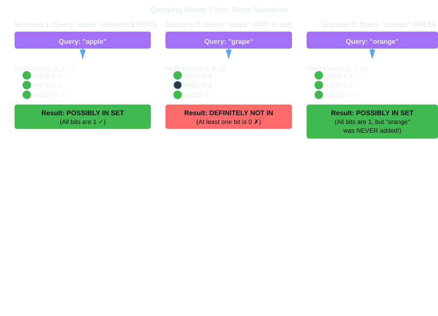
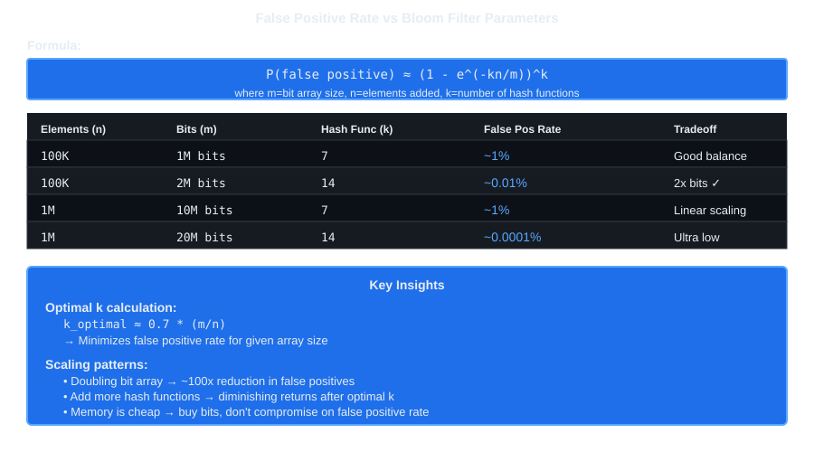

# Bloom Filters

**Concise Definition**: "Bloom filter is a probabilistic data structure that efficiently checks set membership by sacrificing accuracy for space—it guarantees negative results but allows controlled false positives."

**Architectural Definition**: "Bloom filter acts as a memory-efficient pre-filter using a bit array and multiple independent hash functions, enabling O(1) membership queries with minimal storage overhead while trading false positives for extreme space efficiency in distributed systems."

## 1. Core Purpose

**In simple terms:** A Bloom filter is like a security guard with a very small checklist. It can quickly tell you that something is **definitely not present**. When it says something **might be present**, you must check the real database because the filter can occasionally be mistaken.

A Bloom filter answers: **Has this value possibly been added?**

| Aspect | Behavior |
|---|---|
| **"NO" answer** | Element is **DEFINITELY NOT** in the set (100% accurate, no false negatives) |
| **"YES" answer** | Element **MIGHT BE** in the set (could be a false positive) |
| **Storage** | Only stores bits, NOT actual elements (cannot retrieve original data) |
| **Operations** | Add: O(k), Lookup: O(k), Delete: Not supported (without variants) |
| **Space Cost** | ~10 bits per element for 1% false positive rate (~1.2 MB per 1M elements) |

**Key Insight**: Bloom filters are purely compute/memory structures paired with backend storage (DB, cache). The filter is just a fast pre-filter in front of real data.

## 2. How It Works: Visual Flow





### Implementation Logic:

```
create(size, hashCount):
    bits = array of size zeros

add(value):
    for seed from 0 to hashCount - 1:
        position = hash(value, seed) modulo size
        bits[position] = 1

mightContain(value):
    for seed from 0 to hashCount - 1:
        position = hash(value, seed) modulo size
        if bits[position] == 0:
            return false
    return true
```

**Example Walkthrough:**
- Add "apple": hash functions return indices [3, 7, 12] → set bits 3, 7, 12 to 1
- Query "apple": hash returns [3, 7, 12] → all bits are 1 → "PROBABLY EXISTS"
- Query "banana": hash returns [3, 8, 12] → bit 8 is 0 → "DEFINITELY NOT EXISTS"
- Query "grape": hash returns [3, 7, 12] → all bits are 1 → "PROBABLY EXISTS" (FALSE POSITIVE - never added)

## 3. False Positives and Accuracy



### Why False Positives Happen:

Different elements can hash to overlapping bit positions. When querying a new element, if all its hashed positions are already 1 (set by other elements), the filter reports "PROBABLY EXISTS" even though this element was never added.

```
Added:
apple  -> [2, 5, 8]
banana -> [5, 10, 15]

Never added:
grape  -> [2, 5, 8]

All grape positions are already 1 → FALSE POSITIVE
```

### False Positive Rate Formula:

| Parameter | Symbol | Formula |
|---|---|---|
| **False Positive Probability** | p | (1 - e^(-kn/m))^k |
| **Optimal Hash Functions** | k | (m/n) × ln(2) ≈ 0.7 × (m/n) |
| **Bits for Target Accuracy** | m | -n × ln(p) / (ln(2))^2 |

**Practical Examples:**
- 100K elements, 1M bits, 7 hashes → **~1% false positive rate**
- 100K elements, 2M bits, 14 hashes → **~0.01% false positive rate**
- 1M elements, 10M bits, 7 hashes → **~1% false positive rate**

**Key Insight:** Doubling the bit array reduces false positives by ~100×. Memory is cheap—buy bits, don't compromise accuracy.

## 4. Trait vs Technical Mechanism

| Trait | Technical Mechanism |
|---|---|
| **Space Efficiency** | Bit array instead of element storage; O(1) space per element at fixed false positive rate |
| **Speed (O(1) Queries)** | Parallel hash functions compute all positions independently; cache-friendly sequential bit access |
| **No False Negatives** | All hash positions must be 1 to report "EXISTS"; can't miss what's actually in the set |
| **No Deletions** | Setting bits to 0 affects other elements sharing those positions; use Counting BF variants for deletion |
| **Pre-filter Pattern** | Fast negative answer before expensive DB/cache lookup; handles false positives gracefully in layers |

## 5. Common Use Cases (Interview Format)

### 1. Web Crawler (Google, Common Crawl)
**Problem:** Avoid re-crawling billions of URLs already visited.  
**Solution:** Bloom filter holds seen URLs (~few GB); check filter before queuing new URL.  
**Trade-off:** Rare false positive skips a new URL (acceptable).  
**Scale:** Google's crawler handles billions of URLs; Bloom filter makes this feasible.

### 2. Database Storage Engines (Cassandra, RocksDB, LevelDB)
**Problem:** Avoid expensive disk reads for keys that don't exist in SSTable.  
**Solution:** Each SSTable has Bloom filter; check before disk read.  
**Trade-off:** False positive = one unnecessary disk read (saves 99%+ of wasted reads).  
**Impact:** Dramatically reduces read amplification in LSM-tree databases.

### 3. Chrome Safe Browsing
**Problem:** Check if URL is potentially malicious without every access hitting Google servers.  
**Solution:** Local Bloom filter of known malicious URLs; check before contacting server.  
**Trade-off:** False positive = extra server verification (rare, acceptable).  
**Result:** 99%+ of safe URLs never trigger server call; privacy preserved.

### 4. CDN / Edge Cache (Akamai, Cloudflare)
**Problem:** Check if content is cached at edge before forwarding to origin.  
**Solution:** Bloom filter per edge node; check if URL might be cached.  
**Trade-off:** False positive = unnecessary cache lookup (still faster than origin).  
**Benefit:** Avoids origin bandwidth costs for most misses.

### 5. Email Spam Detection (Gmail)
**Problem:** Fast first-pass filter for known spam senders before ML models.  
**Solution:** Bloom filter of spam sender addresses; check incoming emails.  
**Trade-off:** False positive = deeper inspection (rare, acceptable).  
**Speed:** Billions of emails processed cheaply.

### 6. Recommendation Engine (Medium, Netflix)
**Problem:** Don't recommend articles/videos user already consumed.  
**Solution:** Bloom filter per user tracks seen content; check before recommendation.  
**Trade-off:** False positive = occasionally skip valid recommendation (better than duplicates).  
**Scale:** Hundreds of millions of user-article pairs.

### 7. Password Breach Checker (HaveIBeenPwned)
**Problem:** Check if password in leaked database without sending actual password to server.  
**Solution:** Bloom filter of leaked password hashes; local privacy-preserving check.  
**Trade-off:** False positive = warn user unnecessarily (acceptable for security).  
**Privacy:** Password never leaves device in negative case.

### 8. Distributed File Systems (HDFS, Cassandra)
**Problem:** Avoid broadcast queries; route to correct nodes.  
**Solution:** Each node maintains Bloom filter of keys it stores.  
**Trade-off:** False positive = query wrong node (costs one extra network call).  
**Efficiency:** Eliminates querying all N nodes.

## 6. Variants and Extensions

| Variant | When to Use | Trade-off |
|---|---|---|
| **Standard Bloom Filter** | Fast lookup, no deletions needed | 4x-8x more memory for counting |
| **Counting Bloom Filter** | Need to delete elements | Supports deletion via counter decrement |
| **Scalable Bloom Filter** | Don't know size in advance | Chains multiple filters; maintains FP rate |
| **Cuckoo Filter** | Alternative with better performance | Supports deletions; slightly worse space |
| **Quotient Filter** | Cache-friendly SSD access | Better for modern hardware |

## 7. When to Use (and When NOT to Use)

### ✅ Good Use Cases:
- Avoid expensive lookups (DB, disk, network)
- Pre-filter before heavier processing
- Space is critical (millions of items)
- False positives have acceptable cost
- Set membership only (not ranking, counting, retrieval)

### ❌ Don't Use When:
- False positives are dangerous (safety-critical, financial systems)
- Need to return/enumerate elements
- Need to count items
- Need frequent deletions (use Counting BF or Cuckoo Filter)
- Memory unlimited (just store full set in hash table)

## Interview Cheat Sheet

**Common Questions:**
1. "Why no false negatives?" → All k positions must be 1; can't miss what's in the set
2. "Why false positives?" → Bit collisions: different elements hash to same positions
3. "How to reduce FP rate?" → Double bit array (100x improvement); add more hash functions (diminishing)
4. "Can you delete?" → No; use Counting Bloom Filter (uses more memory)
5. "Space complexity?" → ~10 bits per element for 1% FP rate
6. "Time complexity?" → O(k) for add/lookup where k ≈ 7-14 hash functions
7. "Best use case?" → Pre-filter before expensive operations (DB reads, network calls)
8. "Real-world examples?" → Chrome safe browsing, Cassandra SSTable filters, web crawler dedup, CDN caching
