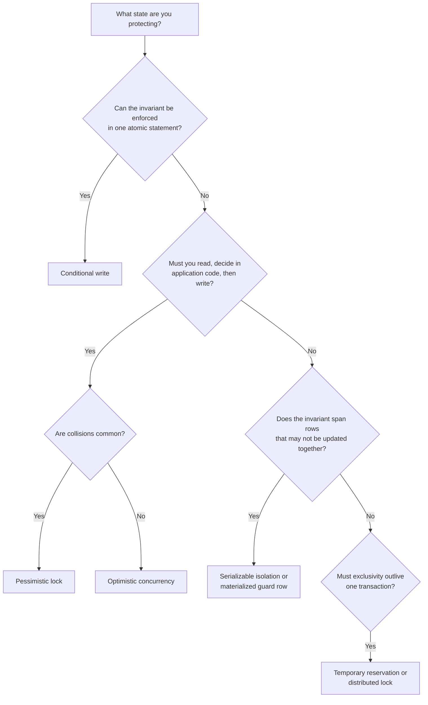

# Dealing with Contention in System Design

## TL;DR

Contention happens when concurrent requests compete to read or modify the same logical resource: the last seat, an inventory counter, an auction's highest bid, or an available driver.

The best solution is usually the **simplest atomic operation that can enforce the invariant**:

1. **Conditional write** when the rule can be expressed in one statement.
2. **Pessimistic locking** when application code must read, decide, and write and conflicts are common.
3. **Optimistic concurrency control** for the same flow when conflicts are rare.
4. **Serializable isolation** when an invariant spans rows that do not directly collide.
5. **A temporary reservation or distributed lock** when exclusivity must outlive one database transaction.

> A lock is not the goal. Preserving a clearly stated invariant is the goal.

---

## 1. What Is Contention?

Contention occurs when multiple operations try to change shared state at the same time and at least one operation depends on what another operation is doing.

Consider the last unit of a product:

```text
Request A reads stock = 1
Request B reads stock = 1
Request A writes stock = 0
Request B writes stock = 0
```

Both requests believe they bought the final unit. The individual reads and writes were valid, but the **read-decide-write sequence was not atomic**.

Typical contention points include:

- a seat that can be sold only once;
- an inventory counter that cannot become negative;
- an auction item with one current highest bid;
- a job that should be claimed by one worker;
- a driver who should receive one active ride request;
- a bank account whose balance must remain valid; and
- a cross-row rule such as "at least one doctor must remain on call."

### Start by stating the invariant

Before choosing a lock, state what must always remain true:

- `available_inventory >= 0`
- one seat has at most one confirmed booking;
- an accepted bid is greater than the current bid;
- one job is owned by at most one worker;
- at least one doctor remains on call; or
- the same idempotency key creates at most one payment.

This turns a vague "concurrency problem" into a specific correctness requirement.

---

## 2. Why Ordinary Transactions Are Not Always Enough

A transaction makes its own operations atomic, but the result also depends on its **isolation level** and on how the application reads and writes data.

The following code can still lose updates under common isolation levels:

```text
BEGIN
  stock = SELECT available FROM inventory WHERE product_id = 42
  if stock > 0:
      UPDATE inventory SET available = stock - 1
COMMIT
```

Two transactions can read the same value before either writes. To fix this, the database must either:

- evaluate the condition as part of the write;
- prevent another transaction from changing the state after it is read; or
- detect the conflict and force one transaction to retry.

---

## 3. Choosing the Right Approach

There is rarely one universally correct mechanism. Choose based on the shape of the write, expected contention, latency requirements, and the scope of the invariant.

Walk down this list and take the first approach that fits.



| Approach | Use when | Avoid when | Contention behavior | Complexity |
|---|---|---|---|---|
| **Conditional write** | The check is a predicate on the row being changed | The decision requires application logic or other rows | One atomic statement; losers fail immediately | Low |
| **Pessimistic locking** | Read-decide-write; conflicts are frequent | A conditional write is enough, or transactions would be long | Conflicting requests wait | Low to medium |
| **Optimistic concurrency** | Read-decide-write; collisions are rare | A hot row would cause repeated retries | Conflicting requests abort and retry | Medium |
| **Serializable isolation** | A cross-row invariant can suffer write skew | Hot paths would produce excessive aborts | Database detects unsafe schedules | Medium |
| **Temporary reservation / distributed lock** | A hold must span a wait, external call, or several steps | One database transaction can enforce the rule | Competitors fail or wait until release/expiry | Medium to high |

---

## 4. Conditional Writes: Reach for These First

Use a conditional write when the invariant can be expressed in the `WHERE` clause of the row being modified.

### Inventory decrement

```sql
UPDATE inventory
SET available = available - 1
WHERE product_id = 42
  AND available > 0;
```

Interpret the affected-row count:

- `1` row updated: the unit was claimed;
- `0` rows updated: no inventory was available.

The check and mutation occur in one atomic database operation. There is no gap in which another request can invalidate the decision.

### Status transition

```sql
UPDATE orders
SET status = 'PROCESSING'
WHERE id = $order_id
  AND status = 'PENDING';
```

This guarantees that only one worker can move the order out of `PENDING`.

### Claiming a job

```sql
UPDATE jobs
SET status = 'RUNNING',
    worker_id = $worker_id,
    started_at = NOW()
WHERE id = $job_id
  AND status = 'READY';
```

### Why this is the best default

- no explicit lock-management code;
- no stale read;
- no retry loop for the winning request;
- short lock duration inside the database; and
- easy behavior to explain and test.

Always gate follow-up work on the affected-row count. Do not send a confirmation, charge a customer, or publish a success event when the update changed zero rows.

---

## 5. Pessimistic Locking: Prevent the Conflict

Use pessimistic locking when the application must first read data, run logic that cannot fit in one statement, and then write the result.

```sql
BEGIN;

SELECT id, status, price
FROM seats
WHERE event_id = $event_id
  AND section = $section
  AND status = 'AVAILABLE'
ORDER BY row_number, seat_number
LIMIT 4
FOR UPDATE;

-- Application verifies that the selected seats form an acceptable block.

UPDATE seats
SET status = 'HELD',
    held_by = $user_id
WHERE id IN ($seat_ids);

COMMIT;
```

`FOR UPDATE` prevents another transaction from modifying the selected rows until the transaction commits or rolls back.

### Use it when

- contention is high and retries would be frequent;
- the decision needs several values or rows;
- waiting is preferable to failing and retrying; and
- the transaction can remain short.

### Costs and failure modes

- competing requests block;
- throughput falls as lock duration increases;
- inconsistent lock order can cause deadlocks; and
- a slow network call inside the transaction can hold locks for seconds.

Acquire rows in a consistent order, keep transactions short, configure lock timeouts, and retry deadlock victims.

> Never hold a database transaction open while waiting for user input or calling a payment provider.

For worker queues, `FOR UPDATE SKIP LOCKED` is useful because workers can skip jobs already claimed by another worker instead of waiting:

```sql
SELECT id
FROM jobs
WHERE status = 'READY'
ORDER BY created_at
LIMIT 1
FOR UPDATE SKIP LOCKED;
```

---

## 6. Optimistic Concurrency: Detect the Conflict

Optimistic concurrency control (OCC) assumes that concurrent edits are uncommon. Requests proceed without blocking, but a write succeeds only if the state has not changed since it was read.

### Version-column pattern

```sql
SELECT id, current_bid, version
FROM auctions
WHERE id = $auction_id;
```

After validating the bid in application code:

```sql
UPDATE auctions
SET current_bid = $new_bid,
    current_winner_id = $user_id,
    version = version + 1
WHERE id = $auction_id
  AND version = $expected_version
  AND current_bid < $new_bid
  AND ends_at > NOW();
```

If zero rows are updated, another request changed the auction or the bid is no longer valid. Reload the current state and either retry or reject the bid.

The comparison token may be:

- a dedicated integer version;
- an update timestamp with sufficient precision;
- an opaque ETag; or
- a business value that changes monotonically, such as the current highest bid.

### Retry correctly

A retry must repeat the entire **read-decide-write** operation using fresh state. Retrying only the final update with the old decision can violate the invariant.

Use:

- bounded retries;
- exponential backoff with jitter;
- a conflict metric; and
- a clear failure response after the retry budget is exhausted.

### The ABA problem

If the comparison token can change from `A` to `B` and later back to `A`, a request may incorrectly conclude that nothing changed. A monotonically increasing version avoids this. A highest bid is also safe when bids can only increase.

### Best fit

OCC works well for:

- occasional edits to documents or product metadata;
- high read-to-write workloads;
- auction bids spread across many items; and
- aggregate updates where collisions are possible but uncommon.

It performs poorly on a hot row when many requests repeatedly lose and retry.

---

## 7. Serializable Isolation: Protect Cross-Row Invariants

Some races do not update the same row. This is **write skew**.

Suppose Alice and Bob are both on call, and the rule is that at least one doctor must remain available:

```text
Transaction A reads: Alice = on, Bob = on
Transaction B reads: Alice = on, Bob = on

Transaction A sets Alice = off
Transaction B sets Bob = off
```

The transactions update different rows, so row locks or version checks on the written row do not collide. Both can commit and violate the invariant.

At `SERIALIZABLE` isolation, the database detects that the concurrent execution could not have occurred safely in a serial order and aborts one transaction.

```sql
BEGIN TRANSACTION ISOLATION LEVEL SERIALIZABLE;

SELECT COUNT(*)
FROM doctors
WHERE shift_id = $shift_id
  AND on_call = TRUE;

UPDATE doctors
SET on_call = FALSE
WHERE id = $doctor_id;

COMMIT;
```

The application must retry serialization failures.

### Alternative: materialize the invariant

Instead of protecting many independent rows, represent the shared constraint on one guard row:

```text
shift_guard
  shift_id
  on_call_count
  version
```

Every update then locks or conditionally changes the same guard row. This can be easier to reason about but may create a hotspot.

Use serializable isolation when correctness matters more than the extra abort/retry cost and no simpler shared row naturally represents the invariant.

---

## 8. Temporary Reservations and Distributed Locks

Sometimes exclusivity must survive longer than a safe database transaction:

- a user needs ten minutes to complete checkout;
- the service must call a payment provider;
- a driver has ten seconds to accept a ride; or
- a workflow spans multiple services.

Use a temporary reservation with an expiry:

```text
SET seat_hold:event123:A14 reservation-7f3c NX EX 600
```

- `NX`: create only if no hold exists;
- `EX 600`: expire after ten minutes;
- the random reservation token identifies the owner.

Release the hold only if the token still matches. A client must never delete a lock that expired and was later acquired by somebody else. This check-and-delete operation should be atomic, commonly through a Redis Lua script.

### A reservation is often a product feature

For ticketing, a short hold is not only about correctness. It prevents a user from spending several minutes entering payment information only to discover that the seat disappeared.

### The database remains authoritative

A distributed lock is a coordination aid, not the final integrity boundary. Systems can pause, clocks can drift, leases can expire, and clients can continue running after losing a lock.

Protect the durable write with a database constraint or conditional update as well:

```sql
UPDATE seats
SET status = 'BOOKED',
    booking_id = $booking_id
WHERE id = $seat_id
  AND status = 'AVAILABLE';
```

For operations where a stale lock holder could corrupt data, use a **fencing token**: each lock acquisition receives a larger sequence number, and the protected resource rejects writes carrying an older token.

### Reservation lifecycle

```text
AVAILABLE -> HELD -> BOOKED
              |
              +---- expiry/payment failure ----> AVAILABLE
```

Make confirmation idempotent, store an expiration timestamp, and design reconciliation for crashes between payment and booking confirmation.

---

## 9. Common Interview Scenarios

Contention appears frequently in system-design interviews. Strong candidates identify it before the interviewer has to ask.

### Online auction

Multiple bidders compete to update the same item. OCC is a natural choice:

```sql
UPDATE auctions
SET current_bid = $new_bid,
    current_winner_id = $bidder,
    version = version + 1
WHERE id = $auction_id
  AND version = $expected_version
  AND current_bid < $new_bid;
```

The current high bid can participate in the version check because it only moves upward, avoiding the ABA problem. Very hot auctions may also serialize bids by `auction_id` through a partitioned queue, but the durable database condition should still enforce correctness.

**Interview phrasing:** "Multiple bidders will compete for the same item, so I will use optimistic concurrency with a version and an atomic `current_bid < new_bid` condition."

### Ticketmaster or event booking

The final sale needs an atomic database transition, but the larger product problem is the checkout wait. Place a short hold on selected seats, usually five to ten minutes, while the user pays.

Use:

- a reservation token and expiry;
- an atomic transition from `AVAILABLE` to `HELD`;
- an idempotent confirmation from `HELD` to `BOOKED`; and
- automatic expiry or reconciliation for abandoned holds.

**Interview phrasing:** "I will reserve seats for ten minutes so users do not lose them during payment, then use a conditional database write to make the final booking authoritative."

### Banking and payments

When money movement stays inside one relational database, use a short transaction with row locking or OCC. Lock accounts in a stable order to reduce deadlocks, write an immutable ledger entry, and enforce idempotency.

When a transfer spans databases, shards, or services, it is no longer only a contention problem. It becomes a distributed transaction or multi-step workflow requiring tools such as an outbox, saga, or reconciliation process.

### Ride-sharing dispatch

Temporarily move a driver from `AVAILABLE` to `PENDING_REQUEST` while waiting for a response:

```sql
UPDATE drivers
SET dispatch_status = 'PENDING_REQUEST',
    request_id = $request_id,
    request_expires_at = NOW() + INTERVAL '10 seconds'
WHERE id = $driver_id
  AND (
      dispatch_status = 'AVAILABLE'
      OR request_expires_at < NOW()
  );
```

Only the request that changes one row owns the offer. An expiry timestamp makes a stale request read as available even before a cleanup job runs.

### Flash sale and inventory

Use a conditional decrement to prevent overselling:

```sql
UPDATE inventory
SET available = available - $quantity
WHERE sku = $sku
  AND available >= $quantity;
```

For checkout UX, add short cart holds. For extreme hotspots, partition inventory into buckets or admission-control requests before they reach the database. Do not replace the authoritative inventory condition with a cache-only counter unless the business explicitly accepts overselling.

### Yelp or review aggregation

Concurrent reviews can race while updating a business's aggregate rating. Prefer storing `rating_sum` and `rating_count`, which can be incremented atomically:

```sql
UPDATE businesses
SET rating_sum = rating_sum + $rating,
    rating_count = rating_count + 1
WHERE id = $business_id;
```

The displayed average is `rating_sum / rating_count`. This is simpler and safer than reading the old average in application code. If reviews can be edited or deleted and the update requires old values, use OCC or process immutable review events through a partitioned consumer.

---

## 10. What Not to Overcomplicate

Do not introduce Redis, ZooKeeper, or another coordination system when one database statement or transaction already solves the problem. Every new component adds:

- deployment and operational cost;
- another source of partial failures;
- expiry and ownership edge cases;
- monitoring requirements; and
- a new consistency boundary.

### No coordination may be necessary

- **Single-user state:** personal preferences, private drafts, or a personal todo list normally have no cross-user contention.
- **Rare administrative edits:** a version column and a conflict message are enough.
- **Read-heavy data with occasional writes:** OCC handles infrequent collisions without blocking readers.
- **Commutative updates:** counters can often use `SET value = value + delta` rather than read-modify-write.

Do not solve a hypothetical race without first identifying the invariant, the competing writers, and the cost of a conflict.

---

## 11. Production Checklist

Whichever approach you choose, cover the surrounding failure modes:

- **Idempotency:** retries must not duplicate charges, bookings, or messages.
- **Timeouts:** lock waits and external calls need explicit deadlines.
- **Retry policy:** retry deadlocks and serialization failures with bounded backoff and jitter.
- **Lock ownership:** release a lease only when the ownership token matches.
- **Lock ordering:** acquire multiple rows in a consistent order.
- **Constraints:** use unique, check, and foreign-key constraints as the last line of defense.
- **Observability:** measure conflict rate, lock wait time, deadlocks, retries, and reservation expiry.
- **Hot keys:** one popular item can bottleneck an otherwise scalable system.
- **Side effects:** publish events through an outbox or after a confirmed commit, not before.
- **Reconciliation:** repair workflows that fail between reservation, payment, and final persistence.

---

## 12. Interview Answer Framework

When you discover contention in an HLD interview, explain it in this order:

1. **State the invariant.** "A seat can have at most one confirmed booking."
2. **Name the race.** "Two requests can read `AVAILABLE` before either writes."
3. **Choose the simplest mechanism.** "The final transition is a conditional update."
4. **Explain why it fits the workload.** "It is one atomic statement and does not hold a long lock."
5. **Cover failure handling.** "I check the affected-row count and make retries idempotent."
6. **Discuss scale only if necessary.** "For checkout UX, I add an expiring reservation; the database remains authoritative."

The strongest answer is not the one with the most locks. It is the one that connects a precise invariant to the least-complex mechanism that preserves it under failure and concurrency.
