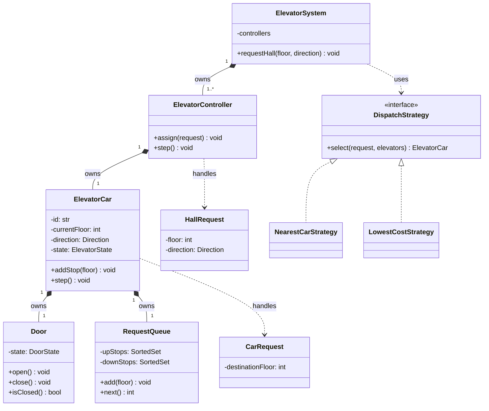
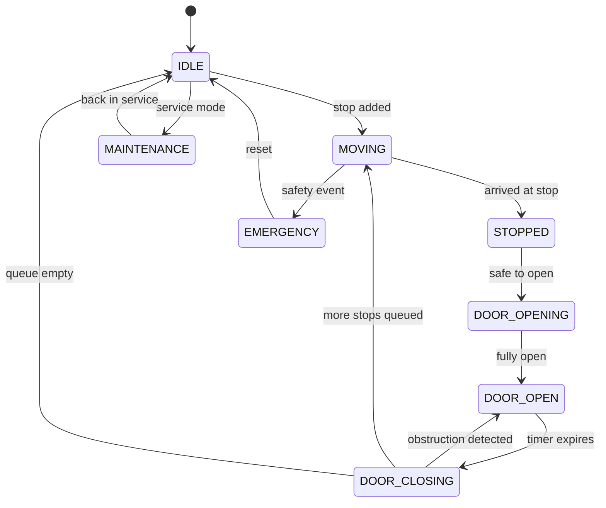
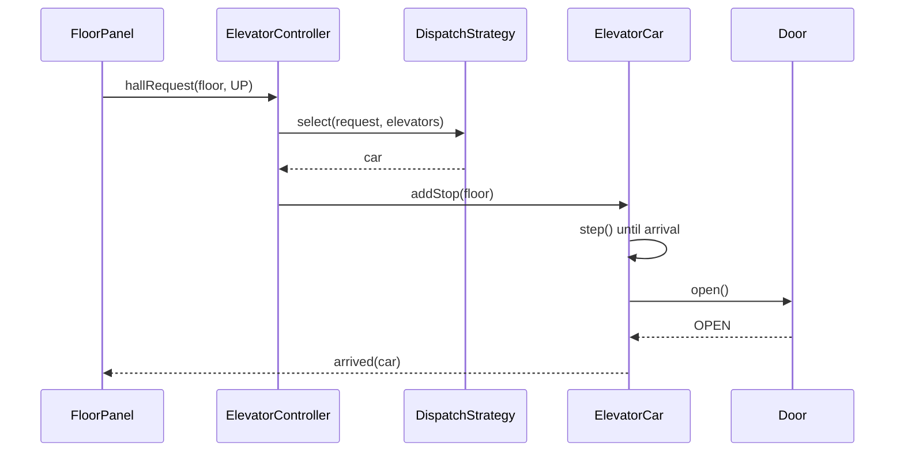

# Elevator System — Low-Level Design

Design an elevator system that accepts hall and car requests, selects an elevator, moves safely, and handles concurrent events.

## Requirements

- Support multiple elevators and floors.
- Accept hall requests with an up or down direction.
- Accept floor selections from inside an elevator.
- Choose an appropriate elevator for each hall request.
- Open and close doors safely.
- Prevent movement while doors are open.
- Support maintenance and emergency states.

## Core Model

### Class Diagram



**Reading the arrows:** every part here is composition — a `Door` or `RequestQueue` has no meaning without its car. `DispatchStrategy` is a dashed dependency because the system only *uses* it, and swapping the strategy never changes elevator behavior.

### Text summary

```text
ElevatorSystem
  ├── ElevatorController
  │     └── ElevatorCar
  │           ├── Door
  │           └── RequestQueue
  └── DispatchStrategy
```

```python
from enum import Enum

class Direction(Enum):
    UP = 1
    DOWN = 2
    IDLE = 3

class ElevatorState(Enum):
    IDLE = 1
    MOVING = 2
    STOPPED = 3
    MAINTENANCE = 4
    EMERGENCY = 5

class DoorState(Enum):
    OPEN = 1
    CLOSED = 2
    OPENING = 3
    CLOSING = 4
    BLOCKED = 5

class HallRequest:
    def __init__(self, floor, direction):
        self.floor = floor
        self.direction = direction

class CarRequest:
    def __init__(self, destination_floor):
        self.destination_floor = destination_floor
```

## Elevator Car

```python
from sortedcontainers import SortedSet

class ElevatorCar:
    def __init__(self, car_id):
        self.id = car_id
        self.current_floor = 0
        self.direction = Direction.IDLE
        self.state = ElevatorState.IDLE
        self.door = Door()
        self.up_stops = SortedSet()
        self.down_stops = SortedSet(reverse=True)

    def add_stop(self, floor):
        """Add floor to the direction-aware queue"""
        pass

    def step(self):
        """Perform one safe state transition"""
        pass
```

The elevator owns its movement state and stop queues. Callers submit requests but cannot directly change its floor, direction, or door state.

## Dispatch Strategy

```python
class DispatchStrategy:
    def select(self, request, elevators):
        """Select an elevator for the hall request"""
        raise NotImplementedError
```

A simple cost function can prefer:

1. An idle elevator close to the requested floor.
2. An elevator already moving toward the floor in the requested direction.
3. The available elevator with the lowest estimated delay.

```text
cost = distance
     + directionMismatchPenalty
     + queuedStopsPenalty
     + capacityPenalty
```

The Strategy pattern allows the scheduler to evolve without changing elevator behavior.

## Request Flow

### Hall Request

1. A floor panel creates a `HallRequest`.
2. The controller asks the dispatch strategy to select an elevator.
3. The controller assigns the pickup floor to that elevator.
4. The floor display receives the selected elevator and arrival updates.

### Car Request

1. A passenger selects a destination.
2. The elevator validates the floor.
3. The stop is added to the up or down queue.
4. The elevator continues serving stops in its current direction.

## Movement State Machine



### Hall request sequence



Important invariants:

- The elevator moves only when the door is fully closed.
- An elevator in maintenance or emergency mode accepts no normal requests.
- Door obstruction returns the door to the open state.
- Requests outside the building's floor range are rejected.

## Scheduling Stops

Maintain two ordered sets:

- `upStops`: ascending floors.
- `downStops`: descending floors.

While moving up, serve `upStops` in ascending order. When empty, switch direction and serve `downStops`. This is similar to the SCAN disk-scheduling algorithm and avoids frequent direction changes.

## Concurrency

Hall panels, car panels, sensors, and timers can emit events simultaneously. Process each elevator's events through a serialized queue or actor so its state transitions remain ordered.

The system-level controller may operate concurrently across elevators, but each individual elevator should have a single logical owner for mutable state.

## Failure and Safety Cases

- Door obstruction or sensor failure.
- Elevator overload.
- Emergency stop or fire mode.
- Power loss and recovery.
- Controller loses communication with one elevator.
- Duplicate button presses.

Safety events take priority over scheduling efficiency and should transition the elevator into an explicit restricted state.

## Extension Points

- Destination dispatch, where passengers choose a floor before entering.
- VIP or service modes.
- Energy-aware grouping and parking floors.
- Peak-hour strategies.
- Accessibility controls and voice announcements.
