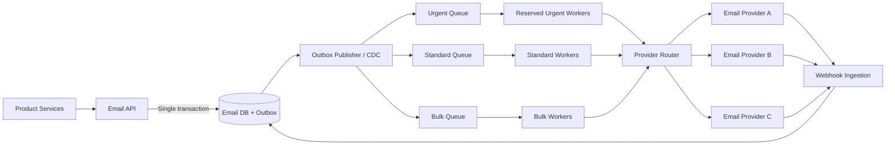

# Email Notification — Bulk & Urgent

## Problem Statement

> Design an email notification service for a SaaS product. 50M transactional
> emails/day (alerts, password resets, billing). Some urgent (sub-second), others
> bulk (eventual). No email may be lost. Duplicates must be rare. Must keep working
> when external provider degrades. Walk me through architecture.

## TL;DR

* **Scale:** 50 million transactional emails per day is about **579 emails/second on average**; design for bursts of 5,000-10,000 emails/second.
* **Priority isolation:** Urgent password resets and security alerts use reserved queues and workers. Bulk billing and campaign traffic cannot consume urgent capacity.
* **No acknowledged request is lost:** The API writes the email and an outbox record in one database transaction before returning success.
* **Delivery:** Workers provide **at-least-once processing**. Idempotency and a delivery ledger make duplicates rare.
* **Provider resilience:** A provider router fails over between multiple pre-warmed email service providers.
* **Important limitation:** Exactly-once delivery cannot be guaranteed across an external provider boundary.

---

## 1. Requirements

### Functional Requirements

| Requirement | Example |
|---|---|
| Send urgent email | Password reset, login alert, fraud alert |
| Send bulk email | Billing statements, product notifications |
| Schedule email | Send now or at a future `sendAt` time |
| Track status | Queued, provider accepted, delivered, bounced, failed |
| Retry failures | Retry temporary provider and network failures |
| Suppress invalid recipients | Hard bounces, complaints, unsubscribes |

### Non-Functional Requirements

| Requirement | Target |
|---|---|
| Volume | 50M emails/day |
| Urgent latency | Sub-second API-to-provider submission under normal conditions |
| Durability | No acknowledged email request may be lost |
| Duplicate rate | Rare, controlled through idempotency |
| Availability | Continue operating when one provider degrades |
| Delivery model | At-least-once |

---

## 2. Capacity

```text
50,000,000 / (24 × 60 × 60) ≈ 579 emails/second average
```

Traffic is not evenly distributed. Billing runs and security incidents can create large
bursts, so provision the queue, database, and workers for approximately 10-20 times the
average rate.

---

## 3. High-Level Architecture



### Why separate urgent and bulk traffic?

A single shared queue allows a billing run to place millions of emails ahead of a
password reset. Separate queues, worker pools, rate limits, and provider quotas provide
**priority isolation**.

Unused urgent capacity may temporarily process standard work, but bulk work must never
consume the capacity reserved for urgent email.

---

## 4. Request API and Idempotency

Send one logical email per request:

```http
POST /emails
Idempotency-Key: password-reset:user-42:token-version-7
```

```json
{
  "tenantId": "tenant-123",
  "recipient": "user@example.com",
  "template": "password-reset",
  "templateVersion": 4,
  "variables": {
    "resetUrl": "https://example.com/reset/..."
  },
  "priority": "urgent",
  "sendAt": "2026-08-12T13:00:00Z"
}
```

The database enforces a unique constraint on:

```text
(tenant_id, idempotency_key)
```

If the caller times out and retries, the API returns the existing `email_id` instead of
creating a second email.

---

## 5. Transactional Outbox

Do not independently write to the database and queue:

```text
Wrong:
Save email in DB → process crashes → queue publish never happens
```

Instead, write both records in one transaction:

```sql
BEGIN;

INSERT INTO emails (...);
INSERT INTO email_outbox (email_id, priority, available_at, ...);

COMMIT;
```

An outbox publisher or CDC process later publishes the record to the appropriate
durable queue. The API returns success only after the transaction commits, guaranteeing
that every acknowledged request remains recoverable.

---

## 6. Queue Choice

Kafka is useful when long retention, replay, high throughput, or multiple independent
consumers are required. A managed queue such as SQS, Azure Service Bus, or Pub/Sub is
often simpler because retries, visibility timeouts, delayed messages, and dead-letter
queues are built in.

The reliability design does not depend on Kafka specifically. It depends on:

* A transactional outbox
* Durable priority queues
* At-least-once workers
* Idempotent processing
* A persistent delivery ledger

### Kafka Topics and Offsets for This Design

If Kafka is selected, use separate topics so bulk traffic cannot block urgent traffic:

| Topic | Purpose |
|---|---|
| `email.urgent` | Password resets, fraud alerts, security notifications |
| `email.standard` | Normal transactional notifications |
| `email.bulk` | Billing statements and eventual bulk delivery |
| `email.retry.1m` | First delayed retry |
| `email.retry.10m` | Longer delayed retry |
| `email.retry.1h` | Extended provider recovery |
| `email.dlq` | Records that exceeded the retry limit |

Use a separate consumer group for each worker pool:

```text
email-urgent-executors   → consumes email.urgent
email-standard-executors → consumes email.standard
email-bulk-executors     → consumes email.bulk
```

Use **manual offset commits with at-least-once processing**:

```text
Poll record
→ claim email_id in delivery ledger
→ send to provider
→ persist result
→ commit Kafka offset
```

Why this order:

* Crash before the result is saved: Kafka redelivers the record.
* Crash after saving but before committing: Kafka redelivers it, but the delivery
  ledger detects the completed email and prevents another normal send.
* Commit before sending: unsafe, because a crash can permanently lose the email.

Recommended consumer settings:

```properties
enable.auto.commit=false
isolation.level=read_committed
auto.offset.reset=earliest
```

`auto.offset.reset=earliest` applies only when the consumer group has no valid committed
offset. During ordinary restarts, the consumer resumes from its committed offset.

Recommended producer and topic durability settings:

```properties
acks=all
enable.idempotence=true
replication.factor=3
min.insync.replicas=2
unclean.leader.election.enable=false
```

Partition using a stable key such as `tenant_id + recipient_hash`. This distributes
traffic while keeping emails for the same tenant and recipient ordered within a
partition. Ordering is guaranteed only inside one partition.

Monitor consumer lag separately for urgent and bulk consumer groups. Urgent lag should
remain near zero; bulk lag may grow temporarily during provider degradation.

---

## 7. Email Executor and Crash Recovery

Place one logical email in each queue record. A worker may poll 20 records for
efficiency, but each email is processed and recorded independently.

```text
Worker polls emails 1-20:

1-7   → provider accepted; status saved
8     → temporary failure
9-20  → worker crashes before processing
```

After the worker lease expires, the queue redelivers unfinished records. The replacement
worker checks the delivery ledger:

```text
1-7   → already accepted; skip
8-20  → retry
```

Recommended processing order:

```text
1. Read the queue record.
2. Claim email_id using a lease and fencing token.
3. Check whether it was already accepted.
4. Render the versioned template.
5. Send through the provider router.
6. Save provider_message_id and result.
7. Acknowledge the queue record only after the result is durable.
```

---

## 8. Delivery State Machine

```text
ACCEPTED → QUEUED → CLAIMED → SUBMITTING → PROVIDER_ACCEPTED
                                         ↘ RETRY_WAIT
                                         ↘ FAILED_PERMANENT

PROVIDER_ACCEPTED → DELIVERED | BOUNCED | COMPLAINED | UNKNOWN
```

`PROVIDER_ACCEPTED` means the provider accepted responsibility for the email. It does
not mean the recipient opened it, and it may not yet mean the destination mail server
accepted it.

---

## 9. Retry and Dead-Letter Handling

| Failure | Action |
|---|---|
| Network timeout or provider 5xx | Retry with exponential backoff and jitter |
| Provider throttling | Retry while respecting `Retry-After` and rate limits |
| Invalid recipient | Mark permanent failure |
| Hard bounce or complaint | Add recipient to suppression list |
| Retry limit exceeded | Move to durable DLQ and alert |

The original queue record is acknowledged only after the retry or DLQ record has been
durably created.

---

## 10. Why Duplicates Cannot Be Completely Eliminated

The difficult case is:

```text
Provider accepts email
        ↓
Network response is lost
        ↓
Worker crashes before saving provider_message_id
```

The system cannot know whether the provider accepted the email. Not retrying could lose
it; retrying could duplicate it. Because email loss is forbidden, retry after attempting
provider reconciliation.

Reduce duplicates using:

* API idempotency keys
* A unique delivery-ledger constraint
* Worker leases and fencing tokens
* Provider idempotency keys, when supported
* Provider status lookup before retrying ambiguous attempts

---

## 11. Provider Degradation and Failover

The provider router tracks:

* Latency and timeout rate
* Throttling and acceptance rate
* Remaining quota
* Bounce rate
* Health by region and recipient domain
* Webhook delay

Use circuit breakers and weighted routing:

```text
Provider A healthy     → A: 60%, B: 30%, C: 10%
Provider A degrading   → A: 5%,  B: 60%, C: 35%
Provider A unavailable → A: 0%,  B: 65%, C: 35%
```

Backup providers must carry continuous traffic so credentials, templates, sending
domains, quotas, and reputation remain warm. During a broad outage, pause bulk traffic
and preserve provider capacity for urgent emails.

---

## 12. Webhooks and Suppression

Providers asynchronously report delivery, bounce, and complaint events. Webhook
ingestion should:

1. Verify the provider signature.
2. Persist the raw event durably.
3. Deduplicate by provider event ID.
4. Update the delivery state using valid state transitions.
5. Add hard bounces and complaints to the suppression store.

Webhook events may arrive late or out of order, so do not use simple last-write-wins
status updates.

---

## 13. Important Metrics

* Urgent API-to-provider latency at p50, p95, and p99
* Oldest queued message by priority
* Queue depth and consumer lag
* Retry, timeout, and permanent-failure rates
* Provider health by destination domain
* Ambiguous and duplicate-suspect attempts
* Webhook processing lag
* Suppression-check failures
* Outbox records waiting to be published

---

## Final Design Principle

The service guarantees that **every acknowledged request remains durable and
recoverable**. It uses at-least-once execution to avoid loss, idempotency to make
duplicates rare, strict priority isolation for urgent traffic, and multiple active
providers so external degradation does not stop the system.
