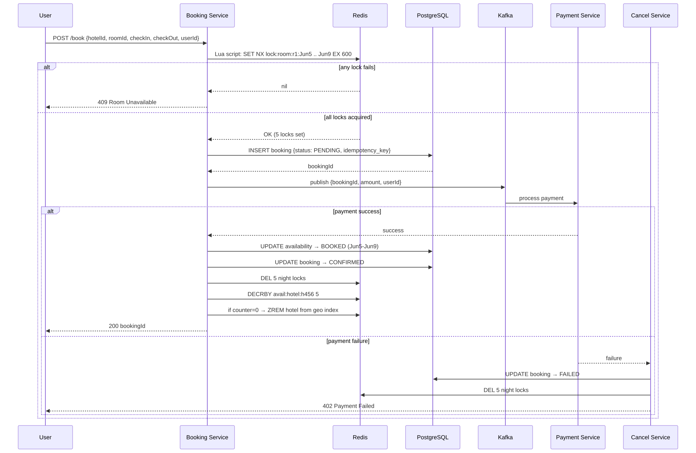

# Hotel Booking System — System Design (Booking.com / Hotels.com)

## TL;DR
* **Core challenge**: No double booking — two users trying to book the same room for overlapping dates must never both succeed
* **Availability model**: One row per night in the availability table — simple to query, easy to lock, no date-range split complexity
* **Locking**: Redis Lua script atomically acquires one lock per night (`SET NX EX 600`). All-or-nothing — if any night is already locked, release all and return 409
* **Defence in depth**: Redis lock (fast path) + DB `status = 'AVAILABLE'` CAS check (safety net)
* **Search**: Redis Geospatial (`GEORADIUS`) for nearby hotels + Redis availability counter per hotel — hotel removed from geo index when last room is booked
* **Pricing**: Multipliers stored in Redis, applied at read time — no cron job, always fresh

---

## Step 1: Requirements

### Functional Requirements
| Priority | Requirement |
|---|---|
| ✅ Core | Users can search hotels by location, dates, guests |
| ✅ Core | Users can view hotel details and available rooms with pricing |
| ✅ Core | Users can book a room — no double booking ever |
| 🔲 Out of scope | Hotel owners manage listings and inventory |
| 🔲 Out of scope | Users can cancel bookings |
| 🔲 Out of scope | Dynamic surge pricing |

### Non-Functional Requirements
| Requirement | Target |
|---|---|
| Consistency | Strong for booking — no double booking |
| Read throughput | 100:1 read to write — search is dominant |
| Search latency | < 500ms |
| Scale | 500M users, 1M hotels |
| Availability | High for search, booking can tolerate brief unavailability |

---

## Step 2: Capacity Estimation

| Metric | Estimate |
|---|---|
| Hotels | 1 million |
| Avg rooms per hotel | 50 |
| Avg availability window | 365 nights |
| Availability table rows | 1M × 50 × 365 = **18 billion rows** |
| Search QPS | ~50,000/sec |
| Booking QPS | ~500/sec |

The availability table is large — 18 billion rows. This is why we need the Redis geospatial layer to filter hotels first before ever touching the availability table.

---

## Step 3: High-Level Architecture



### What each component does

**API Gateway**
All requests pass through authentication (Bearer token) and rate limiting. Routes to Search Service, Hotel Service, or Booking Service based on the endpoint.

**Hotel Service**
Handles hotel and room registration by hotel owners:
- Writes hotel metadata (name, location, tier, stars, rating) to PostgreSQL
- Adds hotel coordinates to Redis Geospatial index: `GEOADD hotels lng lat hotelId`
- Sets availability counter: `SET avail:hotel:{hotelId} {totalRoomNights}`
- Stores room images in S3
- Indexes hotel document in Elasticsearch (optional, for rich text search)

**Search Service**
Two-phase search:
1. **Phase 1 — geo filter**: `GEORADIUS hotels lng lat 10km` → returns nearby hotel IDs
2. **Phase 2 — details**: Fetches hotel name, rating, tier from PostgreSQL for those IDs
3. **Phase 3 — pricing**: Calculates `final_price = base_price × multipliers` from Redis

Never queries the full availability table during search — only shows hotels that have the availability counter > 0.

**Booking Service**
The most critical service. Handles the full booking flow — locking, DB write, payment orchestration. Detailed in Step 4.

**Cancel Service**
Handles payment failures and cancellations. Releases Redis locks, restores availability rows to `AVAILABLE`, increments the availability counter, and re-adds the hotel to the geo index if counter was 0.

**Pricing Service**
Updates multipliers in Redis whenever pricing rules change:
```
SET multiplier:location:NYC    1.5
SET multiplier:tier:luxury     2.0
SET multiplier:location:London 1.3
```
No cron job — multipliers are updated on demand and applied at read time by Search Service.

**Redis**
Four separate responsibilities in Redis:
| Key pattern | Purpose |
|---|---|
| Geospatial sorted set `hotels` | `GEORADIUS` for nearby hotel lookup |
| `avail:hotel:{hotelId}` | Counter of available room-nights per hotel |
| `lock:room:{roomId}:{date}` | Per-night distributed lock during booking |
| `multiplier:location:{city}` / `multiplier:tier:{tier}` | Pricing multipliers |

**PostgreSQL**
Source of truth for all persistent data. Four main tables detailed in Step 5.

**S3**
Stores hotel images. Search Service returns S3 URLs to the client — the browser fetches images directly from S3/CDN, not through the API.

---

## Step 4: Booking Flow — Preventing Double Booking



### The core problem
Two users search for the same room at the same time. Both see it as available. Both click Book. Without locking, both succeed — same room, same nights, double booked.

### Solution: Per-night Redis locks + DB CAS

**Step 1 — Acquire Redis locks (atomic Lua script)**
For a booking of room `r123` for June 5-10 (5 nights):
```lua
-- Lua script runs atomically — no other Redis command can interleave
local keys = {'lock:room:r123:Jun5', 'lock:room:r123:Jun6', ...Jun9}
for _, key in ipairs(keys) do
  if redis.call('SET', key, userId, 'NX', 'EX', 600) == false then
    -- One lock failed — release all acquired locks
    for _, k in ipairs(keys) do redis.call('DEL', k) end
    return 0  -- failed
  end
end
return 1  -- all locks acquired
```

Why Lua? Because `SET NX` for 5 keys one-by-one is not atomic — another request could sneak in between commands. Lua script is atomic in Redis.

- **Lock acquired** → proceed
- **Any lock fails** → release all, return `409 Room Unavailable`

**Step 2 — Write PENDING booking**
```sql
INSERT INTO bookings (booking_id, user_id, room_id, check_in, check_out, status, idempotency_key)
VALUES ('b001', 'u789', 'r123', 'Jun5', 'Jun10', 'PENDING', 'uuid-xyz')
ON CONFLICT (idempotency_key) DO NOTHING
```
Idempotency key prevents duplicate bookings on network retries.

**Step 3 — Publish to Kafka for payment**
```json
{ "bookingId": "b001", "userId": "u789", "amount": 500.00 }
```
Payment is async — Booking Service doesn't block waiting for payment. The response to the user is "booking in progress".

**Step 4a — Payment success**
```sql
UPDATE availability SET status = 'BOOKED'
WHERE room_id = 'r123' AND date BETWEEN 'Jun5' AND 'Jun9'
AND status = 'AVAILABLE'   -- CAS: DB safety net
```
Then:
- `DEL` all 5 night locks from Redis
- `DECRBY avail:hotel:h456 5` — reduce counter
- If counter hits 0 → `ZREM hotels h456` — remove from geo index
- `UPDATE bookings SET status = 'CONFIRMED'`
- Notify user ✅

**Step 4b — Payment failure**
Cancel Service:
- `UPDATE bookings SET status = 'FAILED'`
- `DEL` all 5 night locks
- Counter stays the same (availability rows never changed)
- Notify user ❌

**Step 4c — Service crash**
Redis TTL expires after 600 seconds automatically. Locks disappear, room becomes bookable again. The PENDING booking row in DB is cleaned up by a reconciliation job.

---

## Step 5: Availability Model — One Row Per Night



### Why one row per night (not a date range)?

**Date range approach problem:**
```sql
-- Overlap query is complex
WHERE NOT (end_date <= checkIn OR start_date >= checkOut)

-- Booking June 5-10 on a Jun 1-15 available range
-- requires SPLITTING the row into Jun 1-4 and Jun 11-15
-- Complex update logic, race conditions on splits
```

**One row per night — simple and clean:**
```sql
availability (
  room_id    UUID,
  date       DATE,
  status     TEXT CHECK (status IN ('AVAILABLE', 'LOCKED', 'BOOKED')),
  base_price DECIMAL(10,2),
  PRIMARY KEY (room_id, date)   -- composite PK prevents duplicates
)
```

Checking availability for June 5-10:
```sql
SELECT COUNT(*) FROM availability
WHERE room_id = 'r123'
AND date BETWEEN '2025-06-05' AND '2025-06-09'
AND status = 'AVAILABLE'
-- Should return 5 — if less, some nights are taken
```

Locking for booking:
```sql
UPDATE availability SET status = 'BOOKED'
WHERE room_id = 'r123'
AND date BETWEEN '2025-06-05' AND '2025-06-09'
AND status = 'AVAILABLE'   -- CAS check
```

The `PRIMARY KEY (room_id, date)` uniquely identifies each night — physically impossible to insert duplicate rows for the same room and night.

### Redis availability counter

Rather than querying the availability table on every search to check if a hotel has rooms, we maintain a counter in Redis:

```
avail:hotel:h456 → 47   (47 available room-nights across all rooms)
```

- **Hotel registration**: `SET avail:hotel:h456 {totalRoomNights}`
- **On booking**: `DECRBY avail:hotel:h456 {nightsBooked}`
- **On cancel**: `INCRBY avail:hotel:h456 {nightsRestored}`
- **Counter = 0**: `ZREM hotels h456` — hotel disappears from search
- **Counter 0 → 1**: `GEOADD hotels lng lat h456` — hotel reappears in search

Search Service checks `avail:hotel:{id} > 0` before including a hotel in results — no DB query needed.

---

## Step 6: Pricing — Multipliers at Read Time



### Why not a cron job?

A cron job that updates prices in the availability table creates a **consistency window**:
```
Cron starts updating 18B availability rows
→ takes 20 minutes
→ during those 20 minutes, half the rows show old price, half show new
→ user sees £100, pays, gets charged £150 💥
```

### Multiplier-based pricing at read time

Store only `base_price` in the availability table. Apply multipliers at query time:

```
final_price = base_price
            × GET multiplier:location:{city}
            × GET multiplier:tier:{hotelTier}
            × demand_factor(hotelId)
```

**Multipliers in Redis** (updated instantly by Pricing Service):
```
multiplier:location:NYC    → 1.5
multiplier:location:London → 1.3
multiplier:tier:luxury     → 2.0
multiplier:tier:budget     → 0.8
```

**Demand factor** — based on current occupancy:
```
occupancy = (total_rooms - avail:hotel:id) / total_rooms
demand_factor = 1.0 + (occupancy × 0.5)
-- 80% full hotel gets 1.4× price multiplier
```

Price is calculated fresh on every search request. Multiplier change takes effect immediately — no cron, no inconsistency window.

---

## Step 7: Database Schema

### Hotels Table
```sql
hotels (
  hotel_id    UUID PRIMARY KEY,
  name        TEXT NOT NULL,
  description TEXT,
  city        TEXT,
  lat         DECIMAL(9,6),
  lng         DECIMAL(9,6),
  tier        TEXT CHECK (tier IN ('budget','mid','luxury')),
  stars       INT CHECK (stars BETWEEN 1 AND 5),
  rating      DECIMAL(3,2),
  owner_id    UUID
)
```

### Rooms Table
```sql
rooms (
  room_id     UUID PRIMARY KEY,
  hotel_id    UUID REFERENCES hotels(hotel_id),
  room_type   TEXT,   -- single, double, suite
  capacity    INT,
  base_price  DECIMAL(10,2)
)
```

### Availability Table
```sql
availability (
  room_id    UUID REFERENCES rooms(room_id),
  date       DATE,
  status     TEXT CHECK (status IN ('AVAILABLE','BOOKED')) DEFAULT 'AVAILABLE',
  base_price DECIMAL(10,2),
  PRIMARY KEY (room_id, date)
)
CREATE INDEX idx_avail_hotel_date ON availability(hotel_id, date, status);
```

### Bookings Table
```sql
bookings (
  booking_id      UUID PRIMARY KEY DEFAULT gen_random_uuid(),
  user_id         UUID NOT NULL,
  room_id         UUID REFERENCES rooms(room_id),
  hotel_id        UUID REFERENCES hotels(hotel_id),
  check_in        DATE NOT NULL,
  check_out       DATE NOT NULL,
  total_price     DECIMAL(10,2),
  status          TEXT CHECK (status IN ('PENDING','CONFIRMED','FAILED','CANCELLED')),
  idempotency_key TEXT UNIQUE NOT NULL,
  created_at      TIMESTAMPTZ DEFAULT now()
)
```

---

## Deep Dives

### Why Lua script for Redis locks?

Acquiring 5 locks one-by-one is NOT atomic:
```
SET lock:room:r123:Jun5 userA NX   ← success
SET lock:room:r123:Jun6 userA NX   ← success
                                   ← userB acquires Jun7 here!
SET lock:room:r123:Jun7 userA NX   ← nil — fails
```
Now userA holds Jun5-6, userB holds Jun7. userA releases Jun5-6, userB never gets Jun5-6. Neither booking completes — availability is temporarily stuck. Lua script runs all 5 SET NX commands atomically with no gaps.

### What if Redis goes down during booking?

Redis lock disappears. Two users could both pass the lock check. The DB `AND status = 'AVAILABLE'` CAS check is the final guard — only one UPDATE succeeds. The second gets 0 rows affected → Booking Service returns 409. Same defence-in-depth pattern as Ticketmaster and Uber.

### Why Redis counter instead of querying availability table for search?

Search Service handles 50,000 requests/sec. If every search queried the availability table (18 billion rows) to check if a hotel has rooms, the DB would collapse. Redis counter is O(1) — a single GET in microseconds. The DB is only queried when the user actually views a specific hotel's room details.

### Handling the search date range

The availability counter tells you if a hotel has *any* available room-nights — not necessarily for your specific dates. A more precise search:

```sql
SELECT room_id FROM availability
WHERE hotel_id = 'h456'
AND date BETWEEN checkIn AND checkOut - 1
AND status = 'AVAILABLE'
GROUP BY room_id
HAVING COUNT(*) = (checkOut - checkIn)  -- all nights must be available
```

This query is only run after the geo filter reduces candidates to ~20 hotels — not against all 1M hotels.
