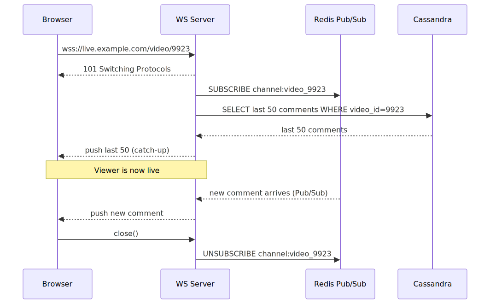

# Live Comments — System Design (YouTube Live / Twitch / Instagram Live)

## TL;DR
* **Core problem**: Fan-out — one comment posted must reach millions of viewers of the same video in < 200ms
* **Transport**: WebSocket — server pushes new comments to viewers without polling
* **Fan-out model**: One Redis Pub/Sub channel per live video; WS Servers subscribe per video, not per viewer
* **Persistence**: Cassandra partitioned by `video_id` — handles writes at scale and serves late joiners
* **Buffer**: Kafka absorbs comment spikes, decouples persistence from fan-out, enables multiple consumers
* **Key insight**: Redis never knows about individual viewers. WS Server is the bridge — one Redis subscription per video per server, fanned out to thousands of viewer sockets internally.

---

## Step 1: Clarify Requirements

### Functional Requirements
- Viewers can post comments on a live video
- Viewers see new comments in near real-time while watching
- Viewers joining late can see comments made before they joined

### Non-Functional Requirements
| Requirement | Target |
|---|---|
| Scale | Millions of concurrent live videos, thousands of comments/sec per video |
| Latency | < 200ms end-to-end comment delivery |
| Availability | Prioritise availability over consistency |
| Consistency | Eventual — viewers can see slightly different comment ordering, that's fine |

### Out of Scope
- Replies to comments
- Reactions / emoji
- Spam/hate speech moderation (mentioned but not core flow)
- Authentication

---

## Step 2: Capacity Estimation

| Metric | Estimate |
|---|---|
| Concurrent live videos | 1 million |
| Avg viewers per video | 1,000 |
| Peak viewers (hot video) | 5 million |
| Comments/sec per hot video | 1,000 |
| Total fan-out writes (hot) | 1,000 × 5M = 5B pushes/sec — handled by WS servers, not Redis |
| Redis publishes for hot video | 1,000/sec — one publish per comment regardless of viewers |
| Cassandra writes | ~10M comments/sec at peak across all videos |

The key realisation: Redis only sees **one publish per comment per video**, not one publish per viewer. WS Servers do the viewer-level fan-out internally.

---

## Step 3: High-Level Architecture



#### What each component does

**Comment Service**
Receives `POST /comment` HTTP requests from viewers. Validates the comment (length, rate limit per user). Does two things synchronously: writes to Cassandra and publishes to Kafka. Returns success to the poster once both are done.

**Cassandra — comment store**
Persists every comment permanently. Schema:
```
Partition key : video_id      ← all comments for one video on same node
Clustering key: created_at DESC ← newest first
Columns       : comment_id, user_id, text, created_at
```
Used for two things: durability, and serving late joiners who need historical comments.

**Kafka — comments topic**
Receives every comment with `key = video_id` (same video → same partition → ordered delivery). Acts as the shock absorber for traffic spikes. Multiple independent consumer groups read from it:
- **Fan-out Service** — real-time delivery
- **Spam Detection** — async moderation
- **Analytics** — view/comment counts

**Fan-out Service**
Kafka consumer. For each comment event, publishes to Redis Pub/Sub:
```
PUBLISH channel:video_9923  <comment_json>
```
One publish per comment — doesn't know or care how many viewers are watching.

**Redis Pub/Sub — one channel per live video**
The message bus between the Fan-out Service and WS Servers. Channels are created on demand and are ephemeral (no storage). Every WS Server that has at least one viewer watching a video subscribes to that video's channel.

**WebSocket Servers**
Hold open WebSocket connections — one per connected viewer. Each server subscribes to Redis channels for all videos currently being watched by its viewers. When a Redis message arrives, it fans out to all relevant viewer sockets internally.

---

## Step 4: How a Viewer Connects



When a viewer opens a live video stream:

**Step 1 — WebSocket upgrade**
The browser initiates a WebSocket connection:
```javascript
const ws = new WebSocket('wss://live.example.com/video/9923');
```
This starts as a normal HTTP GET with `Upgrade: websocket` header. The WS Server responds with `101 Switching Protocols`. The TCP connection stays open from this point.

**Step 2 — WS Server subscribes to Redis**
The WS Server checks: am I already subscribed to `channel:video_9923`?
- No → `SUBSCRIBE channel:video_9923` in Redis
- Yes → reuse the existing subscription (other viewers are already watching this video on this server)

This is the efficiency gain — **one Redis subscription per video per server**, regardless of how many viewers are watching that video on that server.

**Step 3 — Catch-up: historical comments**
```sql
SELECT * FROM comments WHERE video_id = 9923
ORDER BY created_at DESC LIMIT 50
```
The WS Server fetches the last 50 comments from Cassandra and pushes them down the socket immediately. The viewer sees recent comments right away without waiting for new ones.

**Step 4 — Live stream**
From this point, any comment published to `channel:video_9923` in Redis reaches this WS Server and is pushed to the viewer's socket in real-time.

**When the viewer leaves:**
```
1. Socket closes
2. WS Server removes viewer from its internal map for video_9923
3. If no other viewers on this server are watching video_9923:
   → UNSUBSCRIBE channel:video_9923
```

---

## Step 5: Inside the WS Server — The Two-Level Fan-out



This is the core of the design. The WS Server bridges two worlds:

```
Redis Pub/Sub  ←──  WS Server  ──►  WebSocket connections
(one sub/video)     (the bridge)     (one per viewer)
```

**Internally, the server maintains:**
```
videoSubscribers = {
    "video_001": [socketA, socketB, socketC, ...10,000 sockets],
    "video_002": [socketD, socketE, ...],
    "video_003": [socketF, ...]
}
```

**When a Redis message arrives on `channel:video_001`:**
```python
def on_redis_message(channel, data):
    video_id = channel.split(":")[1]         # "video_001"
    sockets = videoSubscribers[video_id]     # [socketA, socketB, ...]
    for socket in sockets:
        socket.send(data)                    # push to each viewer
```

**The two levels of fan-out:**

| Level | From | To | Count |
|---|---|---|---|
| Level 1 (Redis) | Fan-out Service publishes once | All subscribed WS Servers | ~hundreds of servers |
| Level 2 (WS Server) | Each WS Server fans out internally | Its viewers for that video | ~thousands per server |

Result: one comment → one Redis publish → hundreds of server deliveries → millions of viewer pushes. Redis is only involved at level 1.

---

## Step 6: Posting a Comment — Full Write Path

```
1. Viewer types comment → POST /comment { video_id: 9923, text: "🔥🔥" }

2. Comment Service:
   a. Rate limit check (max 1 comment/sec per user)
   b. INSERT INTO comments (video_id=9923, user_id=42, text="🔥🔥", created_at=now())
   c. kafka.publish(topic="comments", key=9923, value={ comment_id, video_id, user_id, text, ts })
   d. Return 201 OK to poster

3. Fan-out Service consumes from Kafka:
   PUBLISH channel:video_9923  '{"comment_id":"...","user":"Alice","text":"🔥🔥"}'

4. Redis broadcasts to all WS Servers subscribed to channel:video_9923

5. Each WS Server pushes to its viewers watching video 9923

Total time: ~50–150ms end-to-end on a warm system
```

---

## Step 7: Hot Video Problem

A celebrity goes live — 5 million concurrent viewers, 5,000 comments/sec.

**Without the channel-per-video model:**
```
5,000 comments/sec × 5M viewers = 25 billion fan-out operations/sec ← impossible
```

**With channel-per-video:**
```
5,000 comments/sec → 5,000 Redis publishes/sec (one per comment)
500 WS Servers subscribed → each receives 5,000 messages/sec
Each server has 10,000 viewers → 5,000 × 10,000 = 50M socket writes/sec across all servers
```

Redis only sees 5,000 publishes/sec — very manageable.



**Further scaling — Redis sharding:**
Multiple hot videos can overwhelm a single Redis node. Shard by `video_id`:
```
Redis instance = hash(video_id) % N
```
Each Redis node handles a fraction of videos. Adding nodes scales linearly.

---

## Step 8: Why Kafka — Not Just Redis Pub/Sub Directly?

You could have the Comment Service publish to Redis directly and skip Kafka:
```
Comment Service → Redis Pub/Sub  (simpler)
Comment Service → Cassandra
```

This works at small scale. Kafka earns its place because:

**1. Spike absorption**
Peak comment bursts (goal scored in a match, streamer does something funny) can be 100× normal rate. Kafka absorbs the spike. Cassandra and the Fan-out Service process at a steady rate. Without Kafka, both get hammered simultaneously.

**2. Multiple independent consumers**
Every comment needs to be: persisted (Cassandra writer), fan-out delivered (Fan-out Service), moderated (Spam Detector), counted (Analytics). Without Kafka, Comment Service must call all of these and becomes fat and slow. With Kafka, each is an independent consumer group — spam detection being slow never delays Redis fan-out.

**3. Replay on consumer crash**
Redis Pub/Sub is at-most-once. If Fan-out Service crashes for 30 seconds, those 30 seconds of comments are lost — viewers miss them. Kafka retains messages; Fan-out Service restarts and replays from its last committed offset.

**4. Ordering per video**
`key = video_id` means all comments for one video land on the same Kafka partition → strict ordering. Viewers always see comments in the order they were posted, not in random delivery order.

---

## Step 9: Key Design Decisions

| Decision | Choice | Alternative | Why |
|---|---|---|---|
| Viewer transport | WebSocket | HTTP polling | Server needs to push without client asking |
| Comment write | HTTP POST | WebSocket | Infrequent per user, simple req/res |
| Fan-out bus | Kafka → Redis Pub/Sub | Direct Redis | Kafka buffers spikes + enables multiple consumers |
| Channel model | Per video | Per viewer | 1 publish reaches all viewers; per-viewer = N publishes |
| Comment store | Cassandra | PostgreSQL | Write-heavy, partition by video_id, no joins |
| Late joiners | Cassandra fetch on connect | Kafka replay | Simpler; Kafka retention is for recovery not history |
| Consistency | Eventual | Strong | Comment ordering can vary across viewers — acceptable |

---

## Common Interview Follow-ups

**Q: What if a WS Server crashes?**
Viewers auto-reconnect to another server. New server subscribes to `channel:video_id`, fetches last 50 comments from Cassandra (catch-up), resumes live stream. Viewer sees a brief reconnection gap — acceptable.

**Q: How do you handle a viewer who has been watching for 2 hours and scrolls up?**
Pagination against Cassandra:
```sql
SELECT * FROM comments WHERE video_id = 9923 AND created_at < cursor
ORDER BY created_at DESC LIMIT 50
```
Cursor-based pagination. The WS connection only carries real-time new comments — historical scroll is a separate REST call.

**Q: What about comment ordering — two viewers see different orders?**
Acceptable by requirement (eventual consistency). Kafka ordering per partition ensures Fan-out Service processes in order. Minor reordering can occur at the WS Server fan-out level under load — this is fine for live chat where comments flow fast anyway.

**Q: How do you rate limit comments?**
Redis counter per user: `INCR rate:user_42:comments EX 1` — increments a per-second counter. If > threshold, reject. Sub-millisecond check, no DB involved.
