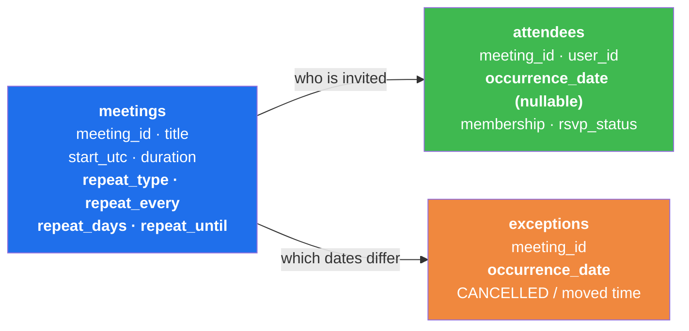
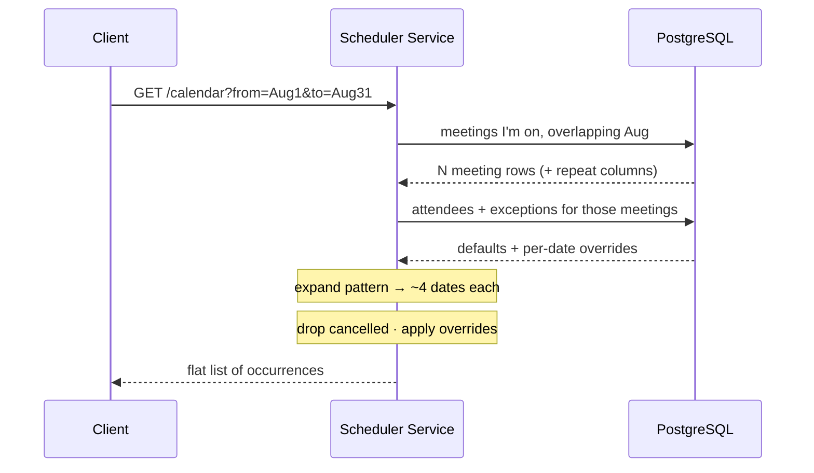
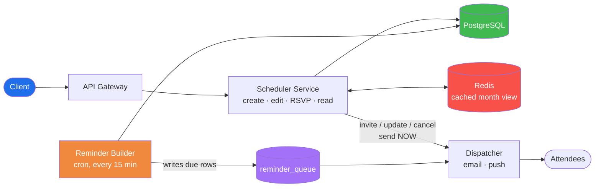
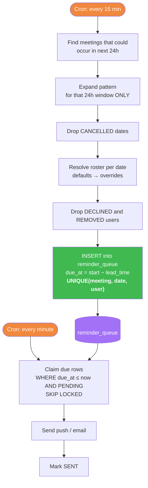
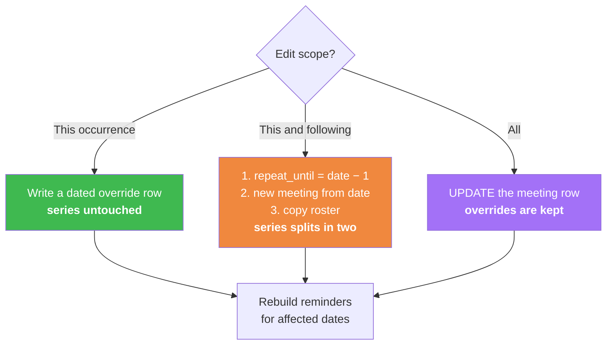

# Meeting Scheduler — System Design (Google Calendar / Outlook)

## TL;DR
* **One idea:** store the repeat **pattern**, not the occurrences. A weekly meeting running forever is **one row**.
* **No RRULE library needed** — four plain columns (`repeat_type`, `repeat_every`, `repeat_days`, `repeat_until`) cover daily / weekly / monthly / forever.
* **Three tables:** `meetings`, `attendees`, `exceptions`.
* **The trick:** `attendees.occurrence_date` is **nullable**. Empty = applies to every occurrence. A date = override for that one date. That's how you add/remove someone from a single occurrence.
* **The rule to memorise:** *no row = inherit from the series.* Removing someone must be an **explicit** `REMOVED` row, never a delete.
* **Reminders** can't be pre-created for infinite meetings — a **rolling 24-hour materializer** turns the pattern into concrete reminder rows, and a dispatcher sends them.

---

## Step 1: Requirements

| | Requirement |
|---|---|
| ✅ | Create a meeting with title, time, duration, attendees |
| ✅ | Meeting can **repeat** — daily, weekly, monthly, or **forever** |
| ✅ | Add or remove an attendee from **one occurrence** without touching the series |
| ✅ | Attendees **accept / reject** — for the series, or for one occurrence |
| ✅ | Load a user's calendar for a date range |
| ✅ | **Notify everyone** — invites, updates, and a reminder before each occurrence |

**The NFR that shapes everything:** reads outnumber writes ~100:1. People stare at calendars; they rarely edit them.

---

## Step 2: The Only Decision That Matters

> **"A weekly meeting with no end date has infinite occurrences. I am not going to store them."**

| | Store every occurrence | Store the pattern ✅ |
|---|---|---|
| Weekly meeting, no end date | **Infinite rows** | 1 row |
| Change time for all future | UPDATE thousands of rows | Update 1 field |
| Create the meeting | 100+ INSERTs | 1 INSERT |
| Load a month | Simple SELECT | SELECT + expand in memory |

Storing the pattern costs a little CPU on read and saves unbounded storage on write. With a 100:1 read ratio that sounds backwards — until you notice expansion is **bounded by the screen**: a month view expands ~4 dates per meeting. Microseconds.

**Say this:** *"Infinity lives in the pattern. Expansion is capped by the window the user is looking at."*

---

## Step 3: The Data Model — 3 Tables



```sql
meetings (
  meeting_id   UUID PRIMARY KEY,
  organizer_id UUID,
  title        TEXT,
  start_utc    TIMESTAMPTZ,   -- the FIRST occurrence
  duration_min INT,
  timezone     TEXT,          -- 'Asia/Kolkata' — needed for DST

  -- recurrence, in plain columns. no library, no parsing.
  repeat_type  TEXT,          -- NONE | DAILY | WEEKLY | MONTHLY
  repeat_every INT  DEFAULT 1,-- 2 = every 2nd week
  repeat_days  TEXT,          -- WEEKLY only: 'MO,WE,FR'
  repeat_until TIMESTAMPTZ    -- NULL = forever
)

attendees (
  meeting_id      UUID,
  user_id         UUID,
  occurrence_date DATE,       -- NULL = every occurrence | date = just that one
  membership      TEXT,       -- ADDED | REMOVED
  rsvp_status     TEXT        -- PENDING | ACCEPTED | DECLINED
)

exceptions (
  meeting_id      UUID,
  occurrence_date DATE,       -- the date the pattern produced
  status          TEXT,       -- CANCELLED | MOVED
  new_start_utc   TIMESTAMPTZ,
  PRIMARY KEY (meeting_id, occurrence_date)
)
```

### What the nullable date buys you

| Row | Meaning |
|---|---|
| `bob · (no date) · ADDED · ACCEPTED` | Bob is on the meeting, accepted, **every** occurrence |
| `bob · Aug 12 · REMOVED` | …except Aug 12, where he isn't invited |
| `carol · Aug 12 · ADDED · PENDING` | Carol is invited to **only** Aug 12 |
| `bob · Aug 19 · ADDED · DECLINED` | Bob's still invited Aug 19, but declined **that date** |

Four requirements, one table.

---

## Step 4: Recurrence Without RRULE

You don't need RFC 5545. Four columns and simple date math cover everything an interview asks for.

| Requirement | Columns |
|---|---|
| One-off meeting | `type=NONE` |
| Every day | `type=DAILY, every=1` |
| Every Tuesday, forever | `type=WEEKLY, every=1, days=TU, until=NULL` |
| Every 2 weeks on Mon + Thu | `type=WEEKLY, every=2, days=MO,TH` |
| Weekdays only | `type=WEEKLY, every=1, days=MO,TU,WE,TH,FR` |
| Monthly on the 5th, until Dec | `type=MONTHLY, every=1, until=Dec 31` |

**Expanding a window — the flow, no library:**

```
1. Clamp the window:  from = max(window_start, meeting.start)
                      to   = min(window_end,   repeat_until or window_end)
                      ← this clamp is what makes "forever" safe

2. Walk the window in the meeting's LOCAL timezone:
     DAILY    → step day by day, keep every Nth day from the start
     WEEKLY   → for each day in range, keep it if
                  (a) its weekday is in repeat_days, and
                  (b) its week number is a multiple of repeat_every
     MONTHLY  → keep the same day-of-month, every Nth month

3. Convert each surviving local date back to UTC
   ← convert AFTER stepping, never before, or DST breaks it

4. Return the list (typically 4–5 dates for a month view)
```

**Why this is enough:** the exotic cases RRULE exists for ("last Friday of the month", "every 3rd weekday") are rare, and an interviewer cares that you *bounded the expansion*, not that you parsed a spec. If asked, say: *"I'd swap these columns for an RRULE string if the product needed full iCalendar interop — the expansion boundary stays identical."*

---

## Step 5: Reading a Calendar



The read is always these six steps, **in this order**:

```
1. FIND    which meetings am I on that could touch this window?
2. EXPAND  run each pattern, only inside the window
3. FILTER  drop dates marked CANCELLED
4. APPLY   guest list = defaults (no date) → then overrides (this date)
5. CHECK   am I still on the list for this date? if not, hide it
6. SORT    return occurrences by start time
```

**Defaults first, overrides second.** That ordering *is* the design.

---

## Step 6: The Four Write Operations

| Action | What gets written | Series touched? |
|---|---|---|
| **Create weekly meeting, forever** | 1 meeting row (`repeat_until = NULL`) + 1 attendee row per person (no date) | — |
| **Remove Bob from Aug 12 only** | 1 attendee row: `bob · Aug 12 · REMOVED` | ❌ No |
| **Bob declines Aug 19 only** | 1 attendee row: `bob · Aug 19 · ADDED · DECLINED` | ❌ No |
| **Cancel Aug 26** | 1 exceptions row: `Aug 26 · CANCELLED` | ❌ No |

A 3-person weekly standup that runs forever is **4 rows**. Removing Bob from one Tuesday makes it **5**.

After that single write:

| Date | Defaults | Overrides | Result |
|---|---|---|---|
| Aug 5 | alice, bob, carol | — | Bob is there |
| **Aug 12** | alice, bob, carol | **bob → REMOVED** | **Bob is gone** |
| Aug 19 | alice, bob, carol | — | Bob is there |
| …forever | | | Bob is there |

> **`ADDED` + `DECLINED` is not the same as `REMOVED`.** Declined = invited but not coming (still on his calendar, greyed out). Removed = not invited (gone from his calendar).

---

## Step 7: Architecture



| Component | Job |
|---|---|
| **Scheduler Service** | Owns the pattern and the expansion. Reads and writes both go through it, so expansion logic lives in exactly one place. |
| **PostgreSQL** | The 3 tables + the reminder queue. |
| **Redis** | Caches the *expanded* month view per user (TTL ~5 min). Reads are 100:1 and expansion is the only real work. Invalidated on any write touching that user. |
| **Reminder Builder** | The scheduler you asked about. Turns infinite patterns into concrete, due-soon reminder rows. Detailed below. |
| **Dispatcher** | The only thing that actually sends. Handles both immediate notifications and due reminders. |

---

## Step 8: Notifications — Two Completely Different Problems

This is where most designs wave their hands. There are **two** kinds, and only one is hard.

| | Trigger | When | Difficulty |
|---|---|---|---|
| **Immediate** | Someone did something — invited, updated, cancelled, RSVP'd | Right now | Easy — you're already in the request |
| **Reminder** | *Nothing happened.* Time simply arrived. | "10 minutes before each occurrence" | **Hard** — the occurrence doesn't exist as a row |

### Why reminders are hard

```
Meeting: "every Tuesday, forever", reminder 10 min before.
→ How many reminders must exist?   ∞
→ How many can you store?          not ∞
```

You cannot pre-create them. But you also can't scan every meeting every minute — with 100M users that's a full table sweep 1,440 times a day.

### The answer: a rolling window materializer

Only ever materialize **the next 24 hours**.



**Two loops, deliberately separate:**

| Loop | Frequency | Job | Why separate |
|---|---|---|---|
| **Builder** | Every 15 min | Pattern → concrete rows for next 24h | Expansion is expensive; doing it hourly is fine |
| **Dispatcher** | Every minute | Send whatever is due | Sending must be punctual; it's a cheap indexed query |

If they were one loop you'd either expand everything every minute (wasteful) or send reminders 15 minutes late (broken).

### The queue table

```sql
reminder_queue (
  meeting_id      UUID,
  occurrence_date DATE,
  user_id         UUID,
  due_at          TIMESTAMPTZ,   -- occurrence start − user's lead time
  status          TEXT,          -- PENDING | SENT
  PRIMARY KEY (meeting_id, occurrence_date, user_id)
)
CREATE INDEX ix_due ON reminder_queue (due_at) WHERE status = 'PENDING';
```

That primary key is doing real work — it makes the builder **idempotent**. Re-running it inserts nothing new (`ON CONFLICT DO NOTHING`), so a crashed or overlapping run is harmless.

### What happens when things change

| Event | Handling |
|---|---|
| Meeting time changed | Delete `PENDING` rows for affected dates; next builder pass regenerates them |
| Occurrence cancelled | Delete `PENDING` rows for that date |
| Attendee removed from one date | Delete that user's `PENDING` row for that date |
| Attendee added < 24h before | The write path materializes their reminder immediately, rather than waiting for the next builder tick |
| Builder crashes mid-run | Rows are `PENDING`; the unique key means the retry can't duplicate |
| Dispatcher crashes after sending | Worst case a duplicate send — dedupe on `(meeting, date, user)` at the notification layer |
| Two dispatchers run at once | `SKIP LOCKED` means each row is claimed by exactly one worker |

### Why bound it at 24 hours

| Window | Queue size | Rebuild cost |
|---|---|---|
| Forever | ∞ | impossible |
| 1 year | billions of rows | huge |
| **24 hours** | **bounded by real meetings/day** | **small, and self-healing** |

Short window = small table, and edits mostly land *before* materialization, so there's less to clean up. It also means a bad deploy only corrupts one day of reminders, and the next run repairs it.

> **Alternative worth naming:** a Redis sorted set scored by `due_at`, popped with `ZRANGEBYSCORE`. Faster, but you lose durability and easy inspection. Postgres + `SKIP LOCKED` is the boring, correct default.

### Immediate notifications
Invites, updates, cancellations and RSVP changes are just fan-outs on the write path — resolve the roster for the affected date(s), hand the list to the Dispatcher, return. Keep it off the critical path (queue it) so creating a meeting stays fast.

---

## Step 9: Editing — "This / This and Following / All"



**Why "this and following" must split:** a single pattern can't say *"different from here onward."* So you end the old pattern with `repeat_until` and start a new meeting from that date. Past exceptions stay attached to the old meeting — correct, because they describe the past.

---

## Step 10: Three Gotchas

**① Removal must be written, never deleted.**
No row means *inherit from the series*. Delete Bob's Aug 12 override and the default silently re-adds him. Only someone who was `ADDED` for a single date can safely be deleted.
> The #1 bug in this design — naming it is a strong interview signal.

**② Expand in local time, then convert to UTC.**
"10:00 every Tuesday" must **stay** 10:00 across a daylight-saving switch — meaning the true UTC instant shifts by an hour. Repeatedly adding "7 days" to a UTC timestamp drifts the meeting to 9:00 or 11:00.

**③ Editing the series doesn't erase overrides.**
Move the series 10:00 → 11:00 and a Tuesday someone dragged to 15:00 **stays at 15:00**. They overrode it deliberately. (Some products prompt *"reset overrides?"* — a product call, not a technical one.)

---

## Interview Cheat Sheet

**What you draw (5 min, two pictures):** the 3-table diagram from Step 3, and the architecture from Step 7. If reminders come up, add the two-loop builder/dispatcher sketch.

| Question | Answer |
|---|---|
| How do you store a recurring meeting? | One row with repeat columns. Occurrences are computed on read, never stored. |
| A weekly meeting with no end date? | `repeat_until = NULL`. Still one row — infinity is in the pattern, not the table. |
| Do you need RRULE? | No. Four columns cover daily/weekly/monthly. Swap in RRULE only if you need iCalendar interop. |
| Remove one person from one occurrence? | One attendee row with that date and `membership = REMOVED`. |
| Why is `occurrence_date` nullable? | Empty = default for all occurrences; a date = override for that date. One table instead of two. |
| Why can't you DELETE to remove someone? | No row means "inherit from the series", so the default re-adds them. |
| **Where do reminders come from?** | **A builder cron materializes only the next 24h of occurrences into a queue; a dispatcher sends what's due each minute.** |
| Why not scan all meetings every minute? | Full-table sweep 1,440×/day. The builder expands once per 15 min into a bounded queue instead. |
| How are reminders idempotent? | `PRIMARY KEY (meeting, date, user)` + `ON CONFLICT DO NOTHING`, so re-runs are safe. |
| Two dispatchers at once? | `SELECT … FOR UPDATE SKIP LOCKED` — each row is claimed once. |
| "This and following"? | End the old pattern with `repeat_until`, start a new meeting from that date, copy the roster. |
| Biggest trap? | Expanding in UTC and breaking DST. Expand in the meeting's local timezone. |
