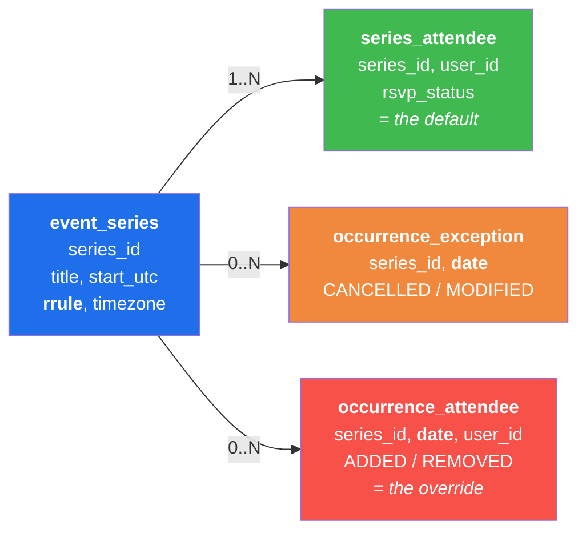
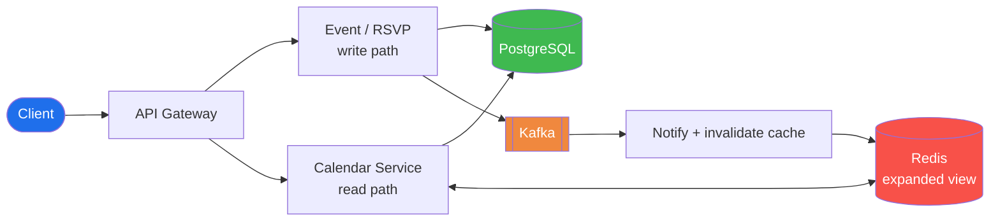
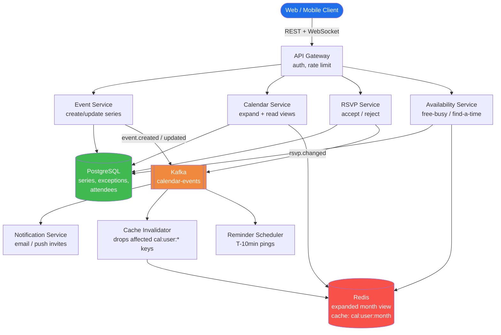
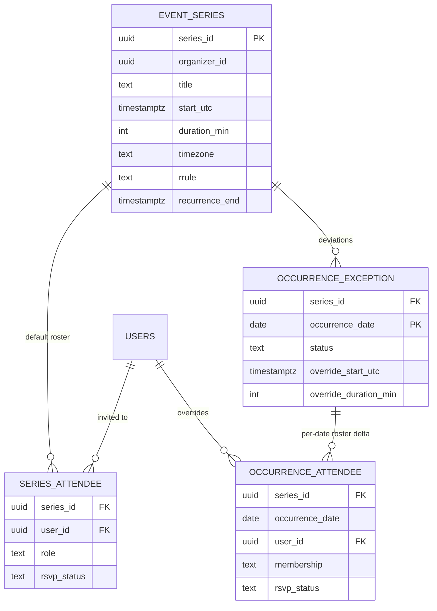
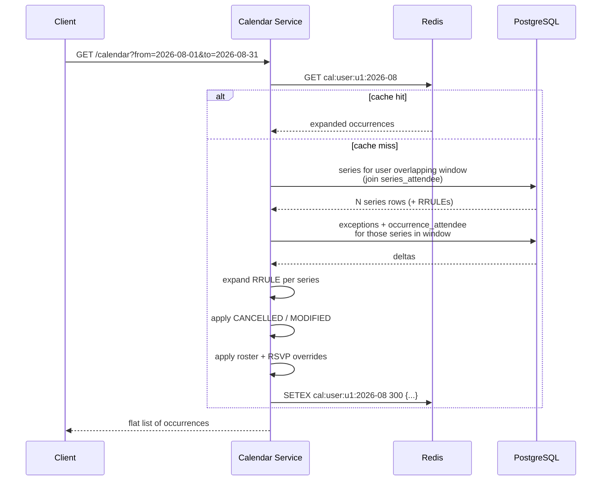
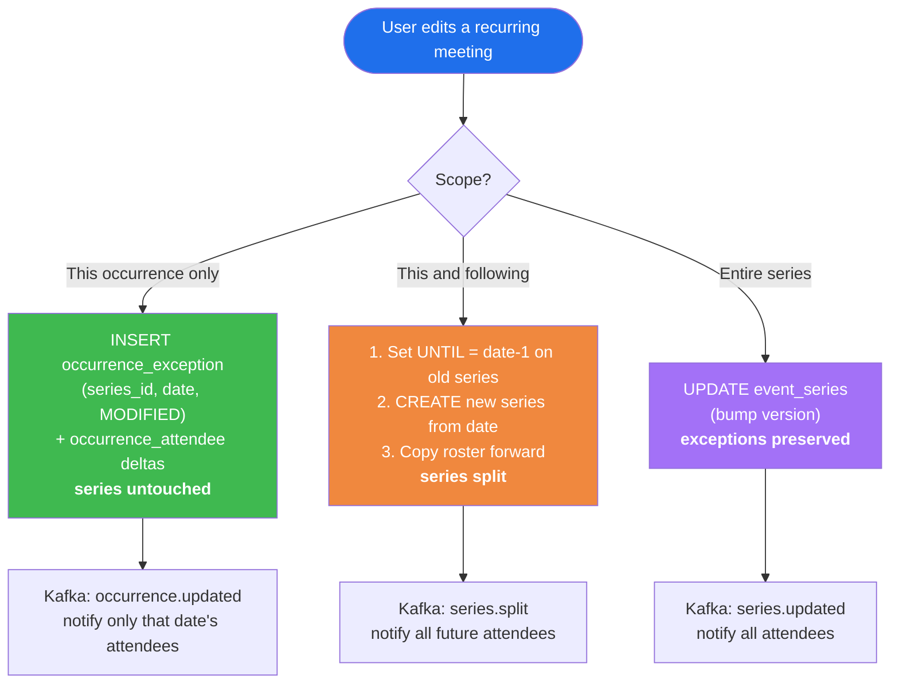
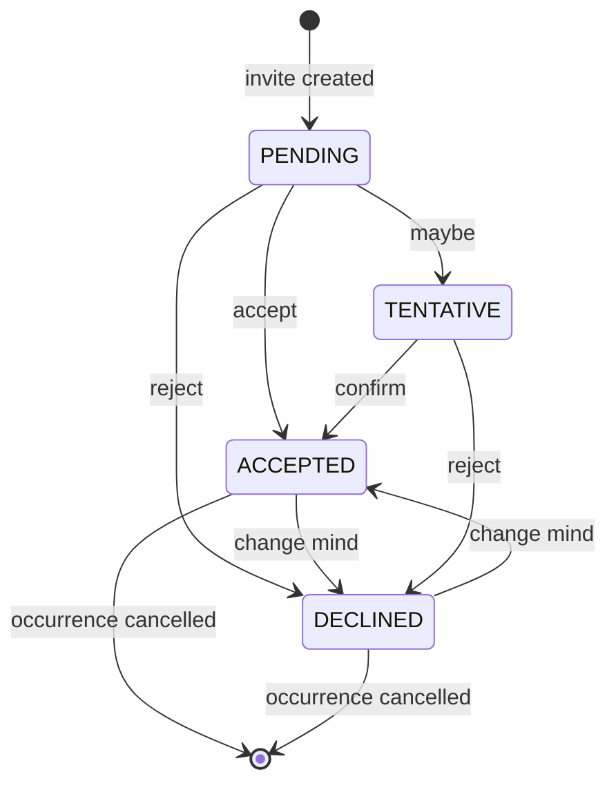
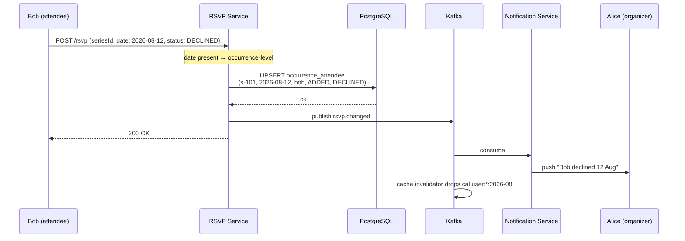

# Meeting Scheduler — System Design (Google Calendar / Outlook)

## TL;DR
* **Core challenge**: A weekly meeting running for 2 years is **one row**, not 104 rows. Never materialise every occurrence.
* **Recurrence model**: Store an **RRULE** (RFC 5545) on the series + an **exceptions table** for occurrences that differ.
* **Per-occurrence edits**: "Remove Bob from *this* Tuesday only" creates an **exception row** keyed by `(series_id, occurrence_date)` — the series itself is untouched.
* **RSVP**: Attendee status lives on `series_attendees` (default for all occurrences) and is **overridden** by `occurrence_attendees` for a single date.
* **Reads**: Expanding a recurrence for a date range is CPU work, not I/O — cache the expanded month view per user in Redis.
* **Conflicts**: Free/busy check = expand all series overlapping the window, then interval-overlap test.

---

## Interview Reality Check — What You Actually Draw in 45 Minutes

> **Honest answer: you cannot produce this whole page in an interview.** This document is the *study reference*. Below is the *interview script* — what fits, in what order, and what you only mention if asked.

### The 45-minute budget

| Time | Phase | What you produce |
|---|---|---|
| 0–5 min | Requirements | 4 bullet FRs, 2 NFRs. **Say the read:write ratio out loud.** |
| 5–8 min | The key insight | "I will not store one row per occurrence." Draw nothing yet — just say it. |
| 8–18 min | Data model | 4 boxes on the board (below). This is where you win. |
| 18–28 min | Architecture | 6 boxes, one arrow each (below). Keep it boring. |
| 28–40 min | Deep dive | Interviewer picks. Usually "remove a user from one occurrence". |
| 40–45 min | Scale + trade-offs | Cache, shard key, one thing you'd do differently. |

### Diagram 1 — the only data model you draw (≈3 minutes)



**Narrate while drawing:** "Series holds the rule. Series-attendee is the default roster. The two orange/red tables only get rows when a *single date* deviates — that's how I add or remove someone from one occurrence without touching the series."

That sentence alone answers three of the four functional requirements.

### Diagram 2 — the only architecture you draw (≈3 minutes)



Six boxes. **Split write path from read path** — that split is the point, because reads outnumber writes 100:1 and reads do the expensive expansion work.

### What to say vs. what to skip

| ✅ Say it unprompted (these are the scoring lines) | ⏸️ Only if asked / if time allows |
|---|---|
| "I store the rule, not the occurrences." | Full RRULE syntax table |
| "Series is the default, occurrence is the override." | The 5-step expansion pseudocode |
| "Absence of a row means *inherit from series*, so removal must be an **explicit** `REMOVED` row." | ER diagram with every column typed |
| "'This and following' splits the series with `UNTIL`." | Find-a-time interval sweep |
| "Expansion happens in the series' local timezone, not UTC — otherwise DST breaks it." | Reminder scheduler, sharding scheme |
| "Reads are cached per user-per-month and invalidated off Kafka." | Optimistic locking / version column |

### The three questions you will actually be asked

1. **"Remove Bob from just next Tuesday — what writes happen?"**
   → One `occurrence_attendee` row: `(series_id, 2026-08-12, bob, REMOVED)`. Series untouched. Every other Tuesday still has Bob.

2. **"The organiser moves the whole series to 11:00, but one occurrence was already moved to 15:00. What happens?"**
   → It stays at 15:00. An explicit per-date override outranks a series-level change. Say this is a *product* decision you'd confirm, not just a technical one.

3. **"How do you load a month view fast?"**
   → Fetch series overlapping the window → expand each rule in-memory → apply exceptions → apply roster deltas → cache the result. It's CPU, not I/O, and it's bounded by the window.

### If the interviewer says "keep it simple"
Drop Kafka, drop Redis, drop the Availability Service. The design still stands on **`event_series` + `occurrence_exception` + `occurrence_attendee`**. Those three tables *are* the answer; everything else is scaling garnish you add when asked "now make it work for 100M users."

---


### Functional Requirements
| Priority | Requirement |
|---|---|
| ✅ Core | User creates a meeting with a title, time, duration, and attendees |
| ✅ Core | Meeting can **recur** — daily / weekly / every 2nd Tuesday / until a date |
| ✅ Core | User can **add or remove an attendee from a single occurrence** without touching the series |
| ✅ Core | Attendees can **accept / reject / tentatively accept** — per series or per occurrence |
| ✅ Core | User sees their calendar for a date range (day / week / month) |
| 🔲 Secondary | Free/busy conflict detection and "find a time" suggestions |
| 🔲 Out of scope | Video-conference link provisioning, room/resource booking |

### Non-Functional Requirements
| Requirement | Target |
|---|---|
| Read:write ratio | ~100:1 — calendars are viewed far more than edited |
| Calendar load latency | < 200 ms for a month view |
| Consistency | Read-your-writes for the organiser; eventual for other attendees' RSVP badges |
| Correctness | An occurrence must **never** silently lose an attendee edit |
| Scale | 100M users, avg 20 meetings/week each |

---

## Step 2: The Central Modelling Decision

> **Interview signal:** the first thing to say out loud is *"I will not store one row per occurrence."*

### ❌ Option A — Materialise every occurrence
Create a row for every Tuesday for the next 2 years.

| Problem | Why it hurts |
|---|---|
| Storage | A weekly meeting with no end date is **infinite** rows |
| Edits | "Change the time for all future" = UPDATE across thousands of rows |
| Writes | Creating one recurring meeting = 100+ inserts |

### ✅ Option B — Store the rule, expand on read
One `event_series` row holding an **RRULE**, plus small exception rows.

| Benefit | Why |
|---|---|
| Storage | O(1) per series, O(edits) for exceptions |
| Edits | "All future" = update one rule (or split the series) |
| Reads | Expansion is pure CPU over a bounded window (a month) — microseconds |

**Say this:** "I store the recurrence rule, not the occurrences. Occurrences are *derived* on read for the requested window, and only the ones that deviate get persisted as exceptions."

---

## Step 3: High-Level Architecture



### What each component does

**Event Service** — owns series creation and mutation. Decides whether an edit applies to *this occurrence*, *this and following*, or *the whole series*, and writes the right rows.

**Calendar Service** — the read path. Takes `(userId, from, to)`, loads every series the user is on that could overlap the window, expands the RRULE, applies exceptions, and returns a flat list of occurrences.

**RSVP Service** — writes accept/reject at series or occurrence granularity. Kept separate from Event Service because RSVP is a **high-frequency, low-privilege** write that must not contend with organiser edits.

**Availability Service** — reuses the expansion logic to answer "is this person free at 3pm?" and to suggest slots.

**Kafka** — decouples notification, cache invalidation, and reminders from the write path so creating a meeting stays fast.

**Redis** — caches the *expanded* month view per user (`cal:user:{id}:2026-08`). Expansion is cheap, but doing it for 100M users on every scroll is not.

---

## Step 4: Data Model



### Tables

```sql
-- The rule. ONE row for "every Tuesday 10:00 forever".
event_series (
  series_id       UUID PRIMARY KEY,
  organizer_id    UUID NOT NULL,
  title           TEXT NOT NULL,
  description     TEXT,
  start_utc       TIMESTAMPTZ NOT NULL,   -- first occurrence
  duration_min    INT NOT NULL,
  timezone        TEXT NOT NULL,          -- 'Asia/Kolkata' — needed for DST
  rrule           TEXT,                   -- NULL = single, non-recurring meeting
  recurrence_end  TIMESTAMPTZ,            -- NULL = never ends
  created_at      TIMESTAMPTZ DEFAULT now(),
  version         INT DEFAULT 1           -- optimistic locking
)

-- Only rows for occurrences that DEVIATE from the rule.
occurrence_exception (
  series_id            UUID REFERENCES event_series(series_id),
  occurrence_date      DATE NOT NULL,     -- the ORIGINAL date the rule produced
  status               TEXT CHECK (status IN ('MODIFIED','CANCELLED')),
  override_start_utc   TIMESTAMPTZ,       -- NULL = time unchanged
  override_duration_min INT,
  override_title       TEXT,
  PRIMARY KEY (series_id, occurrence_date)
)

-- Default roster: applies to EVERY occurrence unless overridden.
series_attendee (
  series_id   UUID REFERENCES event_series(series_id),
  user_id     UUID NOT NULL,
  role        TEXT CHECK (role IN ('ORGANIZER','REQUIRED','OPTIONAL')),
  rsvp_status TEXT CHECK (rsvp_status IN ('PENDING','ACCEPTED','DECLINED','TENTATIVE'))
              DEFAULT 'PENDING',
  PRIMARY KEY (series_id, user_id)
)

-- Roster DELTA for one specific date. This is the "add/remove user
-- from one occurrence" feature and the per-occurrence RSVP.
occurrence_attendee (
  series_id       UUID,
  occurrence_date DATE,
  user_id         UUID,
  membership      TEXT CHECK (membership IN ('ADDED','REMOVED')),
  rsvp_status     TEXT CHECK (rsvp_status IN ('PENDING','ACCEPTED','DECLINED','TENTATIVE')),
  PRIMARY KEY (series_id, occurrence_date, user_id)
)

-- Read-path index: find every series a user belongs to, fast.
CREATE INDEX idx_series_attendee_user ON series_attendee(user_id);
CREATE INDEX idx_series_window ON event_series(start_utc, recurrence_end);
```

> **Why `occurrence_date` and not `occurrence_id`?** The date produced by the rule is the *natural, stable key*. If the occurrence is later moved to a different time, the key still refers to the original slot — which is exactly how RFC 5545 `RECURRENCE-ID` works.

---

## Step 5: Recurrence — RRULE

Rather than inventing a format, use **RFC 5545 RRULE** (the iCalendar standard). Every calendar client already speaks it.

| Requirement | RRULE |
|---|---|
| Every week on Tuesday | `FREQ=WEEKLY;BYDAY=TU` |
| Every weekday | `FREQ=WEEKLY;BYDAY=MO,TU,WE,TH,FR` |
| Every 2 weeks, Mon + Thu | `FREQ=WEEKLY;INTERVAL=2;BYDAY=MO,TH` |
| 2nd Tuesday of every month | `FREQ=MONTHLY;BYDAY=2TU` |
| Last Friday monthly, 12 times | `FREQ=MONTHLY;BYDAY=-1FR;COUNT=12` |
| Daily until 31 Dec 2026 | `FREQ=DAILY;UNTIL=20261231T235959Z` |

```python
from dateutil.rrule import rrulestr

def expand(series, window_start, window_end):
    """Materialise occurrence datetimes for a bounded window only."""
    if not series.rrule:                       # single meeting
        return [series.start_utc] if window_start <= series.start_utc <= window_end else []

    rule = rrulestr(series.rrule, dtstart=series.start_utc)
    return list(rule.between(window_start, window_end, inc=True))
```

### The timezone trap (interviewers love this)
Store `start_utc` **and** the organiser's IANA `timezone`. A "10:00 every Tuesday" meeting must stay at 10:00 local across a DST shift — which means the UTC instant changes by an hour. Expanding purely in UTC silently drifts the meeting. **Expand in the series' local timezone, then convert each occurrence to UTC.**

---

## Step 6: Read Path — Loading a Calendar



The expansion algorithm, in order — **order matters**:

```python
def calendar_view(user_id, window_start, window_end):
    out = []
    for series in series_for_user(user_id, window_start, window_end):
        exceptions = load_exceptions(series.series_id, window_start, window_end)
        deltas     = load_occurrence_attendees(series.series_id, window_start, window_end)

        for dt in expand(series, window_start, window_end):
            key = dt.date()
            exc = exceptions.get(key)

            # 1. Cancelled for this date only → skip entirely
            if exc and exc.status == 'CANCELLED':
                continue

            occ = Occurrence(
                series_id = series.series_id,
                date      = key,
                start     = (exc.override_start_utc if exc and exc.override_start_utc else dt),
                duration  = (exc.override_duration_min if exc else None) or series.duration_min,
                title     = (exc.override_title if exc else None) or series.title,
            )

            # 2. Start from the series roster
            roster = {a.user_id: a.rsvp_status for a in series.attendees}

            # 3. Apply the per-date roster delta
            for d in deltas.get(key, []):
                if d.membership == 'REMOVED':
                    roster.pop(d.user_id, None)
                else:
                    roster[d.user_id] = d.rsvp_status or 'PENDING'

            # 4. Per-occurrence RSVP overrides the series RSVP
            for d in deltas.get(key, []):
                if d.membership == 'ADDED' or d.user_id in roster:
                    if d.rsvp_status:
                        roster[d.user_id] = d.rsvp_status

            # 5. The viewer may have been removed from just this date
            if user_id not in roster:
                continue

            occ.attendees = roster
            out.append(occ)
    return sorted(out, key=lambda o: o.start)
```

**The rule to state in the interview:** *series is the default, occurrence is the override.* Everything is a resolution of `series value → exception override → occurrence-attendee override`.

---

## Step 7: Editing an Occurrence — the "This / This-and-Following / All" Problem

Every calendar app asks this question. Each answer maps to a different write.



### Add / remove a user from ONE occurrence

This is the requirement that the exceptions model exists for.

```sql
-- Remove Bob from ONLY Tuesday 12 Aug 2026
INSERT INTO occurrence_attendee (series_id, occurrence_date, user_id, membership)
VALUES ('s-101', '2026-08-12', 'u-bob', 'REMOVED')
ON CONFLICT (series_id, occurrence_date, user_id)
DO UPDATE SET membership = 'REMOVED';

-- Add Carol to ONLY that same Tuesday
INSERT INTO occurrence_attendee (series_id, occurrence_date, user_id, membership, rsvp_status)
VALUES ('s-101', '2026-08-12', 'u-carol', 'ADDED', 'PENDING')
ON CONFLICT (series_id, occurrence_date, user_id)
DO UPDATE SET membership = 'ADDED';
```

Nothing in `event_series` or `series_attendee` changes. Every other Tuesday still has Bob and not Carol. **Two small rows express a change to one date out of infinity.**

### Cancel a single occurrence
```sql
INSERT INTO occurrence_exception (series_id, occurrence_date, status)
VALUES ('s-101', '2026-08-19', 'CANCELLED');
```
The expansion loop skips it. The rule still generates 26 Aug normally.

### Why "this and following" splits the series
You cannot express "different from this date onward" with one rule plus exceptions without writing an exception for every remaining date. So: bound the old series with `UNTIL = date - 1`, create a new series starting at `date`, and carry the roster over. Old exceptions before the split point stay attached to the old series — which is correct, because they describe the past.

---

## Step 8: RSVP — Accept / Reject



Two granularities, resolved in this order:

| Write | Table | Meaning |
|---|---|---|
| "Accept the whole series" | `series_attendee.rsvp_status` | Default answer for every occurrence |
| "Decline just next Tuesday" | `occurrence_attendee.rsvp_status` (`membership='ADDED'`, i.e. still invited) | Overrides the series answer for that date only |



**Idempotency:** RSVP endpoints are `UPSERT` on the primary key, so a double-tap or a client retry is naturally safe — no idempotency key needed. Contrast with meeting *creation*, which does need one.

---

## Step 9: Conflict Detection & Find-a-Time

```python
def is_free(user_id, start, end):
    for occ in calendar_view(user_id, start - MAX_DURATION, end):
        if occ.rsvp_of(user_id) == 'DECLINED':
            continue                                  # declined ≠ busy
        if occ.start < end and start < occ.end:       # interval overlap
            return False
    return True
```

The overlap test is the classic `a.start < b.end AND b.start < a.end`. Note the window is widened by `MAX_DURATION` on the left — a 3-hour meeting starting *before* your window can still overlap it.

**Find-a-time** for N attendees: expand each attendee's calendar for the search window, merge all busy intervals, sort by start, sweep to find gaps ≥ the requested duration. This is why the expansion result is cached — a 10-person "find a time" is 10 calendar loads.

---

## Step 10: Scaling

| Concern | Approach |
|---|---|
| **Read amplification** | Cache the expanded view per `user + month` in Redis (TTL 5 min). Invalidate via the Kafka `calendar-events` consumer, not TTL alone. |
| **Sharding** | Shard by `user_id` for the attendee-index path; series rows replicated/looked up by `series_id`. A meeting spanning shards is read by fan-out over attendee shards. |
| **Hot calendars** | Meeting-room and shared "team" calendars have thousands of readers → cache aggressively, serve from a read replica. |
| **Unbounded recurrence** | Cap expansion at the requested window; never expand "forever". Reject windows > 1 year. |
| **Reminder fan-out** | A separate scheduler consumes `calendar-events`, expands only the **next 24 hours**, and enqueues delayed jobs — the DB is never polled per-minute. |
| **Concurrent edits** | Optimistic locking with `event_series.version`; a stale write returns 409 and the client re-fetches. |

---

## Deep Dives

### Why not just store occurrences and be done with it?
For a *fixed, short* series (a 6-week course) materialising is genuinely fine and simpler. The rule-based model earns its complexity when series are **open-ended** or **long**. A good answer names this trade-off rather than treating rule-expansion as universally correct: *"I'd materialise if every series had a hard, short bound; I'm choosing rules because 'weekly standup, no end date' is the common case."*

### What happens to exceptions when the series is edited?
Keep them. If the organiser moves the whole series from 10:00 to 11:00, an occurrence that was individually moved to 15:00 **stays at 15:00** — the user explicitly overrode that date. This is what real calendars do, and stating it shows you've thought past the happy path. (Some products prompt "reset overrides?" — mention it as a product decision, not a technical one.)

### Deleting an attendee who was added to only one occurrence
`membership` flips from `ADDED` to `REMOVED` — or the row is deleted, since absence from `occurrence_attendee` means "fall back to the series roster", and they were never on it. Deleting is cleaner. But if they were on the **series** roster, you must write an explicit `REMOVED` row; deleting would silently re-add them.

> This asymmetry is the single most common bug in this design. **Absence means "inherit from series", so removal must be explicit.**

### Why is RSVP a separate service?
Volume and blast radius. Every invited user RSVPs, so RSVP writes outnumber organiser edits by an order of magnitude, and an RSVP must never lock a row the organiser is editing. Separate services also let you scale and rate-limit them independently.

### Timezone + DST, concretely
A weekly 10:00 IST meeting has no DST problem (India has no DST). The same meeting for a New York organiser shifts UTC instant by one hour in March and November. Expand in local time using the stored IANA zone, then convert — never add `7 * 24h` to a UTC timestamp.

---

## Interview Cheat Sheet

| Question | One-line answer |
|---|---|
| How do you store a recurring meeting? | One series row with an RFC 5545 RRULE — occurrences are derived on read, not stored. |
| How do you edit one occurrence? | Write an `occurrence_exception` row keyed by `(series_id, original_date)`; the series is untouched. |
| How do you remove one person from one date? | An `occurrence_attendee` row with `membership='REMOVED'` — the series roster is the default, the delta is the override. |
| Why must removal be an explicit row? | Because "no row" means "inherit the series roster", so deleting would re-add them. |
| How does "this and following" work? | Set `UNTIL` on the old series, create a new series from that date, copy the roster. |
| Per-occurrence RSVP? | `occurrence_attendee.rsvp_status` overrides `series_attendee.rsvp_status` for that date only. |
| How do you keep reads fast? | Cache the expanded month view per user in Redis; invalidate from the Kafka event stream. |
| Biggest trap? | Expanding recurrence in UTC and breaking DST — expand in the series' local timezone. |
