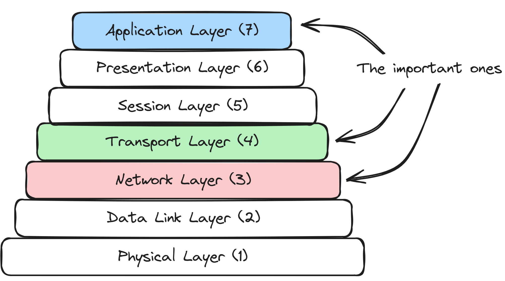
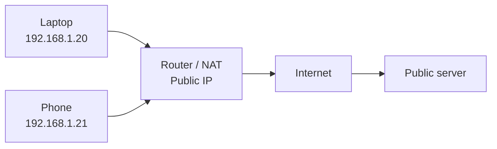
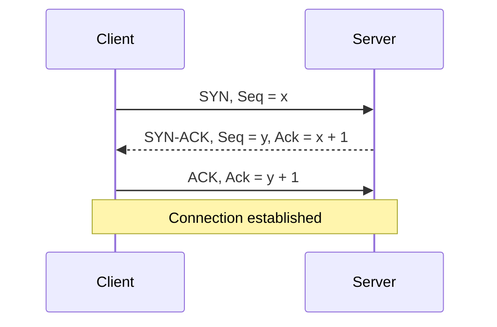
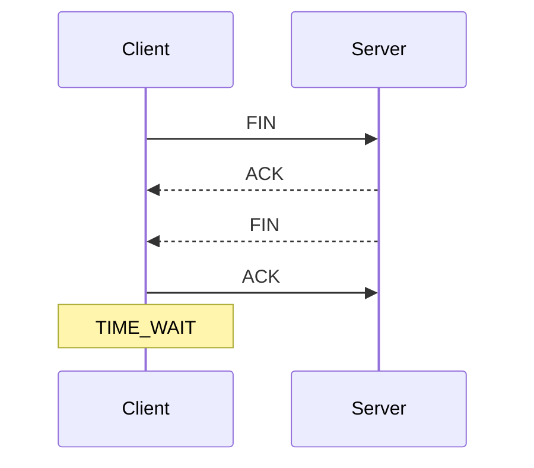
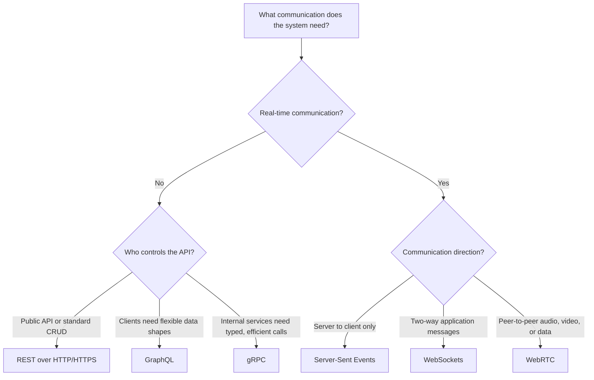
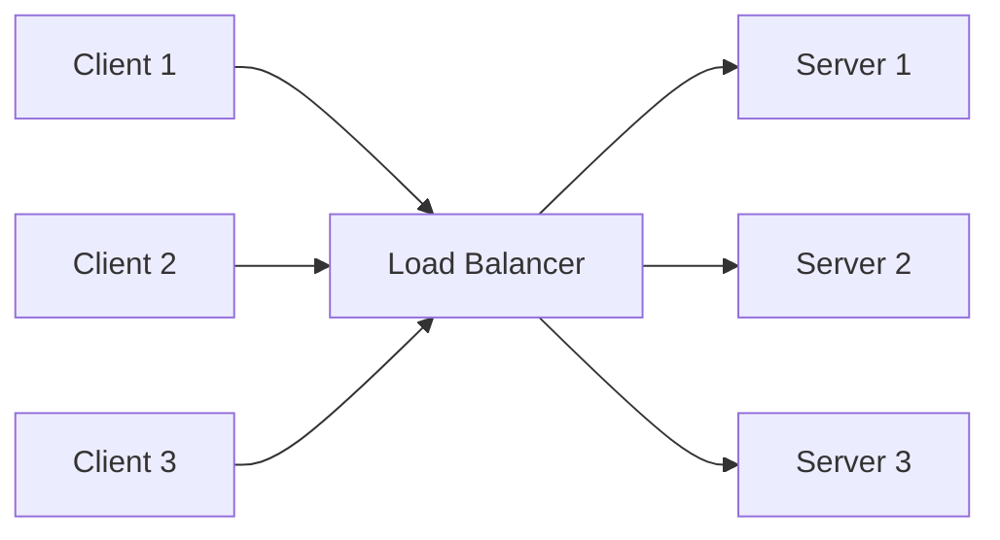

# Networking - Quick Reference for Interviews

Use this note to revise the path a request takes through a network, the differences between TCP and UDP, and the most common application-layer communication choices.

> **Interview focus:** Be able to explain what happens when you enter a URL, why TCP is reliable, when UDP is preferred, and how REST, gRPC, SSE, WebSockets, and WebRTC differ.

## The 7 OSI Layers

The **OSI (Open Systems Interconnection) model** divides network communication into seven conceptual layers. Each layer has a specific responsibility and communicates with the layers directly above and below it.



### Mnemonic

From **Layer 7 to Layer 1**:

> **All People Seem To Need Data Processing**

| Word | Layer |
|---|---|
| **All** | Application |
| **People** | Presentation |
| **Seem** | Session |
| **To** | Transport |
| **Need** | Network |
| **Data** | Data Link |
| **Processing** | Physical |

**Layer 7 - Application**

Provides network services directly to user-facing applications. Protocols such as HTTP, DNS, SMTP, and FTP operate here.

**Layer 6 - Presentation**

Transforms data into a format the application can understand. It handles concerns such as encoding, serialization, compression, and encryption.

**Layer 5 - Session**

Creates, manages, and terminates communication sessions between applications. It also helps with dialog control and session recovery.

**Layer 4 - Transport**

Provides end-to-end communication between processes using **port numbers**. TCP adds reliability and ordering, while UDP favors low overhead and speed.

**Layer 3 - Network**

Moves packets between different networks using logical addresses such as IPv4 and IPv6. Routers operate primarily at this layer.

**Layer 2 - Data Link**

Transfers frames between devices on the same local network using MAC addresses. Ethernet switches operate primarily at this layer.

**Layer 1 - Physical**

Transmits raw bits through cables, fiber, or radio signals. It defines the physical medium, connectors, voltage, frequency, and signaling.

### OSI Encapsulation

As data moves down the sender's stack, each layer adds control information. The receiver removes it in reverse order.

```text
Application data
    -> Transport segment/datagram
    -> Network packet
    -> Data-link frame
    -> Physical bits
```

> **Interview shortcut:** Application creates the data, Transport connects processes, Network routes between networks, Data Link delivers on the local network, and Physical transmits the bits.

## Network Layer and Addressing

The network layer is responsible for logical addressing and routing packets between networks. Its central protocol is **IP (Internet Protocol)**.

### Private IP Address

A **private IP address** identifies a device inside a private network such as a home, office, or cloud virtual network. It is not directly routable on the public internet and may be reused by many independent networks.

Private IPv4 ranges:

| Range | CIDR | Common environment |
|---|---|---|
| `10.0.0.0` - `10.255.255.255` | `10.0.0.0/8` | Large enterprise and cloud networks |
| `172.16.0.0` - `172.31.255.255` | `172.16.0.0/12` | Enterprise and container networks |
| `192.168.0.0` - `192.168.255.255` | `192.168.0.0/16` | Home and small office networks |

**Example:** A laptop may have the private address `192.168.1.20` inside a home Wi-Fi network.

### Public IP Address

A **public IP address** is globally unique and routable over the internet. It is normally assigned to an internet-facing router, load balancer, server, or NAT gateway by an ISP or cloud provider.

**Example:** A public web server might be reachable through `203.0.113.10`.

> The example range `203.0.113.0/24` is reserved for documentation and should not be used as a real destination.

### When Are Private and Public IPs Used Together?

Most client devices use a private IP internally and share a public IP when communicating with the internet. A router or gateway performs **Network Address Translation (NAT)**.



- **Outbound traffic:** NAT replaces the device's private source address with the gateway's public address and tracks the connection.
- **Return traffic:** The gateway uses its translation table to send the response back to the correct private device.
- **Inbound traffic:** An internal service normally needs port forwarding, a reverse proxy, a load balancer, or another explicit mapping to be reachable publicly.

> **Interview focus:** Private IPs conserve IPv4 addresses and isolate internal addressing. NAT provides translation, but it is not a replacement for a firewall.

### DNS - Domain Name System

**DNS** translates human-readable domain names such as `example.com` into IP addresses that computers use for routing.

It lets services change IP addresses without changing their domain names and can return multiple addresses for load distribution and resilience.

```text
Browser cache -> OS cache -> DNS resolver -> authoritative DNS server -> IP address
```

DNS is an **application-layer protocol**. It commonly uses UDP port `53`, while TCP is used for cases such as larger responses and zone transfers.

## Transport Layer Protocols

The transport layer provides process-to-process communication. It uses **ports** to deliver incoming data to the correct application.

### TCP - Transmission Control Protocol

**TCP** is a connection-oriented transport protocol that provides reliable, ordered, and duplicate-free delivery of a byte stream.

TCP achieves reliability through:

- Sequence numbers that identify bytes and restore ordering.
- Acknowledgements that confirm received data.
- Retransmission when data appears to be lost.
- Checksums that detect corruption.
- Flow control that protects a slow receiver.
- Congestion control that reduces pressure on the network.

TCP does not preserve application message boundaries. Applications must define framing through mechanisms such as content length, delimiters, or length-prefixed messages.

### TCP Three-Way Handshake

Before sending application data, TCP establishes a connection and synchronizes sequence numbers.



1. **SYN:** The client asks to start a connection and sends its initial sequence number.
2. **SYN-ACK:** The server acknowledges the client and sends its own initial sequence number.
3. **ACK:** The client acknowledges the server. Both sides can now exchange data.

> **Why three messages?** Both sides must confirm that they can send and receive and must acknowledge each other's initial sequence number.

### TCP Connection Teardown

TCP is full duplex, so each direction closes independently. A graceful close usually requires four messages.



1. One side sends **FIN**, meaning it has no more data to send.
2. The peer sends **ACK**, confirming that half of the connection is closed.
3. When ready, the peer sends its own **FIN**.
4. The original side sends the final **ACK** and temporarily enters `TIME_WAIT`.

`TIME_WAIT` allows delayed packets from the old connection to expire and gives the final ACK time to be retransmitted if necessary.

> A **RST** closes a connection immediately rather than performing a graceful teardown. It may indicate an invalid connection, an unavailable port, or an application abort.

### UDP - User Datagram Protocol

**UDP** is a connectionless transport protocol that sends independent datagrams without establishing a connection or guaranteeing delivery, ordering, or duplicate protection.

#### Key Characteristics of UDP

- No handshake before sending data.
- Best-effort delivery; packets may be lost or duplicated.
- Packets may arrive out of order.
- Preserves datagram boundaries.
- No built-in retransmission, flow control, or congestion control.
- Small fixed header of **8 bytes**.
- Supports broadcast and multicast where the network allows them.
- Applications can add only the reliability features they need.

#### Where Is UDP Used?

- **Live video and audio:** Late data may be less useful than dropped data.
- **Online gaming:** Low latency is more important than retransmitting every position update.
- **VoIP:** A brief missing audio packet is preferable to delayed conversation.
- **DNS lookups:** Most small queries and responses fit efficiently in one datagram.
- **DHCP and service discovery:** Broadcast and multicast are useful before a host knows its network configuration.
- **QUIC / HTTP/3:** QUIC builds reliable, secure, multiplexed communication in user space on top of UDP.

> **Important:** UDP itself is not automatically faster. Its smaller protocol overhead and lack of connection setup can reduce latency, but the application's design and network conditions determine actual performance.

### TCP vs UDP Comparison

| Feature | UDP | TCP |
|---|---|---|
| Connection | Connectionless | Connection-oriented |
| Reliability | Best-effort delivery | Reliable delivery with acknowledgements and retransmission |
| Ordering | No ordering guarantee | Maintains byte-stream order |
| Data model | Individual datagrams | Continuous byte stream |
| Flow control | No | Yes |
| Congestion control | No built-in mechanism | Yes |
| Header size | 8 bytes | 20-60 bytes |
| Setup | No handshake | Three-way handshake |
| Broadcast / multicast | Supported | Not supported |
| Typical latency | Lower protocol overhead | More overhead for reliability |
| Common uses | Streaming, gaming, VoIP, DNS, QUIC | HTTP/1.1, HTTP/2, SSH, email, file transfer, databases |

#### How to Choose

- Choose **TCP** when correctness, complete delivery, and ordering matter more than occasional delay.
- Choose **UDP** when low latency, independent messages, multicast, or application-controlled reliability is more important.
- Choose a protocol built above them when possible; application developers rarely implement raw TCP or UDP behavior from scratch.

## Application Layer Protocols

The application layer defines how software services exchange meaningful requests, responses, events, media, and messages.

### How to Choose an Application Protocol



| If you need... | Start with... |
|---|---|
| A conventional public or CRUD API | REST |
| Client-controlled fields from connected data | GraphQL |
| Fast, strongly typed internal service calls | gRPC |
| One-way live updates from server to browser | SSE |
| Persistent two-way messaging | WebSockets |
| Real-time peer audio, video, or data | WebRTC |

> **Rule of thumb:** Prefer the simplest request-response option that meets the requirements. Use a persistent real-time protocol only when polling or normal HTTP requests are insufficient.

### HTTP and HTTPS

**HTTP** is a stateless request-response protocol used to transfer resources and API messages. A client sends a method, path, headers, and optional body; the server returns a status code, headers, and optional body.

**Stateless** means each request contains the information needed to process it; the HTTP protocol does not require the server to remember previous requests. Applications can still maintain user state through cookies, tokens, sessions, or a database.

```http
GET /users/42 HTTP/1.1
Host: api.example.com
Accept: application/json

HTTP/1.1 200 OK
Content-Type: application/json

{"id":42,"name":"Alex"}
```

An HTTP message has four important parts: **method/path**, **headers**, **status code**, and an optional **body**.

#### Common HTTP Methods

| Method | Typical purpose |
|---|---|
| `GET` | Read a resource |
| `POST` | Create a resource or trigger an operation |
| `PUT` | Replace a resource |
| `PATCH` | Partially update a resource |
| `DELETE` | Remove a resource |

`GET`, `PUT`, and `DELETE` should be **idempotent**: repeating the same request should have the same intended effect as making it once. `POST` is not inherently idempotent.

#### Common HTTP Status Codes

| Group | Common examples |
|---|---|
| Success `2xx` | `200 OK`, `201 Created`, `204 No Content` |
| Redirect `3xx` | `301 Moved Permanently`, `302 Found` |
| Client error `4xx` | `400 Bad Request`, `401 Unauthorized`, `403 Forbidden`, `404 Not Found`, `429 Too Many Requests` |
| Server error `5xx` | `500 Internal Server Error`, `502 Bad Gateway`, `503 Service Unavailable` |

**HTTPS** is HTTP protected by TLS. TLS provides:

- **Encryption:** Prevents intermediaries from reading the traffic.
- **Integrity:** Detects traffic modification.
- **Authentication:** Certificates help verify the server's identity.

> **Security note:** HTTPS protects data in transit; it does not make client input trustworthy. The server must still authenticate the caller, authorize access, and validate all input.

HTTP versions commonly use different transports:

| Version | Transport |
|---|---|
| HTTP/1.1 | TCP |
| HTTP/2 | TCP with multiplexed streams |
| HTTP/3 | QUIC over UDP |

### REST - Simple and Flexible

**REST** is an architectural style in which resources are identified by URLs and manipulated through standard HTTP methods.

```text
GET    /users/42          -> read a user
POST   /users             -> create a user
PATCH  /users/42          -> update part of a user
GET    /users/42/orders   -> read the user's orders
```

Model URLs around **resource nouns** such as `/users` and `/orders`, not method names such as `/getUser` or `/createOrder`. Use the HTTP method to express the operation.

**Strengths:** Simple, widely supported, cache-friendly, human-readable, and a strong default for public APIs and CRUD services.

**Trade-offs:** JSON has serialization overhead, clients may over-fetch or under-fetch data, and multi-resource screens may require several network round trips.

**Good fit:** Public APIs, browser and mobile backends, CRUD services, and systems where broad interoperability matters.

> **Interview default:** Start with REST unless the requirements clearly need flexible queries, high-performance internal RPC, or real-time communication.

### GraphQL - Flexible Data Fetching

**GraphQL** exposes a typed schema and lets clients request exactly the fields they need, often through a single endpoint.

```graphql
query {
  user(id: 42) {
    name
    orders { id status }
  }
}
```

- **Over-fetching:** A REST response returns fields the client does not need.
- **Under-fetching:** The client needs multiple endpoint calls to construct one view.

**Strengths:** Reduces over-fetching and round trips, supports nested data retrieval, provides schema introspection, and gives frontends flexible queries.

**Trade-offs:** Query cost control, authorization, caching, N+1 database queries, and schema evolution require careful design.

**Good fit:** Product UIs with varied data requirements and multiple clients that need different views of connected data.

> **Interview guidance:** Use GraphQL when client flexibility is a real requirement, not simply because the data contains relationships.

### gRPC - Efficient Service Communication

**gRPC** is an RPC framework that commonly uses HTTP/2 and Protocol Buffers for strongly typed contracts and compact binary messages. Service definitions generate client and server code in multiple languages.

**Strengths:** Efficient serialization, generated clients, explicit contracts, deadlines, and unary, client-streaming, server-streaming, or bidirectional calls.

**Trade-offs:** Binary payloads are less human-readable, browser support usually needs gRPC-Web or a gateway, and public API debugging is less convenient than plain HTTP/JSON.

**Good fit:** Internal microservices, low-latency communication, polyglot systems, and strongly typed service contracts.

> A common design uses **REST externally** for compatibility and **gRPC internally** for efficient service-to-service calls.

### Server-Sent Events - Real-Time Server Push

**SSE** keeps an HTTP connection open so a server can continuously push text events to a browser. Communication is one-way: server to client.

```text
id: 101
event: price-update
data: {"price": 250}
```

**Strengths:** Simple browser `EventSource` API, automatic reconnection, event IDs for resuming missed messages, and compatibility with standard HTTP infrastructure.

**Trade-offs:** The client cannot send events over the same stream, data is text-based, and proxies or load balancers may buffer or terminate long-lived connections.

**Good fit:** Notifications, dashboards, progress updates, live scores, and AI token streaming.

### WebSockets - Real-Time Bidirectional Communication

**WebSockets** start with an HTTP upgrade handshake and then create a persistent, full-duplex connection over which either side can send messages.

```text
HTTP upgrade -> persistent WebSocket connection -> client and server exchange frames
```

**Strengths:** Low-overhead bidirectional messaging and support for text or binary frames.

**Trade-offs:** WebSockets provide a communication channel, not an application message contract. The system must define message types and handle stateful scaling, load balancing, reconnection, authentication refresh, backpressure, and missed-message recovery.

**Good fit:** Chat, collaborative editing, multiplayer updates, trading dashboards, and interactive real-time applications.

> **Interview guidance:** Do not choose WebSockets for ordinary request-response traffic or one-way updates that SSE can handle.

### WebRTC - Peer-to-Peer Communication

**WebRTC** enables real-time audio, video, and data communication, usually between browsers or devices. It uses signaling to exchange connection metadata, STUN to discover public addresses, and TURN to relay traffic when direct connectivity fails.

```text
1. Peers connect to a signaling server.
2. STUN helps each peer discover a publicly reachable address.
3. Peers exchange connection details through signaling.
4. They connect directly, or fall back to a TURN relay.
```

**Strengths:** Very low-latency media, peer-to-peer paths where possible, built-in encryption, and support for audio, video, and data channels.

**Trade-offs:** Signaling is not included, NAT traversal is complex, TURN relays add cost, and group calls usually need media servers such as an SFU.

**Good fit:** Video calls, voice calls, screen sharing, peer-to-peer file transfer, and interactive media.

> **Interview guidance:** WebRTC is usually the right answer for voice/video calling, but it is rarely the simplest choice for ordinary collaborative applications.

### Application Protocol Decision Table

| Technology | Communication style | Best suited for |
|---|---|---|
| REST | Request-response | Public APIs and standard CRUD |
| GraphQL | Client-defined queries | Data-rich UIs with varied client needs |
| gRPC | Typed RPC and streaming | Internal service-to-service calls |
| SSE | Server-to-client stream | Notifications and live updates |
| WebSockets | Bidirectional persistent connection | Chat and interactive real-time apps |
| WebRTC | Peer-to-peer media and data | Voice, video, and low-latency media |

### SSE vs WebSockets vs WebRTC

| Question | SSE | WebSockets | WebRTC |
|---|---|---|---|
| Direction | Server to client | Bidirectional | Peer to peer |
| Main data | Text events | Text or binary messages | Audio, video, or data |
| Typical transport | HTTP connection | TCP; commonly TLS in production | Primarily UDP, with fallbacks and relays |
| Built-in reconnection | Browser support | Application-managed | Application-managed |
| Best example | Live notifications | Chat | Video call |

## Load Balancers

A **load balancer** distributes incoming traffic across multiple healthy backend servers. It improves scalability, availability, and fault tolerance while giving clients one stable endpoint.



If a server fails a health check, the load balancer temporarily stops sending new traffic to it.

### Layer 4 Load Balancer - Transport Layer

A **Layer 4 load balancer** routes TCP or UDP connections using network and transport information such as source/destination IP addresses and ports. It does not need to understand HTTP paths, headers, or message bodies.

```text
TCP traffic on port 443 -> choose a backend server
UDP traffic on port 53  -> choose a DNS server
```

**Strengths:** Fast, protocol-agnostic, low processing overhead, and useful for both TCP and UDP traffic.

**Limitations:** Cannot route using URLs, HTTP headers, cookies, or application-specific content.

**Good fit:** Databases, DNS, game servers, VoIP, raw TCP services, and TLS pass-through.

### Layer 7 Load Balancer - Application Layer

A **Layer 7 load balancer** understands application protocols such as HTTP and HTTPS. It can inspect request information and make content-aware routing decisions.

```text
/api/*          -> API servers
/images/*       -> media servers
Host: admin.com -> admin servers
Header: beta    -> beta deployment
```

**Strengths:** Path- and host-based routing, TLS termination, redirects, request rewriting, authentication integration, rate limiting, and observability.

**Limitations:** More CPU and memory overhead, greater configuration complexity, and usually tied to supported application protocols.

**Good fit:** Websites, REST and GraphQL APIs, microservice gateways, gRPC, WebSockets, and HTTP-based applications.

### Layer 4 vs Layer 7

| Feature | Layer 4 Load Balancer | Layer 7 Load Balancer |
|---|---|---|
| OSI layer | Transport | Application |
| Routes using | IP address, port, TCP/UDP connection | Host, path, method, header, cookie, content |
| Understands HTTP | No | Yes |
| Protocol support | Any TCP or UDP protocol | Supported application protocols, commonly HTTP/HTTPS |
| TLS handling | Commonly passes encrypted traffic through | Commonly terminates TLS to inspect HTTP |
| Performance | Lower processing overhead | More processing for content-aware routing |
| Routing flexibility | Basic | Advanced |
| Example decision | Send port `443` traffic to a server | Send `/payments` to the payment service |

### Which One Should You Choose?

- Choose **Layer 4** when you need high-throughput connection distribution, UDP support, TLS pass-through, or a non-HTTP protocol.
- Choose **Layer 7** when routing depends on the hostname, URL, headers, cookies, or other application data.
- Large systems may use both: a Layer 4 load balancer at the network edge and Layer 7 load balancers or gateways behind it.

### Important Load-Balancing Concepts

| Concept | Meaning |
|---|---|
| Health checks | Remove unhealthy instances from traffic rotation |
| Round robin | Send requests to servers in sequence |
| Least connections | Prefer the server with the fewest active connections |
| Weighted routing | Send more traffic to higher-capacity servers |
| Consistent hashing | Map a key or client to a stable backend with limited remapping |
| Sticky sessions | Keep a client on one backend; useful sometimes, but adds state and hurts even distribution |
| TLS termination | Decrypt HTTPS at the load balancer and optionally re-encrypt traffic to backends |

> **Interview focus:** Start by saying what information the load balancer must inspect. IP and port suggest Layer 4; host, path, headers, or cookies require Layer 7.

## Interview Revision Checklist

Be ready to answer these questions:

1. What does each OSI layer do?
2. What is the difference between a private and public IP?
3. How does NAT allow many private devices to share one public IP?
4. What happens during a DNS lookup?
5. Why does TCP need a three-way handshake?
6. Why can TCP teardown use four messages?
7. What do sequence numbers, acknowledgements, flow control, and congestion control solve?
8. When is packet loss preferable to retransmission?
9. Why can HTTP/3 use UDP and still provide reliable delivery?
10. When would you choose REST, GraphQL, gRPC, SSE, WebSockets, or WebRTC?

> **One-line summary:** IP gets packets to the correct machine, TCP or UDP gets data to the correct process, and application protocols define what that data means.