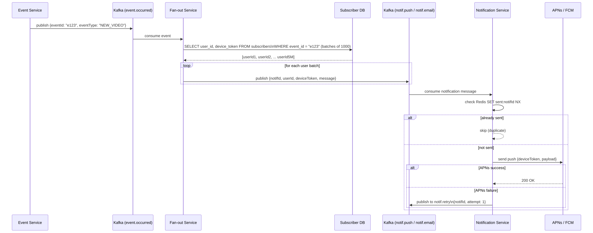

# Notification Service — System Design

## TL;DR
* **Core challenge**: Fan-out — one event (e.g. new YouTube video) must notify millions of subscribers across email, push, and SMS
* **Recommended approach**: **Background Job** for fan-out (expands 1 event → N user messages via DB loop) + **Kafka** for delivery (parallel consumers send push/email/SMS)
* **Why this combo**: Background jobs are great at long-running stateful loops with built-in retry/progress tracking. Kafka is great at high-throughput parallel delivery with backpressure handling
* **Push delivery**: Mobile push goes through **APNs** (iOS) and **FCM** (Android) — you cannot push directly to a device. You need a device token stored per user
* **Retries**: Failed deliveries go to a Kafka retry topic with attempt count. After max retries → dead letter queue (DLQ) + alert
* **Idempotency**: Redis `SET NX` on `notif_id` before every send — prevents duplicate notifications even if a message is consumed twice

---

## Step 1: Requirements

### Functional Requirements
| Priority | Requirement |
|---|---|
| ✅ Core | System can send notifications to users when an event occurs |
| ✅ Core | Users can subscribe to events (e.g. follow a creator, subscribe to alerts) |
| ✅ Core | Supports multiple channels: push, email, SMS |
| 🔲 Out of scope | Users can set notification preferences per channel |
| 🔲 Out of scope | Notification inbox / history |
| 🔲 Out of scope | Do-not-disturb schedules |

### Non-Functional Requirements
| Requirement | Target |
|---|---|
| Scale | 5 million subscribers per popular event |
| Latency | Notifications delivered within a few seconds of event |
| Reliability | At-least-once delivery — retries on failure |
| Idempotency | No duplicate notifications to the same user |
| Availability | High — notification pipeline should not be a single point of failure |

---

## Step 2: High-Level Architecture



### What each component does

**API Gateway**
All requests from Admin and User clients go through the API Gateway. Handles Bearer token authentication and rate limiting before forwarding to downstream services.

**Event Service**
Receives events (e.g. "new video published", "price drop", "friend request"). Does one thing: **enqueues a background fan-out job**:
```json
{ "eventId": "e123", "eventType": "NEW_VIDEO", "videoId": "v456" }
```
It does NOT query subscribers or write to Kafka itself — that's the Job Worker's responsibility. Event Service stays fast and stateless regardless of subscriber count.

**Subscriber Service**
Handles `POST /subscribe` and `DELETE /subscribe`. Manages which users want notifications for which events. Writes to the subscribers table in PostgreSQL.

**Job Queue (Sidekiq / BullMQ / Celery)**
Redis-backed background job queue. Stores the fan-out job until a worker picks it up. Provides built-in retry on worker crash, job progress visibility, and concurrency control — no custom tracking table needed.

**Fan-out Job Worker** *(the key piece)*
Picks up the job from the queue. Loops through the subscribers table in batches of 1,000, writing one Kafka message per user to the appropriate delivery topic. This is where "1 event → N user messages" happens.

```
job { eventId: "e123" }
  → SELECT subscribers WHERE event_id = "e123" LIMIT 1000 OFFSET 0  → write 1000 msgs to notif.push
  → SELECT subscribers WHERE event_id = "e123" LIMIT 1000 OFFSET 1000 → write 1000 msgs
  → ... repeat until no rows returned
```

**Kafka Topics**
| Topic | Written by | Read by | Volume |
|---|---|---|---|
| `notif.push` | Fan-out Job Worker | Notification Service | 1 per user |
| `notif.email` | Fan-out Job Worker | Notification Service | 1 per user |
| `notif.sms` | Fan-out Job Worker | Notification Service | 1 per user |
| `notif.retry` | Notification Service | Retry Consumer | 1 per failure |
| `notif.dlq` | Retry Consumer | Monitoring | after max retries |

**Notification Service**
One consumer group per channel (push / email / SMS). Each instance:
1. Consumes a message from the relevant Kafka topic
2. Checks Redis idempotency key — skip if already sent
3. Looks up device token from devices table
4. Calls APNs / FCM / SendGrid / Twilio
5. On failure → publishes to `notif.retry`

**APNs / FCM**
You cannot push to a mobile device directly. Apple and Google run the delivery infrastructure:
- **APNs** (Apple Push Notification Service) — delivers to iOS devices
- **FCM** (Firebase Cloud Messaging) — delivers to Android devices

Your Notification Service calls their HTTP APIs with the device token + payload. They handle the actual device delivery.

**Redis — Idempotency Store**
Before every send: `SET sent:{notifId} 1 NX EX 86400`
- `NX` = only set if not exists
- `OK` → first time, proceed with send
- `nil` → already sent, skip

Prevents duplicate notifications even when Kafka redelivers the same message (consumer crash, rebalance).

**PostgreSQL**
Four key tables:
- `users` — userId, email, phone
- `events` — eventId, eventType, metadata
- `subscribers` — userId, eventId, notificationType — **indexed on eventId** for fast fan-out queries
- `devices` — userId, deviceToken, platform (ios/android), lastActiveAt

---

## Step 3: Fan-out — Two Approaches

There are two valid ways to expand one event into N per-user notifications. Both achieve the same result — the difference is the trigger mechanism.

---

### Approach 1: Kafka Fan-out Service

```
event.occurred topic  →  Fan-out Service  →  notif.push topic  →  Notification Service  →  APNs/FCM
     (1 message)           (DB loop)           (5M messages)
```

**How the Kafka topics look:**

| Topic | Written by | Read by | Volume |
|---|---|---|---|
| `event.occurred` | Event Service | Fan-out Service | 1 per event |
| `notif.push` | Fan-out Service | Notification Service | 1 per user |
| `notif.retry` | Notification Service | Retry Consumer | 1 per failure |

Fan-out Service is both a **Kafka consumer** (reads from `event.occurred`) and a **Kafka producer** (writes to `notif.push`). It loops through the subscribers DB in batches of 1000, writing one message per user. Notification Service starts consuming from `notif.push` immediately — it doesn't wait for Fan-out to finish all 5M writes.

---

### Approach 2: Background Job (simpler alternative)

Instead of a dedicated Fan-out Service, the event triggers a background job:

```
Event fires
    ↓
Event Service enqueues a background job { eventId: "e123" }
    ↓
Job Worker (Sidekiq / Celery / BullMQ) picks it up
    ↓
Same DB loop — queries subscribers in batches of 1000
    ↓
Writes to notif.push Kafka topic (or calls Notification Service directly)
```

The fan-out logic is identical — the only difference is the job queue (Redis-backed) triggers it instead of a Kafka message.

**Crash recovery is simpler** — job frameworks like Sidekiq have built-in retry, progress tracking, and failure visibility out of the box. No need to manage `fanout_progress` table manually.

---

### Which to use?

| | Kafka Fan-out | Background Job |
|---|---|---|
| Trigger | Kafka consumer | Job queue (Sidekiq / Celery) |
| Retry on crash | Kafka offset not committed → auto retry | Job marked failed → retried by framework |
| Progress tracking | Manual (`fanout_progress` table) | Built into job framework |
| Complexity | Higher | Lower |
| Best when | Kafka already in stack, very high throughput | Simpler stack, medium scale |

**Recommendation:** Use background jobs if you're building from scratch — simpler to operate. Use Kafka fan-out if the event pipeline is already Kafka-based and multiple services need to consume the same event.

---



### Step-by-step: From one event to 5 million notifications (Kafka approach)

**Step 1 — Event published**
Event Service publishes one lean message to `event.occurred`:
```json
{ "eventId": "e123", "eventType": "NEW_VIDEO", "videoId": "v456" }
```
No user IDs, no device tokens — just the event identity.

**Step 2 — Fan-out Service expands**
Fan-out Service consumes the message and queries subscribers in batches:
```sql
SELECT s.user_id, s.notification_type, d.device_token, d.platform
FROM subscribers s
JOIN devices d ON s.user_id = d.user_id
WHERE s.event_id = 'e123'
LIMIT 1000 OFFSET 0
```
For a 5 million subscriber event, this runs 5,000 iterations (5M / 1000 per batch).

For each user, writes to the appropriate Kafka topic:
```json
{
  "notifId": "n-uuid-xyz",
  "userId": "u789",
  "deviceToken": "abc123token",
  "platform": "ios",
  "title": "New video from Taylor Swift",
  "body": "Anti-Hero (Acoustic Version) is now live"
}
```

**Why is Fan-out separate from Event Service?**
Event Service handles high-frequency, low-latency event ingestion. If it had to fan-out to 5M users synchronously, one popular event would stall all other events. Separating fan-out means Event Service always responds quickly and Fan-out Service scales independently to absorb spikes.

**Step 3 — Notification Service sends**
Each Notification Service instance consumes from `notif.push`:
1. `SET sent:n-uuid-xyz 1 NX EX 86400` — check Redis
2. If `nil` returned → already sent, commit offset and move on
3. If `OK` → call APNs/FCM with device token
4. APNs/FCM delivers to device

**Step 4 — Response handling**
- **Success** → commit Kafka offset, done
- **Failure** → publish to `notif.retry` with attempt count, do NOT commit offset

---

## Step 4: Retry & Dead Letter Queue



### Handling failures without losing notifications or spamming users

**Why retries are necessary**
APNs and FCM are external services. They have occasional outages, rate limits, and transient failures. Without retries, a temporary blip means millions of notifications are silently dropped.

**The retry flow**
```json
// notif.retry message
{
  "notifId": "n-uuid-xyz",
  "userId": "u789",
  "deviceToken": "abc123token",
  "payload": { ... },
  "attempt": 1,
  "nextRetryAt": 1715001800
}
```

Retry Consumer checks `nextRetryAt` — if not yet time, it sleeps and re-checks. This implements **exponential backoff**:
- Attempt 1: retry after 30 seconds
- Attempt 2: retry after 2 minutes
- Attempt 3: retry after 10 minutes
- Attempt 4+: publish to `notif.dlq`

**Dead Letter Queue (DLQ)**
Messages that fail after all retries land in `notif.dlq`. A monitoring consumer reads from DLQ and triggers an alert (PagerDuty, Slack). The operations team can investigate and manually replay if needed.

**Why idempotency matters with retries**
Without the Redis `SET NX` check, a retry could deliver the same notification twice — annoying at best, trust-destroying at worst ("Why did I get 3 identical notifications?"). The idempotency key ensures even if a message is retried 3 times, the user only ever sees it once.

---

## Step 5: Database Schema

### Subscribers Table
```sql
subscribers (
  id               UUID PRIMARY KEY,
  user_id          UUID NOT NULL,
  event_id         UUID NOT NULL,           -- what event triggers this
  notification_type TEXT                    -- push / email / sms
)
CREATE INDEX idx_subscribers_event_id ON subscribers(event_id);
-- Fast lookup: "give me all users subscribed to event X"
```

### Devices Table
```sql
devices (
  device_id     UUID PRIMARY KEY,
  user_id       UUID NOT NULL,
  device_token  TEXT NOT NULL,              -- from APNs/FCM on first app launch
  platform      TEXT CHECK (platform IN ('ios', 'android', 'web')),
  last_active_at TIMESTAMPTZ
)
```
The `device_token` is registered by the mobile app on first launch and sent to your backend via `POST /devices`. Tokens can expire or rotate — FCM/APNs will return an error if a token is stale, at which point you delete it from the table.

---

## Deep Dives

### Why not have Event Service fan-out directly?

Event Service would need to:
1. Query 5M subscribers from DB
2. Write 5M Kafka messages
3. Do all this before returning a response

This turns a fast, simple event publish into a minutes-long operation. A single viral event would block all other events. Dedicated Fan-out Service keeps Event Service at O(1) — it always does exactly one DB write and one Kafka publish regardless of subscriber count.

### What if Fan-out Service is slow for a 5M subscriber event?

Kafka buffers the `event.occurred` message. Fan-out Service processes at its own pace — multiple instances can run in parallel, each handling a different partition. The Notification Service consumers also run in parallel, so even if fan-out writes 5M messages over 10 seconds, the notification consumers start processing immediately as messages land. The spike is absorbed across time, not all at once.

### Device token management

APNs/FCM return specific error codes when a token is invalid:
- **APNs**: `BadDeviceToken` or `Unregistered`
- **FCM**: `registration-token-not-registered`

When Notification Service receives these errors, it should delete the stale token from the devices table — no point retrying with a bad token. This is called **token cleanup** and keeps the devices table accurate over time.

### Per-user notification preferences (below the line, but worth mentioning)

In a real system, users can turn off specific notification types ("don't email me, only push"). This is handled by adding a `preferences` table:
```sql
notification_preferences (
  user_id   UUID,
  channel   TEXT,   -- push / email / sms
  enabled   BOOLEAN DEFAULT true
)
```
Fan-out Service checks preferences when writing per-user messages — only write to `notif.push` if `push` is enabled for that user. This avoids sending messages downstream that will just be ignored.
