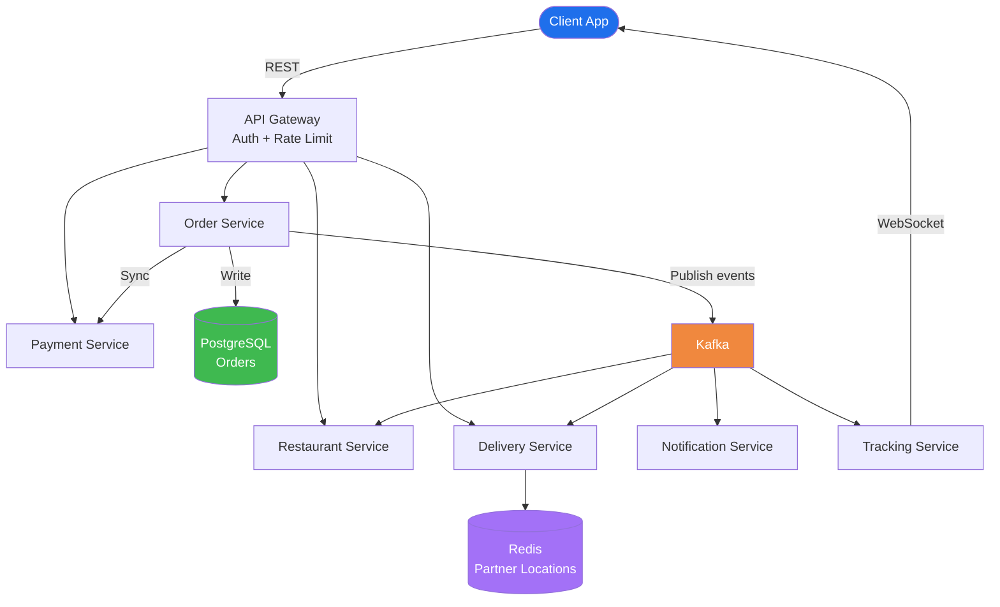
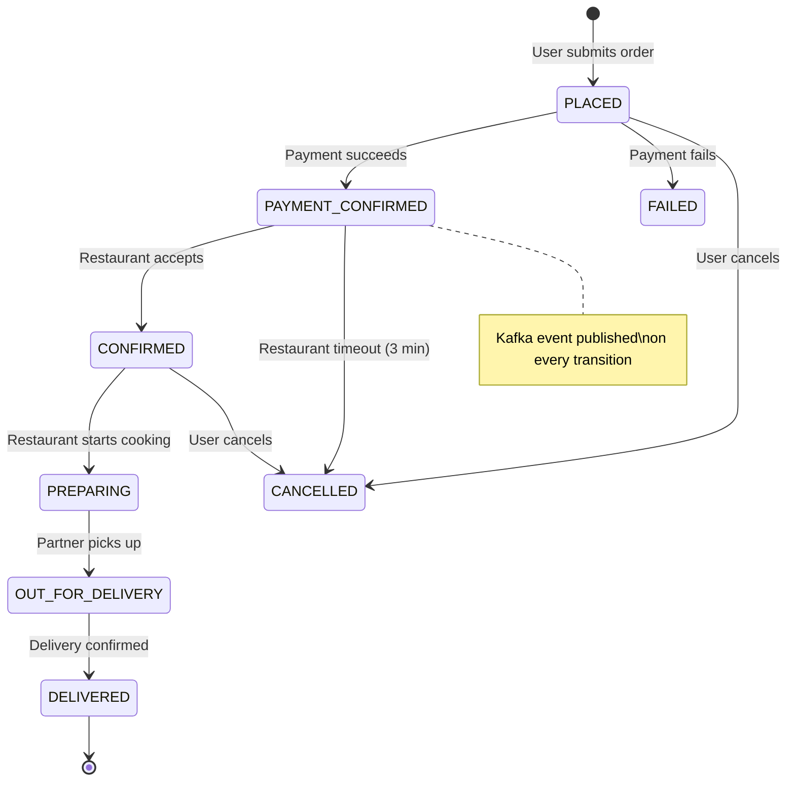
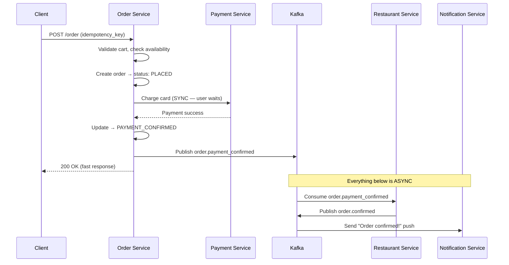

# Orders App — System Design (Swiggy / Uber Eats / Amazon)

## TL;DR
* **Architecture**: Event-driven microservices — each service owns its state, communicates via Kafka
* **Order lifecycle**: State machine — every transition is a Kafka event consumed by downstream services
* **Cart**: Redis (ephemeral, TTL-based) — never written to the primary DB
* **Payment**: Synchronous (user waits); everything else is async Kafka consumers
* **Background jobs**: Order timeouts, payment retries, invoice generation, refunds — all async
* **Real-time tracking**: WebSocket + Redis pub/sub for partner GPS pings
* **Key insight**: Kafka events are the audit log. Each service reacts independently — easy to retry, debug, scale.

---

## Step 1: Clarify Requirements

### Functional Requirements
- Browse menu, add items to cart
- Place order → payment → restaurant confirmation → delivery assignment
- Real-time order status updates pushed to client
- Live delivery partner location on map
- Order cancellation (before restaurant confirms)
- Notifications at each stage (push / SMS / email)

### Non-Functional Requirements
| Requirement | Target |
|---|---|
| Scale | ~3M orders/day, peak ~200 orders/sec (dinner rush) |
| Latency | Order placement < 2s end-to-end (payment included) |
| Availability | 99.99% — revenue lost directly on downtime |
| Consistency | Strong for payments; eventual for notifications/tracking |
| Idempotency | Same order request must never charge twice |

### Out of Scope
- Restaurant menu management system
- Delivery partner app internals
- Fraud detection / ML risk scoring

---

## Step 2: Capacity Estimation

| Metric | Estimate |
|---|---|
| Orders/day | 3 million |
| Peak orders/sec | ~200/sec (7–9pm dinner rush) |
| DB writes per order | ~10 (order + items + events + payment + assignment) |
| Peak DB writes/sec | ~2,000/sec |
| GPS pings | 1M active deliveries × 1 ping/5s = **200k Redis writes/sec** |
| Notifications/day | ~15M (5 per order average) |

---

## Step 3: High-Level Architecture



---

## Step 4: Deep Dive

### Order State Machine




### Order Placement Flow (Sync vs Async)



### Idempotency (Prevent Double Charge)
```
Client generates UUID idempotency_key before calling /place-order

Server:
  SELECT * FROM orders WHERE idempotency_key = ?
  Found? → return cached response (not a new order)
  Not found? → process + store key with response

Also pass idempotency_key to Stripe/Razorpay → they deduplicate charges on their end
```

### Cart Design (Why Redis, Not DB?)
```
Redis Hash: cart:{userId} → {itemId: quantity, ...}
TTL: 24 hours

On order placement:
  HGETALL cart:{userId} → snapshot into order_items table
  DEL cart:{userId}

Why not DB?
  Cart changes on every add/remove/quantity-change
  High-frequency writes for ephemeral data = wasteful DB pressure
  Redis: sub-millisecond, no schema, natural TTL
```

### Real-time Tracking Architecture


### Background Jobs
| Job | Trigger | Action |
|---|---|---|
| Order timeout | Cron every 1 min | Cancel orders in PLACED > 5 min (payment never came) |
| Restaurant timeout | Cron every 1 min | Cancel PAYMENT_CONFIRMED unaccepted > 3 min |
| Payment retry | Failed payment event | Retry up to 3× with exponential backoff |
| Partner re-assignment | Partner offline event | Find new delivery partner |
| Invoice generation | order.delivered event | Generate PDF → S3 → email to user |
| Refund processing | order.cancelled event | Call Payment Gateway refund API async |

---

## Step 5: Key Design Decisions

| Decision | Choice | Alternative | Why |
|---|---|---|---|
| Service communication | Kafka (async) | Sync REST between services | Decoupled; one failure doesn't cascade |
| Order state | PostgreSQL | NoSQL | ACID for financial state machine |
| Cart | Redis | PostgreSQL | Ephemeral, high-frequency, natural TTL |
| Payment call | Synchronous | Async | User must know charge result immediately |
| Real-time tracking | WebSocket + Redis | Polling | Push cheaper at scale; polling = thundering herd |

---

## Common Interview Follow-ups

**Q: What if Kafka goes down during order placement?**
Payment is sync and committed to DB before Kafka publish. Kafka failure only delays downstream (notifications, delivery). Order and payment are safe. Use outbox pattern for guaranteed Kafka delivery.

**Q: What if the restaurant never responds?**
Cron job scans PAYMENT_CONFIRMED orders every 1 min. Orders unaccepted > 3 min → auto-cancel → refund Kafka event → customer notified.

**Q: How do you handle a 10× traffic spike during a promo?**
API Gateway rate limits. Kafka absorbs write spikes (consumers process at steady rate). Stateless Order/Restaurant services scale horizontally. Redis handles cart and tracking load.
