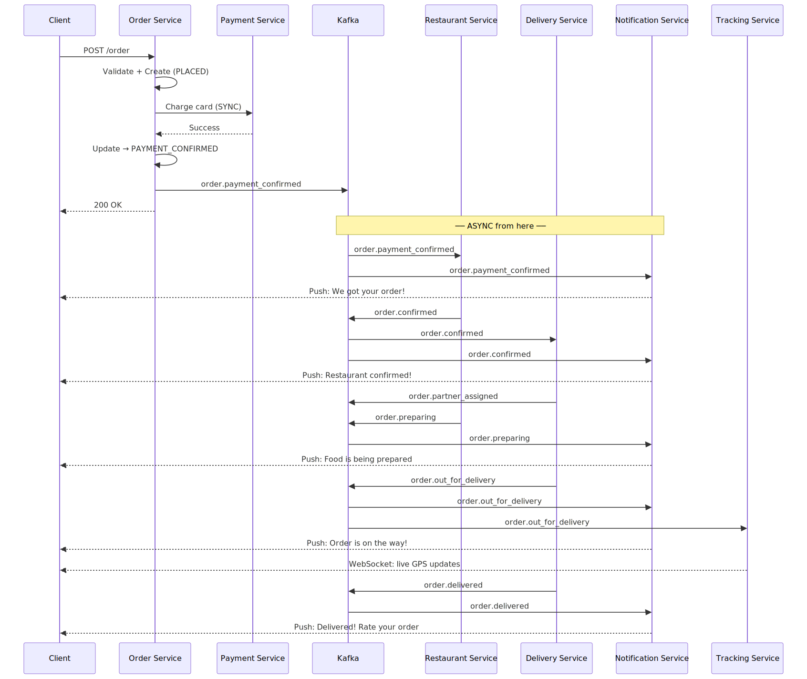
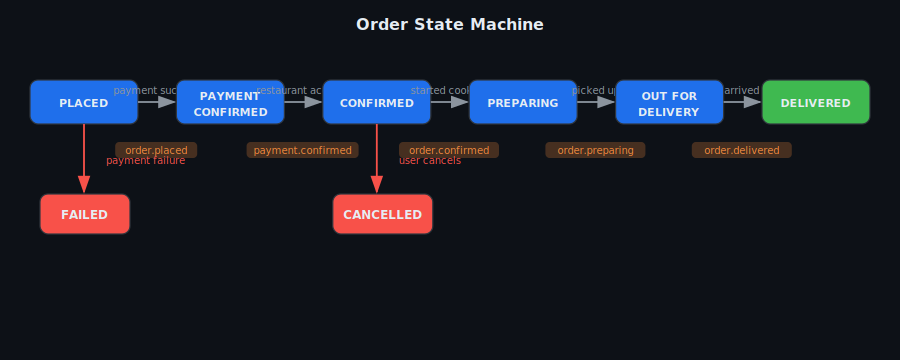
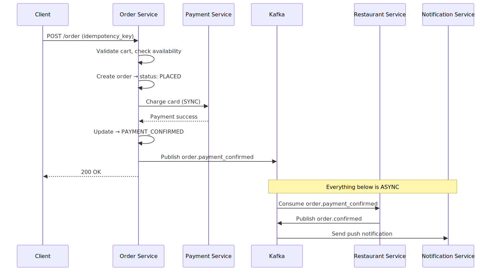

# Orders App — System Design (Swiggy / Uber Eats / Amazon)

## TL;DR
* **Architecture**: Event-driven microservices — each service owns its state, communicates via Kafka
* **Order lifecycle**: State machine — every transition is a Kafka event consumed by downstream services
* **Cart**: Redis (ephemeral, TTL-based) — never written to the primary DB
* **Payment**: Synchronous (user waits); everything else is async Kafka consumers
* **Background jobs**: Order timeouts, payment retries, invoice generation, refunds — all async
* **Real-time tracking**: WebSocket + Redis pub/sub for partner GPS pings
* **Key insight**: Kafka events are the audit log. Each service reacts independently — easy to retry, debug, scale.

---

## Step 1: Clarify Requirements

### Functional Requirements
- Browse menu, add items to cart
- Place order → payment → restaurant confirmation → delivery assignment
- Real-time order status updates pushed to client
- Live delivery partner location on map
- Order cancellation (before restaurant confirms)
- Notifications at each stage (push / SMS / email)

### Non-Functional Requirements
| Requirement | Target |
|---|---|
| Scale | ~3M orders/day, peak ~200 orders/sec (dinner rush) |
| Latency | Order placement < 2s end-to-end (payment included) |
| Availability | 99.99% — revenue lost directly on downtime |
| Consistency | Strong for payments; eventual for notifications/tracking |
| Idempotency | Same order request must never charge twice |

### Out of Scope
- Restaurant menu management system
- Delivery partner app internals
- Fraud detection / ML risk scoring

---

## Step 2: Capacity Estimation

| Metric | Estimate |
|---|---|
| Orders/day | 3 million |
| Peak orders/sec | ~200/sec (7–9pm dinner rush) |
| DB writes per order | ~10 (order + items + events + payment + assignment) |
| Peak DB writes/sec | ~2,000/sec |
| GPS pings | 1M active deliveries × 1 ping/5s = **200k Redis writes/sec** |
| Notifications/day | ~15M (5 per order average) |

---

## Step 3: High-Level Architecture



#### What each service does

**API Gateway**
Every request from the client app goes through the API Gateway first. It handles JWT authentication (rejects unauthenticated requests before they hit any service), rate limiting per user (prevents abuse during flash sales), and routes requests to the correct downstream service. It does NOT contain any business logic.

**Order Service**
The core of the system. It owns the `orders` and `order_items` tables in PostgreSQL. Its responsibilities:
- Validates the cart snapshot (are items still available? prices correct?)
- Creates the order row with status `PLACED`
- Calls the Payment Service **synchronously** (user waits on this)
- Transitions the order state in DB after payment
- Publishes Kafka events on every state transition — these are the trigger for everything downstream

**Payment Service**
Called synchronously by the Order Service. Talks to the external payment gateway (Stripe / Razorpay). Returns success or failure. Stores a `payment_transactions` record for audit. Passes the `idempotency_key` to the gateway so the same charge is never made twice even on retries.

**Restaurant Service**
Kafka consumer. Listens for `order.payment_confirmed`. Sends the order to the restaurant's POS system or app. Waits for the restaurant to accept. Publishes `order.confirmed` or triggers the cancellation flow on timeout.

**Delivery Service**
Kafka consumer. Listens for `order.confirmed`. Finds the nearest available delivery partner using geospatial queries. Assigns them to the order. Also continuously receives GPS pings from all active partners and stores their location in Redis.

**Notification Service**
Kafka consumer. Listens for every order event (`placed`, `confirmed`, `preparing`, `out_for_delivery`, `delivered`, `cancelled`). Sends push notification / SMS / email at each stage. Fully stateless — just reads the event and fires the notification.

**Tracking Service**
Reads partner locations from Redis every 2 seconds and pushes updates to the customer's open WebSocket connection. Maintains WebSocket sessions per active delivery.

---

## How Services Are Connected — The Mental Model

Before the full flow, this is the single most important thing to understand:

> **Services never call each other directly. There are no REST calls from Delivery Service to Notification Service, or from Restaurant Service to Delivery Service. Every service only talks to Kafka.**

Think of Kafka as a **notice board**. A service posts a notice (publishes an event). Any other service that cares about that notice reads it (consumes the event). The publisher has no idea who is reading — and doesn't need to.



Each service has two lists:
- **What it publishes** — events it fires when something happens in its domain
- **What it subscribes to** — events from other domains it needs to react to

### Each service's publish / subscribe contract

**Order Service**
- Publishes: `order.payment_confirmed`
- Subscribes to: nothing (it's the entry point, triggered by the client directly)

**Restaurant Service**
- Publishes: `order.confirmed`, `order.preparing`
- Subscribes to: `order.payment_confirmed` — this is how it knows a paid order arrived

**Delivery Service**
- Publishes: `order.partner_assigned`, `order.out_for_delivery`, `order.delivered`, `order.cancelled`
- Subscribes to: `order.confirmed` — this is how it knows it's time to find a delivery partner

**Notification Service**
- Publishes: nothing (it only sends notifications, never changes order state)
- Subscribes to: **every** order event — `payment_confirmed`, `confirmed`, `preparing`, `out_for_delivery`, `delivered`, `cancelled`

**Tracking Service**
- Publishes: nothing
- Subscribes to: `order.out_for_delivery` (start GPS streaming), `order.delivered` (stop GPS streaming)

**Invoice Service**
- Publishes: nothing
- Subscribes to: `order.delivered` (generate receipt PDF)

**Refund Service**
- Publishes: nothing
- Subscribes to: `order.cancelled` (trigger payment reversal)

---

### Why this matters

**Adding a new feature = add a new consumer. Zero changes to existing services.**

Say you want to add a loyalty points service that gives points on every delivery. You create a new service that subscribes to `order.delivered` and awards points. The Order Service, Delivery Service, Restaurant Service — none of them change at all. They don't even know the loyalty service exists.

**A service going down doesn't break the order flow.**

If the Notification Service crashes, orders still get placed, confirmed, and delivered. Kafka holds onto the unread events (for days, by default). When Notification Service comes back up, it reads from its last committed offset and sends all the missed notifications in order.

**Each service owns its own database.**

No service reads another service's DB directly. The only shared communication channel is Kafka. This means:
- Restaurant Service can use PostgreSQL
- Tracking Service can use Redis
- Invoice Service can use S3
- None of them need to know what the others use

---

## End-to-End Order Flow — How Kafka Connects Everything

This is the full sequential journey of one order, from tap to delivery, showing exactly when each Kafka event fires and who reacts to it.



### Step-by-step walkthrough

---

**Step 1 — User places order (SYNC)**

User taps "Place Order". `POST /order` hits the Order Service with a cart snapshot and an `idempotency_key`.

- Order Service validates the cart and creates an `orders` row → status `PLACED`
- Calls the Payment Service **synchronously** — this is the only blocking call in the entire system
- Payment Service talks to Stripe/Razorpay and returns success
- Order Service updates status → `PAYMENT_CONFIRMED`, writes the event to the **outbox table**
- Outbox poller publishes **`order.payment_confirmed`** to Kafka
- Order Service returns `200 OK` to the client

> **The client is unblocked here.** Everything below is async — the user sees "Order Placed!" while the rest happens in the background.

---

**Step 2 — Restaurant is notified (ASYNC)**

Kafka event: `order.payment_confirmed`

**Two consumers react in parallel:**

→ **Restaurant Service** receives the event. It pushes the order to the restaurant's POS system and starts a 3-minute acceptance timer.

→ **Notification Service** receives the same event. Sends a push notification to the user: *"We received your order!"*

These two consumers are in **different consumer groups** — both get the full event independently. Neither blocks the other.

---

**Step 3 — Restaurant accepts (ASYNC)**

Restaurant operator taps "Accept" in their app. Restaurant Service:
- Updates the order status in DB → `CONFIRMED`
- Publishes **`order.confirmed`** to Kafka

**Two consumers react:**

→ **Delivery Service** receives `order.confirmed`. It queries nearby available partners using geospatial index (partner location stored in Redis). Assigns the closest partner. Publishes **`order.partner_assigned`**.

→ **Notification Service** receives `order.confirmed`. Sends: *"Your order has been confirmed by the restaurant!"*

---

**Step 4 — Cooking starts (ASYNC)**

Restaurant taps "Start Cooking". Restaurant Service publishes **`order.preparing`**.

→ **Notification Service** sends: *"The restaurant is preparing your food."*

No other service needs to act on this event — it's purely informational for the user.

---

**Step 5 — Partner picks up (ASYNC)**

Delivery partner arrives at the restaurant and taps "Picked Up". Delivery Service:
- Updates order status → `OUT_FOR_DELIVERY`
- Publishes **`order.out_for_delivery`**

**Two consumers react:**

→ **Notification Service** sends: *"Your order is on the way!"*

→ **Tracking Service** receives the event and **opens a WebSocket session** for this order. From now on it polls `GET location:{partnerId}` from Redis every 2 seconds and pushes GPS coordinates to the customer's app in real time.

---

**Step 6 — Order delivered (ASYNC)**

Partner taps "Delivered" (or OTP is confirmed). Delivery Service:
- Updates order status → `DELIVERED`
- Marks partner as available again
- Publishes **`order.delivered`**

**Multiple consumers react:**

→ **Notification Service** sends: *"Your order has been delivered! Rate your experience."*

→ **Tracking Service** closes the WebSocket connection. GPS updates stop.

→ **Invoice Service** (background job) generates a PDF receipt → uploads to S3 → emails to user.

---

### Kafka topics summary

| Topic | Published by | Consumed by |
|---|---|---|
| `order.payment_confirmed` | Order Service | Restaurant Service, Notification Service |
| `order.confirmed` | Restaurant Service | Delivery Service, Notification Service |
| `order.partner_assigned` | Delivery Service | (internal tracking) |
| `order.preparing` | Restaurant Service | Notification Service |
| `order.out_for_delivery` | Delivery Service | Notification Service, Tracking Service |
| `order.delivered` | Delivery Service | Notification Service, Tracking Service, Invoice Service |
| `order.cancelled` | Order/Restaurant/Delivery Service | Notification Service, Refund Service |

### Why this Kafka design is powerful

- **No service knows about other services.** The Order Service doesn't know Notification Service exists — it just publishes events. New consumers can be added (e.g. analytics, fraud detection) without touching existing services.
- **Failures are isolated.** If the Notification Service goes down, orders still process. When it recovers, it replays events from its last committed offset and catches up.
- **Events are the audit log.** Every state transition is a Kafka event. You can replay the full history of any order by replaying its events in order.
- **Retry is built in.** Kafka retains messages for days. A failed consumer just resets its offset and retries — no message is lost.

---

### Order State Machine



#### How each state transition works

**PLACED**
Order row created in PostgreSQL. Cart is snapshotted into `order_items`. The Payment Service is called synchronously right after. This state is very short-lived — it lasts only as long as the payment gateway call takes (< 2s).

**PLACED → PAYMENT_CONFIRMED**
Payment gateway returns success. Order Service updates the DB row to `PAYMENT_CONFIRMED` and publishes `order.payment_confirmed` to Kafka. The client gets `200 OK` here. Everything from this point is async.

**PLACED → FAILED**
Payment gateway returns failure (insufficient funds, card declined). Order stays in DB for audit, status set to `FAILED`. No Kafka events downstream. User is shown an error and can retry with a different card.

**PAYMENT_CONFIRMED → CONFIRMED**
Restaurant Service receives the `order.payment_confirmed` Kafka event and forwards the order to the restaurant POS. Restaurant operator taps "Accept". Restaurant Service publishes `order.confirmed`. If no response within 3 minutes → auto-cancel and refund.

**CONFIRMED → PREPARING**
Restaurant taps "Start Cooking". Restaurant Service publishes `order.preparing`. Notification Service sends "Your food is being prepared" push to user.

**PREPARING → OUT_FOR_DELIVERY**
Delivery partner arrives at restaurant and taps "Picked Up" in their app. Delivery Service publishes `order.out_for_delivery`. Tracking Service starts pushing live GPS to customer's WebSocket.

**OUT_FOR_DELIVERY → DELIVERED**
Partner taps "Delivered" (or OTP confirmed). Delivery Service publishes `order.delivered`. Invoice generation job is triggered. Partner is marked available again for new assignments.

**→ CANCELLED**
Can be triggered by: user cancellation (before CONFIRMED), restaurant timeout, or partner going offline during delivery. In all cases, `order.cancelled` is published → Refund Service initiates reversal to original payment method.

> **Key rule**: The DB is updated first, Kafka event published second. If Kafka publish fails after DB write, an **outbox pattern** guarantees the event is eventually published — a background poller reads the `outbox` table and retries.

---

### Order Placement Flow (Sync vs Async)



#### How the order placement flow works — step by step

**1. Client → Order Service**
User taps "Place Order". The client sends `POST /order` with the cart contents and a client-generated `idempotency_key` (UUID). The idempotency key is the client's guard against accidental double-taps — if the same key arrives twice, the second request returns the cached result without processing.

**2. Order Service — Validate**
Before touching payment, the Order Service:
- Checks items are still available (menu items can go out of stock)
- Recalculates the price server-side (never trust client-sent prices)
- Checks the restaurant is still accepting orders (open/closed status)
If any check fails → 400 error returned, no order created.

**3. Order Service — Create Order Row**
```sql
INSERT INTO orders (id, user_id, restaurant_id, status, idempotency_key, total, created_at)
VALUES (snowflakeId, userId, restaurantId, 'PLACED', key, total, NOW())
```
Also inserts rows into `order_items` (one per cart item). Status is `PLACED`. This write happens before payment — so we have a record even if payment fails.

**4. Order Service → Payment Service (SYNC)**
This is the only synchronous service-to-service call in the entire system. It must be sync because the user is waiting to know if their card was charged. The Order Service calls the Payment Service with `{ order_id, amount, card_token, idempotency_key }`.

The Payment Service calls Stripe/Razorpay, waits for the gateway response, and returns success or failure. This is the slowest part of the flow (~500ms–1.5s depending on the gateway).

**5. Payment confirmed — DB update + Kafka publish**
On success, Order Service:
- Updates `orders.status = 'PAYMENT_CONFIRMED'` in PostgreSQL
- Writes a row to the `outbox` table: `{ event: 'order.payment_confirmed', payload: {...} }`
- A background outbox poller reads this and publishes to Kafka (guarantees delivery even if Kafka is briefly down)

**6. Order Service → Client: 200 OK**
The client gets the response here. The user sees "Order placed!" on their screen. Everything from this point — restaurant confirmation, delivery assignment, notifications — happens in the background and is pushed to the client via WebSocket/push notifications.

**7. Restaurant Service (ASYNC)**
Consumes `order.payment_confirmed` from Kafka. Sends the order details to the restaurant's POS (Point of Sale) system. Starts a 3-minute acceptance timer.

**8. Notification Service (ASYNC)**
Consumes every order event from Kafka. On `order.payment_confirmed` → sends "We got your order!" push notification. On `order.confirmed` → sends "Restaurant confirmed your order!". Each notification is independent and retried if it fails.

---

### Idempotency (Prevent Double Charge)
```
Client generates UUID idempotency_key before calling /place-order

Server:
  SELECT * FROM orders WHERE idempotency_key = ?
  Found? → return cached response (not a new order)
  Not found? → process + store key with response

Also pass idempotency_key to Stripe/Razorpay → they deduplicate charges on their end
```

#### Why idempotency matters here

Network failures are common on mobile. If the user taps "Place Order" and the response never arrives (connection drops), the app retries. Without idempotency, that retry creates a second order and charges the card again. With the `idempotency_key`:

- The **client generates** a UUID when the user taps "Place Order" — before the first request goes out
- On retry, the **same UUID** is sent again
- The Order Service checks: `SELECT * FROM orders WHERE idempotency_key = ?`
  - Found → return the original response immediately, no processing
  - Not found → process normally and save the key + response
- The key is also forwarded to the payment gateway — Stripe/Razorpay have their own idempotency layer, so even if the Order Service crashes mid-payment, a retry to the gateway with the same key returns the original charge result, not a second charge

**Storage**: `idempotency_key` is a unique-indexed column on the `orders` table. No separate table needed.

---

### Cart Design (Why Redis, Not DB?)
```
Redis Hash: cart:{userId} → {itemId: quantity, ...}
TTL: 24 hours

On order placement:
  HGETALL cart:{userId} → snapshot into order_items table
  DEL cart:{userId}

Why not DB?
  Cart changes on every add/remove/quantity-change
  High-frequency writes for ephemeral data = wasteful DB pressure
  Redis: sub-millisecond, no schema, natural TTL
```

#### How cart operations work in Redis

Every cart interaction maps to a single Redis command:

```
Add item      : HSET cart:9923711  item:42  2         → set item 42 qty = 2
Remove item   : HDEL cart:9923711  item:42
Change qty    : HSET cart:9923711  item:42  5         → overwrite qty
View cart     : HGETALL cart:9923711                  → { item:42: 5, item:77: 1, ... }
Abandon cart  : TTL expires after 24h → key deleted automatically
```

The Redis hash `cart:{userId}` maps `itemId → quantity`. The entire cart is one Redis key — one `HGETALL` fetches everything.

**On order placement**, the Order Service:
1. Calls `HGETALL cart:{userId}` to snapshot the cart
2. Inserts rows into `order_items` in PostgreSQL (permanent record)
3. Calls `DEL cart:{userId}` to clear the cart
4. Refreshes the client's cart UI to empty

**What if the user has the cart open on two devices?**
Both read from the same Redis key. Writes are last-write-wins (fine for cart — no financial consequence).

---

### Real-time Tracking Architecture


#### How real-time tracking works — step by step

**1. Partner App → Delivery Service (GPS ping)**
The delivery partner's app sends a GPS ping every 5 seconds:
```
POST /location  { partner_id: 7712, lat: 12.9716, lng: 77.5946, timestamp: ... }
```
At peak — 1M active deliveries × 1 ping/5s = **200,000 writes/second**. This must be extremely fast to handle.

**2. Delivery Service → Redis**
The Delivery Service writes the location to Redis:
```
SET location:7712  "12.9716,77.5946"  EX 10
```
- Key: `location:{partnerId}` — one key per active partner
- Value: `"lat,lng"` string (or a small JSON)
- `EX 10`: key expires in 10 seconds — if the partner goes offline, the key disappears automatically. No stale location data.

Why Redis and not PostgreSQL? At 200k writes/sec, PostgreSQL would need massive connection pooling and sharding. Redis handles this trivially — it's an in-memory key-value store built for exactly this access pattern.

**3. Tracking Service → Redis (poll)**
The Tracking Service polls `GET location:{partnerId}` every 2 seconds for each active delivery it's tracking. It compares the new location with the last sent location — if it changed, it pushes to the customer's WebSocket.

**4. Tracking Service → Customer App (WebSocket push)**
The customer's app holds an open WebSocket connection to the Tracking Service while the order is `OUT_FOR_DELIVERY`. The Tracking Service pushes location updates as JSON:
```json
{ "partner_id": 7712, "lat": 12.9718, "lng": 77.5950, "eta_minutes": 4 }
```
The app updates the map marker in real time.

**Why WebSocket and not HTTP polling?**
If 1M customers each polled every 2 seconds, that's 500k HTTP requests/sec just for location updates — each with TCP handshake, auth, headers. WebSocket keeps the connection open: zero handshake overhead per update. One persistent connection per customer instead of 500k requests/sec.

**What happens when the order is delivered?**
The Tracking Service closes the WebSocket connection. The `location:{partnerId}` Redis key is deleted (or expires). The partner is marked available in the Delivery Service.

---

### Background Jobs
| Job | Trigger | Action |
|---|---|---|
| Order timeout | Cron every 1 min | Cancel orders in PLACED > 5 min (payment never came) |
| Restaurant timeout | Cron every 1 min | Cancel PAYMENT_CONFIRMED unaccepted > 3 min |
| Payment retry | Failed payment event | Retry up to 3× with exponential backoff |
| Partner re-assignment | Partner offline event | Find new delivery partner |
| Invoice generation | order.delivered event | Generate PDF → S3 → email to user |
| Refund processing | order.cancelled event | Call Payment Gateway refund API async |

---

## Step 5: Key Design Decisions

| Decision | Choice | Alternative | Why |
|---|---|---|---|
| Service communication | Kafka (async) | Sync REST between services | Decoupled; one failure doesn't cascade |
| Order state | PostgreSQL | NoSQL | ACID for financial state machine |
| Cart | Redis | PostgreSQL | Ephemeral, high-frequency, natural TTL |
| Payment call | Synchronous | Async | User must know charge result immediately |
| Real-time tracking | WebSocket + Redis | Polling | Push cheaper at scale; polling = thundering herd |

---

## Common Interview Follow-ups

**Q: What if Kafka goes down during order placement?**
Payment is sync and committed to DB before Kafka publish. Kafka failure only delays downstream (notifications, delivery). Order and payment are safe. Use outbox pattern for guaranteed Kafka delivery.

**Q: What if the restaurant never responds?**
Cron job scans PAYMENT_CONFIRMED orders every 1 min. Orders unaccepted > 3 min → auto-cancel → refund Kafka event → customer notified.

**Q: How do you handle a 10× traffic spike during a promo?**
API Gateway rate limits. Kafka absorbs write spikes (consumers process at steady rate). Stateless Order/Restaurant services scale horizontally. Redis handles cart and tracking load.
