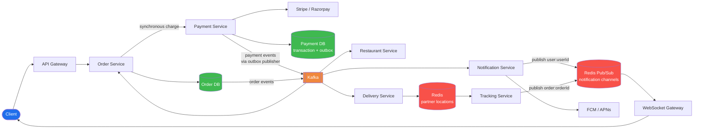
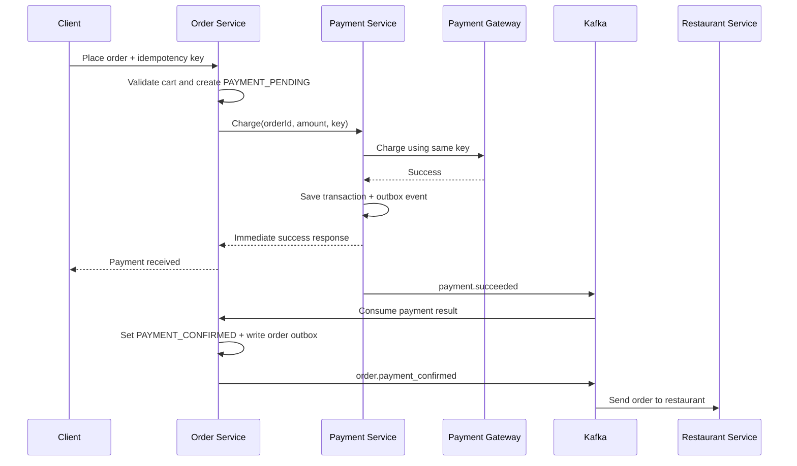
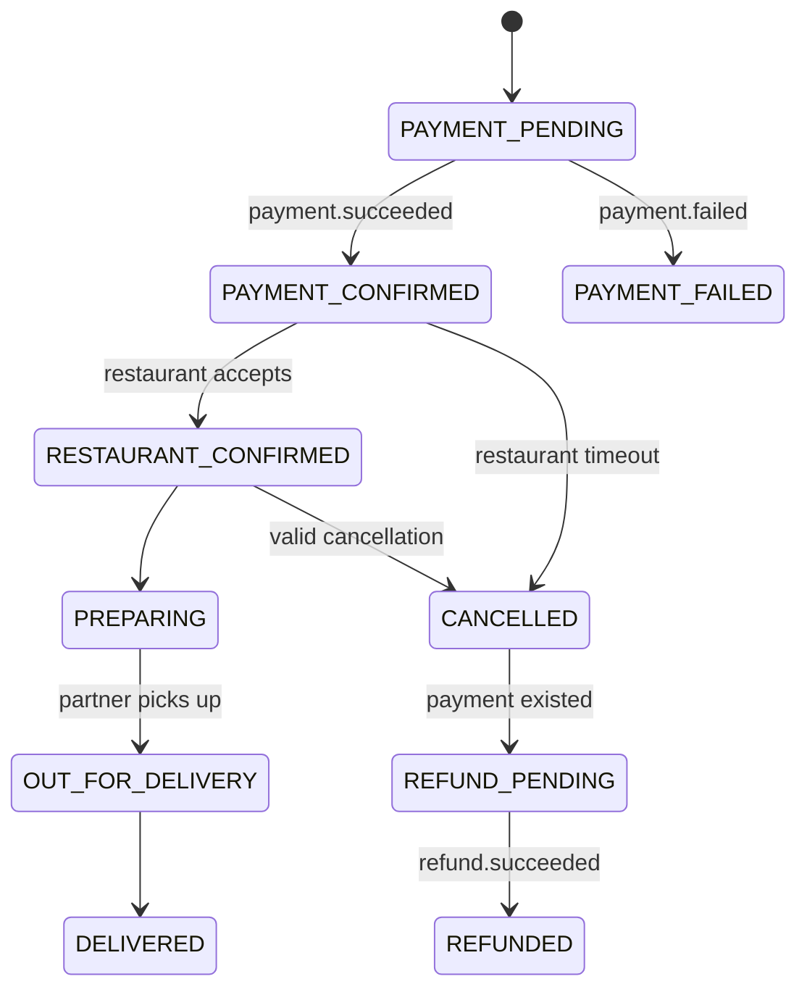

# Orders App — Interview System Design

## 60-Second Answer

* The **Order Service** owns the order lifecycle.
* The **Payment Service** owns payment state and talks to Stripe/Razorpay.
* Order Service calls Payment Service **synchronously** so the user gets an immediate answer.
* Payment Service also publishes a durable `payment.succeeded` or `payment.failed` event through Kafka.
* Order Service consumes that event, updates the order, then publishes order events for restaurant, delivery, and notifications.
* Use an **outbox table** in each service so a database update cannot happen without its Kafka event eventually being published.

> **Interview sentence:** "Payment is the one deliberate synchronous call for user experience; Kafka remains the durable source of truth for completing the workflow."

---

## 1. Requirements

### Functional

- Browse items and maintain a cart
- Place an order and pay
- Restaurant accepts and prepares the order
- Assign a delivery partner
- Show order status and live partner location
- Cancel and refund when allowed
- Notify the user at every important stage

### Non-functional

| Requirement | Target |
|---|---|
| Order placement | Under 2 seconds, including payment |
| Payment correctness | Never charge twice |
| Availability | 99.99% |
| Order consistency | Strong |
| Notifications/tracking | Eventual consistency is acceptable |
| Scale | About 3 million orders/day, 200/sec peak |

---

## 2. Interview Architecture

Draw only this diagram first:


```mermaid
flowchart LR
    C([Client]) --> AG[API Gateway]
    AG --> O[Order Service]
    O --> ODB[(Order DB)]

    O -->|synchronous charge| P[Payment Service]
    P --> PG[Stripe / Razorpay]
    P --> PDB[(Payment DB<br/>transaction + outbox)]
    P -->|payment events<br/>via outbox publisher| K[[Kafka]]
    K --> O
    ODB -->|order events| K

    K --> R[Restaurant Service]
    K --> D[Delivery Service]
    K --> N[Notification Service]

    N -->|publish user:userId| PUB[(Redis Pub/Sub<br/>notification channels)]
    PUB --> WS[WebSocket Gateway]
    WS --> C
    N --> PUSH[FCM / APNs]

    D --> LOC[(Redis<br/>partner locations)]
    LOC --> T[Tracking Service]
    T -->|publish order:orderId| PUB

    style C fill:#1f6feb,color:#fff
    style ODB fill:#3fb950,color:#fff
    style PDB fill:#3fb950,color:#fff
    style K fill:#f0883e,color:#fff
    style PUB fill:#f85149,color:#fff
    style LOC fill:#f85149,color:#fff
```

### What each service owns

| Service | Responsibility |
|---|---|
| **Order Service** | Cart validation, order state, order items, cancellation rules |
| **Payment Service** | Charges, payment transactions, gateway webhooks, refunds |
| **Restaurant Service** | Restaurant acceptance and preparation |
| **Delivery Service** | Partner assignment and delivery state |
| **Notification Service** | Consumes Kafka events, publishes online-user updates to Redis channels, and uses FCM/APNs for offline users |
| **Tracking Service** | Reads live GPS data and publishes it to an order-specific Redis channel |
| **WebSocket Gateway** | Holds client connections, subscribes to Redis channels, and pushes updates to local sockets |

### The communication rule

Kafka is the default:

```text
Restaurant Service does not call Delivery Service.
Delivery Service does not call Notification Service.
They publish events and interested services consume them.
```

Payment is the one exception:

```text
Order Service ──synchronous──> Payment Service
```

The user is waiting to know whether payment succeeded, so this call is synchronous. Payment still emits a Kafka event for durability and recovery.

### How notifications reach the user

```text
order.confirmed
      ↓
Kafka
      ↓
Notification Service
      ↓
Redis channel user:{userId}
      ↓
WebSocket Gateway holding that user's connection
      ↓
Customer app
```

Users never connect directly to Redis. They connect to a WebSocket Gateway. The gateway subscribes to channels for its locally connected users and forwards each event to the correct socket.

Kafka and Redis have different jobs:

| Component | Job |
|---|---|
| **Kafka** | Durable service-to-service event delivery |
| **Redis Pub/Sub** | Fast routing to the WebSocket server holding the connected user |
| **WebSocket Gateway** | Final delivery from the backend to the user's open app |

---

## 3. Why Payment Service Publishes the Payment Event

Payment Service owns the payment transaction, so it should publish:

```text
payment.succeeded
payment.failed
refund.succeeded
refund.failed
```

Order Service should not pretend to own payment facts. It consumes the payment event and translates it into order facts:

```text
payment.succeeded
        ↓
Order Service updates order
        ↓
order.payment_confirmed
```

This separation keeps ownership clear:

| Fact | Owner |
|---|---|
| Card was charged | Payment Service |
| Order can go to restaurant | Order Service |

---

## 4. Placing an Order — Complete Flow


```mermaid
sequenceDiagram
    participant C as Client
    participant O as Order Service
    participant P as Payment Service
    participant G as Payment Gateway
    participant K as Kafka
    participant R as Restaurant Service

    C->>O: Place order + idempotency key
    O->>O: Validate cart and create PAYMENT_PENDING
    O->>P: Charge(orderId, amount, key)
    P->>G: Charge using same key
    G-->>P: Success
    P->>P: Save transaction + outbox event
    P-->>O: Immediate success response
    O-->>C: Payment received

    P->>K: payment.succeeded
    K->>O: Consume payment result
    O->>O: Set PAYMENT_CONFIRMED + write order outbox
    O->>K: order.payment_confirmed
    K->>R: Send order to restaurant
```

### Step by step

1. Client sends the cart and a client-generated `idempotency_key`.
2. Order Service checks stock, prices, and restaurant availability.
3. Order Service creates the order as `PAYMENT_PENDING`.
4. Order Service synchronously asks Payment Service to charge.
5. Payment Service charges the gateway using the same idempotency key.
6. Payment Service stores the transaction and a payment outbox event together.
7. Payment Service returns success/failure immediately for good user experience.
8. Its outbox publishes the durable payment event to Kafka.
9. Order Service consumes the event and updates its state.
10. Order Service publishes `order.payment_confirmed`.
11. Restaurant and Notification services consume that order event.

### Why use both HTTP and Kafka?

| Path | Purpose |
|---|---|
| Synchronous HTTP response | Give the user an immediate answer |
| Kafka payment event | Guarantee that services eventually agree |

Example failure:

```text
Gateway charged the card
        ↓
Payment Service saved SUCCESS
        ↓
HTTP response to Order Service was lost
```

The user may briefly see "processing," but `payment.succeeded` still reaches Order Service and repairs the order.

---

## 5. Outbox Pattern

Without an outbox, this can happen:

```text
Payment transaction saved successfully
        ↓
Service crashes before publishing to Kafka
        ↓
Card charged, but Order Service never knows
```

The fix:

```text
One database transaction:
  1. Save payment transaction
  2. Save outbox row

Background publisher:
  3. Read outbox row
  4. Publish to Kafka
  5. Mark outbox row published
```

The Payment Service and Order Service each have their own outbox because each owns a separate database.

> **Interview sentence:** "The outbox closes the gap between committing domain state and publishing the corresponding event."

---

## 6. Order State Machine


```mermaid
stateDiagram-v2
    [*] --> PAYMENT_PENDING
    PAYMENT_PENDING --> PAYMENT_CONFIRMED : payment.succeeded
    PAYMENT_PENDING --> PAYMENT_FAILED : payment.failed
    PAYMENT_CONFIRMED --> RESTAURANT_CONFIRMED : restaurant accepts
    PAYMENT_CONFIRMED --> CANCELLED : restaurant timeout
    RESTAURANT_CONFIRMED --> PREPARING
    PREPARING --> OUT_FOR_DELIVERY : partner picks up
    OUT_FOR_DELIVERY --> DELIVERED
    RESTAURANT_CONFIRMED --> CANCELLED : valid cancellation
    CANCELLED --> REFUND_PENDING : payment existed
    REFUND_PENDING --> REFUNDED : refund.succeeded
```

| State | Meaning |
|---|---|
| `PAYMENT_PENDING` | Order exists; payment result is not finalized |
| `PAYMENT_CONFIRMED` | Payment event consumed; restaurant workflow can start |
| `PAYMENT_FAILED` | Charge failed; user may retry |
| `RESTAURANT_CONFIRMED` | Restaurant accepted |
| `PREPARING` | Food is being prepared |
| `OUT_FOR_DELIVERY` | Partner picked it up |
| `DELIVERED` | Completed |
| `CANCELLED` | Workflow stopped |
| `REFUND_PENDING` | Refund requested from Payment Service |
| `REFUNDED` | Payment Service confirmed reversal |

---

## 7. Kafka Events

Use a few domain topics, not one topic per order or user:

```text
payment-events
order-events
delivery-events
notification-retry
notification-dead-letter
```

Partition order events by `order_id`:

```text
partition key = order_id
```

That keeps one order's events in order while different orders process in parallel.

| Event | Publisher | Important consumers |
|---|---|---|
| `payment.succeeded` | Payment Service | Order Service |
| `payment.failed` | Payment Service | Order Service |
| `order.payment_confirmed` | Order Service | Restaurant, Notification |
| `order.payment_failed` | Order Service | Notification |
| `order.confirmed` | Restaurant Service | Delivery, Notification |
| `order.preparing` | Restaurant Service | Notification |
| `order.partner_assigned` | Delivery Service | Notification, Tracking |
| `order.out_for_delivery` | Delivery Service | Notification, Tracking |
| `order.delivered` | Delivery Service | Notification, Invoice |
| `order.cancelled` | Order/Restaurant Service | Refund, Notification |
| `refund.requested` | Refund Service | Payment Service |
| `refund.succeeded` | Payment Service | Order, Notification |

Every consumer must be idempotent because Kafka can deliver an event more than once.

---

## 8. Preventing Double Charges

The client generates one UUID when the user taps "Place Order":

```text
idempotency_key = 83f1...
```

The same key is used for:

```text
Client → Order Service
Order Service → Payment Service
Payment Service → Stripe/Razorpay
```

If the request is retried:

```text
Order Service finds the existing order
Payment Service finds the existing transaction
Gateway returns the original charge result
```

Use unique constraints:

```text
orders.idempotency_key                       UNIQUE
payment_transactions(order_id, operation)   UNIQUE
```

> **Interview sentence:** "Retries are expected; idempotency makes them harmless."

---

## 9. Restaurant and Delivery Flow

```text
order.payment_confirmed
        ↓
Restaurant receives order
        ↓
Restaurant accepts
        ↓
order.confirmed
        ↓
Delivery Service finds nearby partner
        ↓
order.partner_assigned
        ↓
Partner picks up
        ↓
order.out_for_delivery
        ↓
Delivered
        ↓
order.delivered
```

Restaurant Service and Delivery Service never need to call each other directly.

If the restaurant does not accept within three minutes:

```text
Order timeout
   → order.cancelled
   → refund.requested
   → Payment Service refunds
   → refund.succeeded
```

---

## 10. Real-Time Tracking

Partner app sends GPS every five seconds:

```text
location:{partnerId} → {lat, lng, timestamp}
```

Store the latest location in Redis because it changes frequently and old points are usually not needed.


```mermaid
flowchart LR
    P([Partner App]) -->|GPS every 5 sec| T[Tracking Service]
    T --> R[(Redis)]
    R --> W[WebSocket Server]
    W --> C([Customer App])

    style P fill:#1f6feb,color:#fff
    style C fill:#1f6feb,color:#fff
    style R fill:#f85149,color:#fff
```

Kafka is not the best path for every GPS update. These updates are temporary and only the newest location matters.

---

## 11. Cart

Use Redis:

```text
cart:{userId} → item and quantity map
TTL           → 24 hours
```

When placing an order:

```text
1. Read cart from Redis
2. Recalculate prices server-side
3. Copy final items into order_items
4. Delete cart after successful placement
```

The order contains a permanent snapshot. The cart remains temporary.

---

## 12. Background Jobs

| Job | Trigger | Action |
|---|---|---|
| Payment reconciliation | Scheduled + gateway webhooks | Repair missing payment results |
| Restaurant timeout | Order remained unaccepted for 3 minutes | Cancel and request refund |
| Payment retry | Technical failure only | Retry with backoff and same idempotency key |
| Partner reassignment | Partner unavailable | Find another partner |
| Invoice generation | `order.delivered` | Generate PDF and store in S3 |
| Refund processing | `order.cancelled` | Ask Payment Service to reverse payment |

Do not automatically retry card declines such as insufficient funds. Retry only technical failures.

---

## 13. What to Draw in an Interview

For a 45-minute interview:

1. Requirements — 5 minutes
2. Architecture diagram — 8 minutes
3. Payment flow — 10 minutes
4. Order state machine — 7 minutes
5. Idempotency + outbox — 8 minutes
6. Tracking or scaling deep dive — remaining time

### Say these lines

- "Order Service owns the order; Payment Service owns the charge."
- "Payment is synchronous for UX but also emits a durable event."
- "The outbox prevents a successful charge from losing its Kafka event."
- "Every payment request carries the same idempotency key through all layers."
- "Kafka is partitioned by order ID so one order stays ordered."
- "GPS goes through Redis/WebSocket because only the latest value matters."

### Skip unless asked

- Exact database columns
- Kafka broker counts
- Every notification template
- Detailed restaurant POS integration
- Exact geospatial algorithm

---

## Common Interview Questions

**Why doesn't Payment Service only use Kafka?**  
It could, but the API would return `202 Processing` and the user would wait for a later update. The hybrid design gives immediate feedback while keeping Kafka durability.

**Why doesn't Order Service publish the payment result?**  
Because Payment Service owns the payment transaction. Order Service publishes the consequence for its own domain: `order.payment_confirmed`.

**What if the card is charged but the HTTP response is lost?**  
Payment Service's outbox still publishes `payment.succeeded`. Order Service consumes it and repairs the order.

**What if Kafka is down?**  
Outbox rows remain unpublished and retry later. Payment and order state are safe in their databases.

**What if Kafka delivers the same event twice?**  
Consumers track the event ID or enforce a unique state transition, making processing idempotent.

**What if Order Service consumes `payment.succeeded` after it already handled the HTTP success?**  
The HTTP response is only for UX. The durable event performs an idempotent state transition, so processing it again changes nothing.

**Why not call Restaurant Service synchronously after payment?**  
Restaurant delays should not keep the user's payment request open. Kafka isolates failures and allows retries.

**How is a refund handled?**  
Cancellation publishes `refund.requested`; Payment Service performs the reversal and publishes `refund.succeeded` or `refund.failed`.
