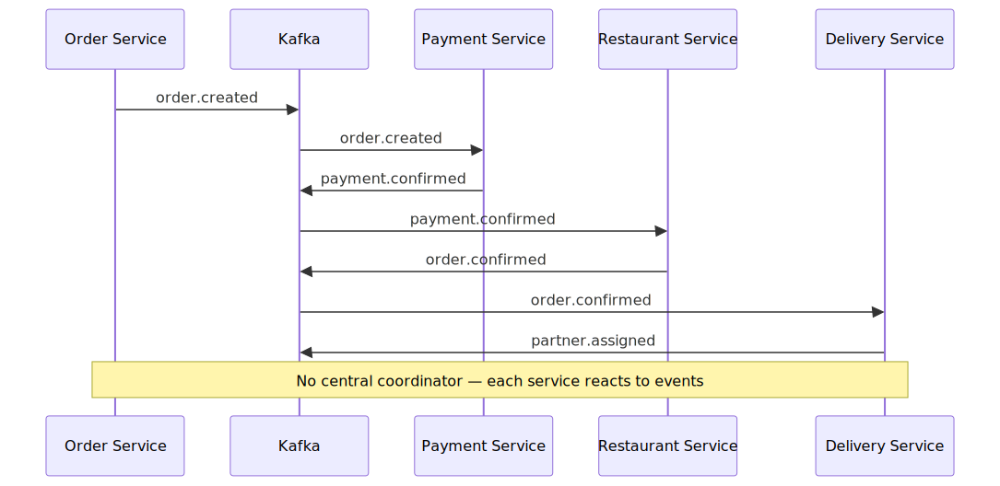
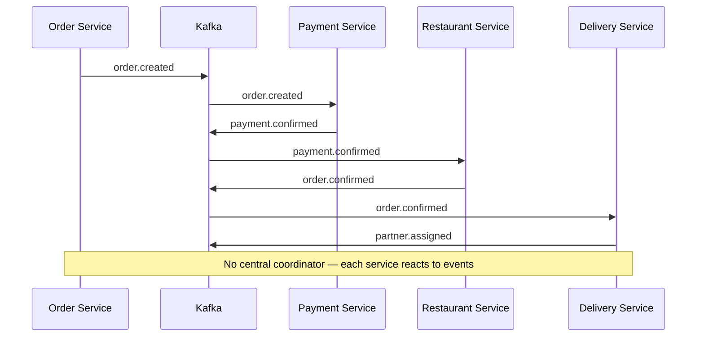
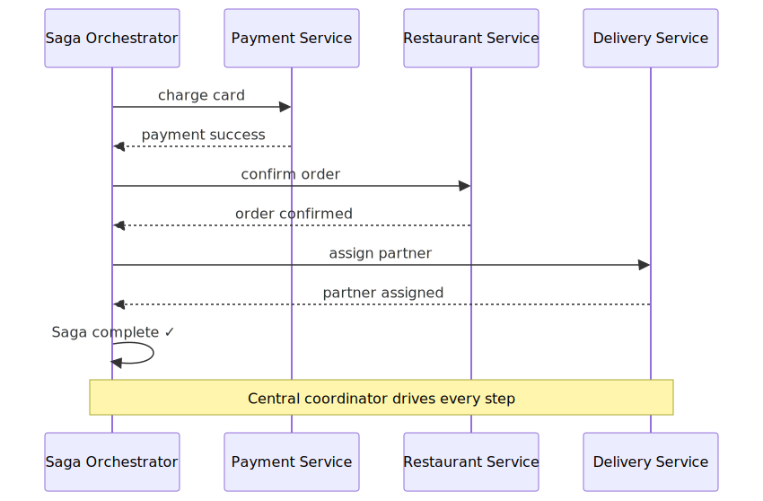
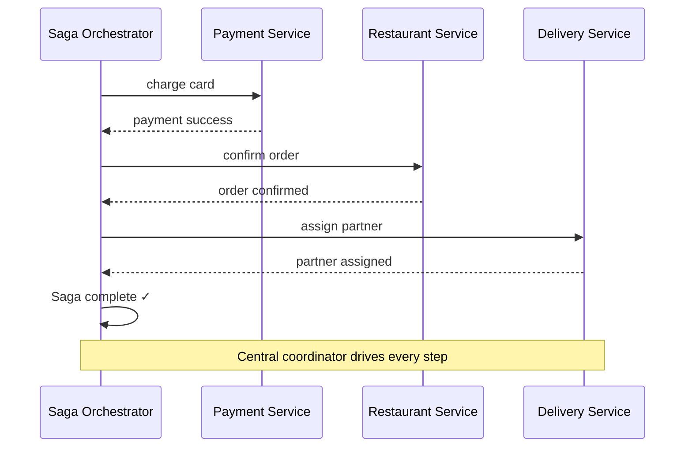
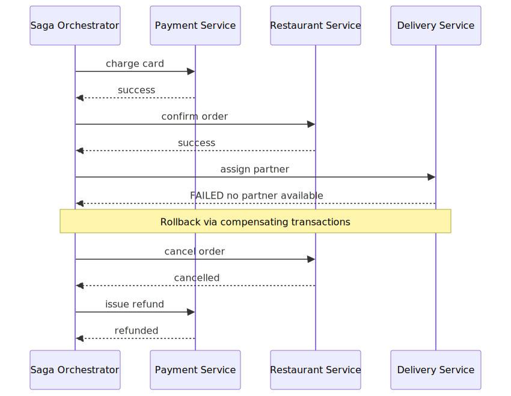
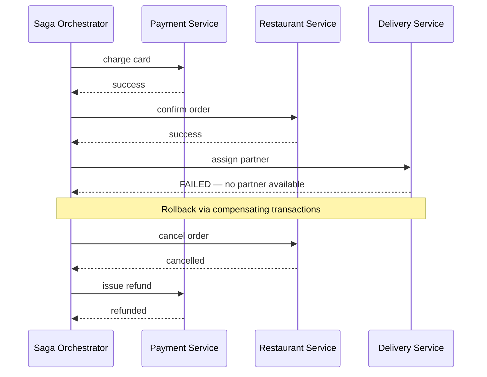
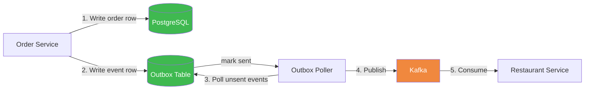

# Saga Pattern — Distributed Transactions Across Microservices

## TL;DR
* **Problem**: Microservices each own their DB — you can't wrap a multi-service operation in one ACID transaction
* **Saga**: Break the transaction into steps; each step publishes an event for the next service to react to
* **Rollback**: No `ROLLBACK` — instead each step has a **compensating transaction** that undoes it
* **Two styles**: Choreography (event-driven, no coordinator) vs Orchestration (central controller)
* **Outbox pattern**: Guarantees the Kafka event always fires, even if the broker is briefly down
* **Key insight**: Sagas trade atomicity for availability. You accept eventual consistency and design rollback explicitly.

---

## The Problem — Why Sagas Exist

In a monolith, a multi-step operation is easy:
```sql
BEGIN
  UPDATE accounts SET balance = balance - 100 WHERE id = 1   -- debit
  UPDATE accounts SET balance = balance + 100 WHERE id = 2   -- credit
  INSERT INTO audit_log ...
COMMIT  -- all succeed, or none do
```

In microservices, each service owns its own database. There is no shared transaction. If you debit one account in Service A and then Service B crashes before crediting the other account, **you have no way to atomically rollback**.

```
Order Service (PostgreSQL)  ──── Payment Service (own DB) ──── Delivery Service (own DB)
       ↓                                  ↓                            ↓
 can't ROLLBACK across these — they are completely separate databases
```

The Saga pattern solves this by replacing the single atomic transaction with a **sequence of local transactions**, each publishing an event that triggers the next step. If any step fails, previously completed steps are undone using **compensating transactions**.

---

## Two Types of Sagas

### 1. Choreography — Event-Driven, No Coordinator

Each service reacts to events from Kafka and publishes its own events when done. There is no central brain — services coordinate by listening and responding.





#### How it works
1. Order Service creates the order and publishes `order.created`
2. Payment Service **listens** for `order.created`, charges the card, publishes `payment.confirmed`
3. Restaurant Service **listens** for `payment.confirmed`, confirms with the restaurant, publishes `order.confirmed`
4. Delivery Service **listens** for `order.confirmed`, assigns a partner, publishes `partner.assigned`

No service calls another service directly. Each only knows about the Kafka topics it cares about.

#### Pros
- Simple to build — just add a Kafka consumer to a new service
- Highly decoupled — services don't know each other exist
- Easy to extend — add a new consumer without touching anything else

#### Cons
- Hard to trace — when something goes wrong, you need to grep across multiple service logs to reconstruct what happened
- No single place that knows the full saga state
- Cyclic dependencies can creep in as the system grows

---

### 2. Orchestration — Central Coordinator

A dedicated **Saga Orchestrator** service drives the entire flow. It explicitly calls each service in order, waits for replies, and decides what to do next — including rollback.





#### How it works
The Orchestrator owns a **saga state machine** — it knows exactly which step it's on and what to do next. Each service is just a worker that receives a command and returns a result. The Orchestrator decides the sequencing.

#### Pros
- Full visibility — the orchestrator's state table shows exactly where every order is
- Easier rollback — the orchestrator knows exactly which steps completed and can issue compensating calls in reverse order
- Easier to debug — one service owns the entire flow

#### Cons
- Single point of failure if orchestrator goes down (mitigated with persistence)
- Creates coupling — orchestrator knows about every service
- More code upfront

---

## Compensating Transactions — The Rollback Mechanism

Since there's no `ROLLBACK`, every step in a Saga must have a corresponding **compensating transaction** — an operation that logically undoes it if a later step fails.





#### Compensating transaction table

| Step | Forward action | Compensating action |
|---|---|---|
| 1 | Create order | Delete order row |
| 2 | Charge card | Issue refund |
| 3 | Confirm with restaurant | Send cancellation to POS |
| 4 | Assign delivery partner | Unassign partner, mark available |

**Important**: Compensating transactions are NOT guaranteed to be instant. A refund might take 3–5 business days. The system must handle this gracefully — status shown to user as "Cancellation in progress" rather than "Cancelled" until the refund completes.

**Compensations must also be idempotent** — if the compensating call fails and retries, running it twice must not double-refund.

---

## Outbox Pattern — Guarantee the Event Always Fires

The biggest failure point in a Saga is: **"What if the DB write succeeds but the Kafka publish fails?"**

```
Order Service:
  UPDATE orders SET status = PAYMENT_CONFIRMED   ← succeeds ✅
  kafka.publish(order.payment_confirmed)          ← Kafka is down ❌

Result: Order is confirmed in DB, but Restaurant Service never hears about it.
        Order is stuck forever.
```

The **Outbox Pattern** solves this by making the Kafka publish part of the same DB transaction:





#### How it works

```sql
BEGIN
  UPDATE orders SET status = 'PAYMENT_CONFIRMED' WHERE id = ?
  INSERT INTO outbox (event_type, payload, sent) VALUES ('order.payment_confirmed', '...', false)
COMMIT
```

Both writes happen atomically in one DB transaction. A separate **Outbox Poller** (background job) continuously reads `SELECT * FROM outbox WHERE sent = false`, publishes each event to Kafka, then marks it `sent = true`.

**Guarantees:**
- If the DB transaction commits → the outbox row exists → Kafka publish will eventually happen
- If the DB transaction rolls back → no outbox row → nothing published
- If Kafka is down → outbox rows pile up, published when Kafka recovers
- If the poller crashes mid-publish → it retries (event published twice) → consumers must be **idempotent**

---

## Real-World Example — Orders App

The orders app uses **Choreography** style:

| Saga step | Event published | Who reacts |
|---|---|---|
| 1. Order validated | `order.payment_confirmed` | Restaurant Service, Notification Service |
| 2. Restaurant confirms | `order.confirmed` | Delivery Service, Notification Service |
| 3. Partner assigned | `order.partner_assigned` | Tracking Service |
| 4. Partner picks up | `order.out_for_delivery` | Notification Service, Tracking Service |
| 5. Delivered | `order.delivered` | Notification Service, Invoice Service |

**Compensations triggered by `order.cancelled`:**
- Refund Service → issues refund (compensates step 1)
- Restaurant Service → cancels order with POS (compensates step 2)
- Delivery Service → unassigns partner (compensates step 3)

---

## Choreography vs Orchestration — When to Use Which

| | Choreography | Orchestration |
|---|---|---|
| Flow visibility | Hard — distributed across services | Easy — one place owns the state |
| Coupling | Low — services don't know each other | Medium — orchestrator knows all |
| Debugging | Hard — grep across many logs | Easy — query orchestrator state |
| Adding new steps | Easy — add a new consumer | Needs orchestrator change |
| Best for | Simple linear flows, many independent consumers | Complex flows with branching, retries, rollback logic |
| Example | Orders notification fan-out | Bank transfer with multi-step compliance checks |

---

## Common Interview Follow-ups

**Q: What's the difference between Saga and 2-Phase Commit (2PC)?**
2PC locks all resources until every participant votes — gives you atomicity but kills availability and throughput. Sagas release locks after each local transaction, accept eventual consistency, and use compensations for rollback. Sagas scale; 2PC doesn't.

**Q: What if a compensating transaction also fails?**
This is a real problem. Options: retry with exponential backoff (most common), alert a human operator (for financial systems), or put the saga in a `MANUAL_REVIEW` state. The saga must log every compensation attempt.

**Q: Can Saga steps run in parallel?**
Yes. In choreography, multiple services can consume the same event simultaneously (different consumer groups). In orchestration, the orchestrator can issue parallel commands and wait for all to complete before proceeding.

**Q: How do you avoid processing the same event twice?**
Each consumer must be idempotent. Store `processed_event_ids` in the consumer's DB. On receipt: `IF event_id already processed → skip`. This handles Kafka's at-least-once delivery guarantee.
