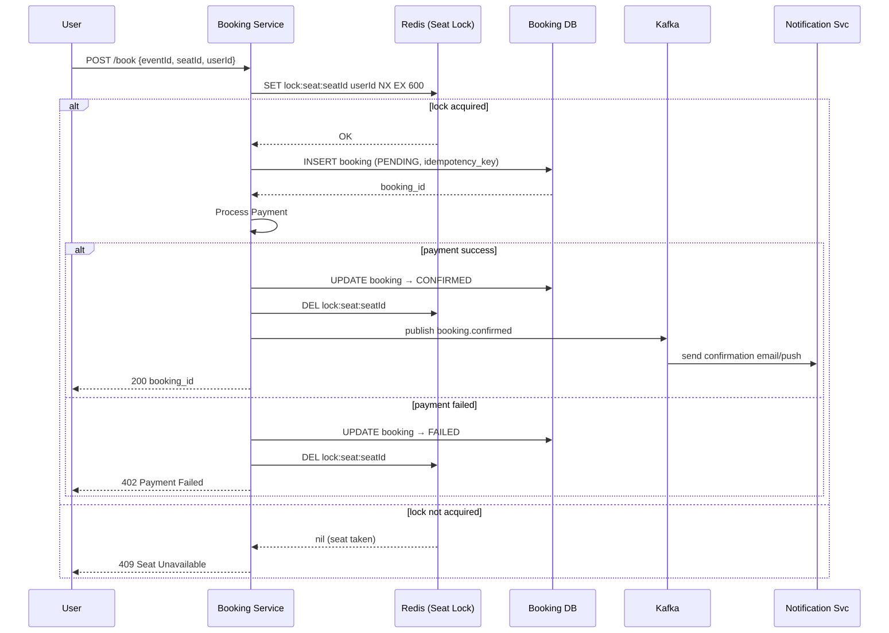

# Ticketmaster — System Design

## TL;DR
* **Core challenge**: High-concurrency seat booking — thousands of users race to book the same seat for a popular event (10M users, one event)
* **Booking consistency**: Redis distributed lock (`SET NX EX`) ensures exactly one user gets each seat — no double booking
* **Read-heavy**: 100:1 read-to-write ratio — events and seat maps served from Redis cache, not the DB
* **Search**: Elasticsearch for full-text, geo, and faceted search; kept in sync via Kafka → Indexer pipeline
* **Key insight**: Availability for read paths (search, view), strict consistency for write paths (booking). These are separate services with different database strategies.

---

## Step 1: Requirements

### Functional Requirements
| Priority | Requirement |
|---|---|
| ✅ Core | Users can view events and seat maps |
| ✅ Core | Users can search for events (by name, city, date, category) |
| ✅ Core | Users can book tickets to events (no double booking) |
| 🔲 Out of scope | Users can view their booking history |
| 🔲 Out of scope | Admins can create/manage events |
| 🔲 Out of scope | Dynamic pricing for popular events |

### Non-Functional Requirements
| Requirement | Target |
|---|---|
| Consistency | Strong for booking (no double-booking), eventual for search/view |
| Scale | 10 million concurrent users for a single popular event |
| Search latency | < 500ms |
| Read throughput | 100:1 read-to-write ratio — heavily cached |
| Availability | High for search & view; booking can tolerate small downtime |

---

## Step 2: Capacity Estimation

| Metric | Estimate |
|---|---|
| Daily active users | 10 million |
| Peak concurrent users (hot event) | 10 million |
| Events in the system | ~500,000 |
| Seats per event | ~50,000 |
| Bookings per second (peak) | ~5,000/sec |
| Search queries per second | ~50,000/sec (100:1) |
| Seat map reads per second | ~500,000/sec (heavy read) |

The hardest problem is not storage — it's the **thundering herd**: all 10M users hitting "Book" at the same moment for the same event. The booking system must handle this without double-booking or crashing.

---

## Step 3: High-Level Architecture

### Event Creation & Search / View



### Booking Flow Architecture



### What each component does

**Client (Browser/App)**
Users interact via a web or mobile interface. Static assets (HTML, JS, CSS) are served from a CDN — the client never hits origin servers for static content.

**Load Balancer**
Distributes incoming API requests across service instances. Routes `/search` to Search Service, `/events` to Event Service, `/book` to Booking Service. Enables horizontal scaling of each service independently.

**Event Service**
Handles all event read operations — `GET /events/:id`, `GET /events/:id/seats`. Sits in front of Redis cache. Returns seat availability and event metadata. Cache TTL is short (30 seconds) since seat status changes frequently during sales. On cache miss, reads from PostgreSQL and repopulates cache.

**Search Service**
Handles `GET /search?q=...&city=...&date=...` queries. Delegates entirely to Elasticsearch for full-text + faceted search. Caches popular search results in Redis (TTL 60s). Never reads from the Event DB directly — it only reads from the Elasticsearch index.

**Booking Service**
The most critical service. Handles `POST /book`. Uses Redis distributed locking to prevent double-booking. Writes to the Booking DB with idempotency keys to handle retries safely. Publishes events to Kafka after a confirmed booking (for notifications, analytics, cache invalidation).

**Event DB (PostgreSQL)**
Source of truth for all event and seat data. Seats table tracks: `seat_id`, `event_id`, `status` (AVAILABLE / LOCKED / BOOKED), `price`, `section`, `row`, `number`. Strong ACID guarantees — no double-booking at the DB level either (enforced via unique constraints + the Redis lock layer above it).

**Booking DB (PostgreSQL)**
Separate database from Event DB — booking writes are isolated so they don't compete with event reads. Stores bookings with status (PENDING → CONFIRMED / FAILED), user ID, seat ID, payment reference, idempotency key.

**Redis — Seat Lock**
Implements distributed locks using `SET key value NX EX 600` (NX = only set if not exists, EX = expire in 10 minutes). When a user initiates booking, a lock is placed on that seat. If payment succeeds, the lock is removed and seat is marked BOOKED in DB. If payment fails or times out, the lock expires automatically — seat becomes available again.

**Redis — Read Cache**
Caches event details and seat maps. Key: `seat:event:{eventId}` → JSON of seat statuses. Short TTL (30s) since popular events have rapidly changing seat availability. Invalidated explicitly by Booking Service on each confirmed booking.

**Kafka**
After a booking is confirmed (or failed), Booking Service publishes to Kafka. Multiple consumers process this independently:
- **Notification Service** — sends confirmation email/push
- **Indexer** — updates Elasticsearch if event details change
- **Analytics** — booking funnel tracking

**Elasticsearch — Search Index**
Stores event documents with all searchable fields: name, description, venue, city, date, category, tags. Supports full-text search, geo-distance queries ("events near me"), and faceted filtering (by date range, price range, category). Kept up to date by the Indexer consuming from Kafka.

---

## Step 4: Booking Flow (The Hard Part)



### Step-by-step: How a seat gets booked

**Step 1 — Client sends booking request**
```
POST /book
{ "eventId": "123", "seatId": "A14", "userId": "u789", "idempotencyKey": "uuid-xyz" }
```
The idempotency key is generated client-side. If the user retries (network timeout, double-click), the server recognises the same key and returns the original result instead of double-booking.

**Step 2 — Acquire Redis distributed lock**
```
SET lock:seat:A14 u789 NX EX 600
```
- `NX` = only set if key does not exist. If another user already holds the lock, this returns `nil`.
- `EX 600` = auto-expire in 10 minutes. Prevents permanent locks if the server crashes mid-booking.
- If `nil` returned → respond immediately with `409 Seat Unavailable`. No DB hit needed.

**Step 3 — Create PENDING booking in DB**
```sql
INSERT INTO bookings (id, user_id, seat_id, status, idempotency_key)
VALUES ('b001', 'u789', 'A14', 'PENDING', 'uuid-xyz')
ON CONFLICT (idempotency_key) DO NOTHING
```
Writing PENDING first means if the server crashes after this point, we can reconcile. The `ON CONFLICT` clause handles retries.

**Step 4 — Process payment**
Booking Service calls the Payment Service (synchronous call). Payment Service charges the user's card. Returns success or failure.

**Step 5a — Payment success**
```sql
UPDATE bookings SET status = 'CONFIRMED' WHERE id = 'b001'
UPDATE seats SET status = 'BOOKED' WHERE seat_id = 'A14'
```
Release the Redis lock: `DEL lock:seat:A14`
Invalidate the seat map cache: `DEL seat:event:123` — so the next read reflects the now-booked seat.

Then publish to Kafka topic `booking.confirmed`:
```json
{ "bookingId": "b001", "userId": "u789", "seatId": "A14", "eventId": "123" }
```
Kafka decouples everything that needs to react to this event. Multiple consumers process it independently:
- **Notification Service** — sends confirmation email / push notification to the user
- **Analytics Service** — records the sale for revenue reporting and funnel tracking
- **Cache Invalidation Consumer** — double-checks the seat map cache is cleared across all regions

Return `200 { bookingId }` to the client. The client doesn't wait for any of the downstream Kafka consumers — they run asynchronously after the response is sent.

**Step 5b — Payment failure**
```sql
UPDATE bookings SET status = 'FAILED' WHERE id = 'b001'
```
Release the Redis lock: `DEL lock:seat:A14` — seat becomes available immediately for the next user.

Publish to Kafka topic `booking.failed`:
```json
{ "bookingId": "b001", "userId": "u789", "seatId": "A14", "reason": "payment_declined" }
```
- **Notification Service** consumes this and sends a "payment failed" email to the user.
- **Analytics Service** records the failed attempt for conversion tracking.

Return `402 Payment Failed` to the client.

### Why not use a DB transaction for the lock?
A DB-level `SELECT FOR UPDATE` would work but creates a long-held row lock that blocks all reads on that seat row for the duration of payment processing (potentially seconds). Redis lock is in-memory and fast — the DB only gets touched for the actual write, not the "reservation" phase.

---

## Step 5: Search Flow



### How search works

**Query path**
```
GET /search?q=taylor+swift&city=NYC&date_from=2025-06-01&date_to=2025-07-01&category=concert
```

1. Search Service checks Redis for a cached result for this query string.
2. On cache HIT → return immediately (< 5ms).
3. On cache MISS → query Elasticsearch with a compound query:
   - Full-text match on `name`, `description`
   - Filter by `city`, `date_range`, `category`
   - Geo-distance filter if coordinates are provided
   - Results scored and ranked by relevance + date
4. Cache the result in Redis with a 60s TTL.
5. Return ranked list of events to client.

**Index update path**
When a new event is created or updated (by an admin, out of scope but relevant here):
1. Event Service writes to PostgreSQL.
2. Publishes `event.created` or `event.updated` to Kafka.
3. Indexer (Kafka consumer) reads the event and upserts the document in Elasticsearch.

This is **eventual consistency** for search — a new event might not appear in search for a few seconds. That's acceptable per our non-functional requirements.

### Why Elasticsearch instead of PostgreSQL full-text search?
PostgreSQL `tsvector` works but degrades at scale. Elasticsearch is purpose-built for:
- **Relevance ranking** — BM25 scoring out of the box
- **Horizontal sharding** — distribute index across nodes automatically
- **Faceted search** — aggregations for "how many results per city?" in one query
- **Typo tolerance** — fuzzy matching on search terms

---

## Step 6: Seat Map & Viewing Flow



### Serving the seat map efficiently

The seat map view (`GET /events/123/seats`) is the most read-heavy endpoint. During a popular sale, millions of users are refreshing it every few seconds to see which seats are still available.

**Cache strategy:**
```
Key:   seat:event:123
Value: { seats: [{ id: "A1", status: "AVAILABLE" }, { id: "A2", status: "BOOKED" }, ...] }
TTL:   30 seconds
```

**On read:**
1. Event Service checks Redis for `seat:event:123`.
2. HIT → return cached seat map (< 10ms).
3. MISS → query PostgreSQL seats table, build seat map, write to Redis, return to client.

**On booking confirmed:**
Booking Service publishes `booking.confirmed` to Kafka → a Cache Invalidation consumer deletes `seat:event:123` from Redis. Next read rebuilds from DB.

**Why 30-second TTL and not real-time?**
Even with explicit invalidation, cache and DB can diverge under very high load. A 30s TTL is a safety net — worst case, a user sees a seat as available that was just booked 25 seconds ago. When they try to book it, they get `409`. This is acceptable UX — the seat map is "approximately real-time", but booking itself is strictly consistent.

---

## Step 7: Handling the Thundering Herd (10M Users, 1 Event)

When Taylor Swift announces a concert, 10 million users hit the booking page simultaneously. How does the system survive?

### Problem 1: Cache stampede on seat map
All 10M users request the seat map at the same time. If the cache is cold (just expired), 10M requests all miss and hit the DB simultaneously → DB dies.

**Solution: Cache warming + probabilistic early expiry**
- Before the sale starts (known time), pre-warm the cache for that event's seat map.
- Use **probabilistic early expiry** (also called "jitter"): instead of all 10M requests expiring at the same second, each cache write has a small random jitter added to the TTL (e.g., 30s ± 5s) so expirations are spread out.
- Alternatively, a **background refresher** process continuously refreshes the hot seat map cache before it expires, so it's never cold.

### Problem 2: Booking service overload
10M users all trying to book at the same time → Booking Service gets 10M requests/sec.

**Solution: Virtual waiting queue**
Instead of hitting Booking Service directly, users are placed in a virtual queue:
- A **Queue Service** assigns each user a position number.
- Users see "You are #2,847,331 in line" with an estimated wait time.
- The queue drains at a controlled rate (e.g., 5,000 bookings/sec) to match Booking Service capacity.
- Users are notified via WebSocket or polling when it's their turn.
- Each user gets a **time-limited token** (valid 10 minutes) to complete their booking once dequeued.

This pattern is used by Ticketmaster, PlayStation Network (PS5 launch), and Nike SNKRS drops.

### Problem 3: Redis lock contention
For the most in-demand seats, thousands of users try `SET NX` on the same key simultaneously. Redis is single-threaded and handles this serially — only the first one wins. This is actually the desired behaviour — no data races possible.

---

## Step 8: Database Schema

### Events Table (PostgreSQL)
```sql
events (
  event_id    UUID PRIMARY KEY,
  name        TEXT NOT NULL,
  venue_id    UUID,
  city        TEXT,
  date_time   TIMESTAMPTZ,
  category    TEXT,
  description TEXT,
  created_at  TIMESTAMPTZ DEFAULT now()
)
```

### Seats Table (PostgreSQL)
```sql
seats (
  seat_id     UUID PRIMARY KEY,
  event_id    UUID REFERENCES events(event_id),
  section     TEXT,
  row         TEXT,
  number      INT,
  price       DECIMAL(10,2),
  status      TEXT CHECK (status IN ('AVAILABLE','LOCKED','BOOKED')) DEFAULT 'AVAILABLE'
)
-- Unique constraint prevents double-booking at DB level (defence in depth)
CREATE UNIQUE INDEX ON seats (event_id, section, row, number);
```

### Bookings Table (PostgreSQL)
```sql
bookings (
  booking_id       UUID PRIMARY KEY DEFAULT gen_random_uuid(),
  user_id          UUID NOT NULL,
  seat_id          UUID REFERENCES seats(seat_id),
  event_id         UUID REFERENCES events(event_id),
  status           TEXT CHECK (status IN ('PENDING','CONFIRMED','FAILED')),
  payment_ref      TEXT,
  idempotency_key  TEXT UNIQUE NOT NULL,
  created_at       TIMESTAMPTZ DEFAULT now()
)
```
The `UNIQUE` constraint on `idempotency_key` means retried requests are safe — the second `INSERT` on the same key fails silently (`ON CONFLICT DO NOTHING`), and the service re-reads the existing booking row.

---

## Deep Dives

### Why Redis for locking instead of DB `SELECT FOR UPDATE`?
`SELECT FOR UPDATE` acquires a row-level lock in PostgreSQL. While the lock is held, all other transactions trying to read/update that row are **blocked**. For booking, the lock is held for the entire payment round-trip (1–3 seconds). With thousands of concurrent users, this creates a massive queue of blocked DB connections → connection pool exhaustion → DB overload.

Redis lock is different:
- Lock acquisition and release are sub-millisecond (in-memory).
- The DB is only touched for the write, not during the "waiting" phase.
- Redis can handle millions of lock operations per second on a single node.

### What if Redis goes down during a booking?
If Redis crashes after a user acquires a lock but before the booking is committed:
- The lock key is gone (Redis lost it).
- Another user can now acquire the lock and book the same seat.
- **Defence in depth**: the `seats` table has `status` with a unique constraint. The second booking attempt will fail at the DB level with a constraint violation.
- The Booking Service catches this violation, returns `409`, and the second user's booking is rolled back cleanly.

So Redis lock is the primary guard (fast path), and the DB unique constraint is the fallback guard (slow path). Together they ensure no double-booking even under Redis failure.

### Idempotency key flow
Users on slow connections often submit a form twice. Without idempotency, this creates two bookings for the same seat. The flow:

1. Client generates a UUID before sending the request.
2. Client includes it as `X-Idempotency-Key: uuid-xyz` in the request header.
3. Booking Service stores `(idempotency_key, result)` in the bookings table.
4. On retry with the same key: DB returns existing row via `ON CONFLICT DO NOTHING`, service returns original result.
5. Client gets the same `booking_id` both times — no duplicate booking created.

### Should we shard the Booking DB?
At 5,000 bookings/sec, a single PostgreSQL instance handles this comfortably (PostgreSQL can do ~10,000–50,000 simple writes/sec with SSDs). Sharding adds complexity and is not needed at this scale.

If we needed to scale further, we'd shard by `event_id` — all bookings for one event go to the same shard. This keeps event-level queries efficient and avoids cross-shard joins.
