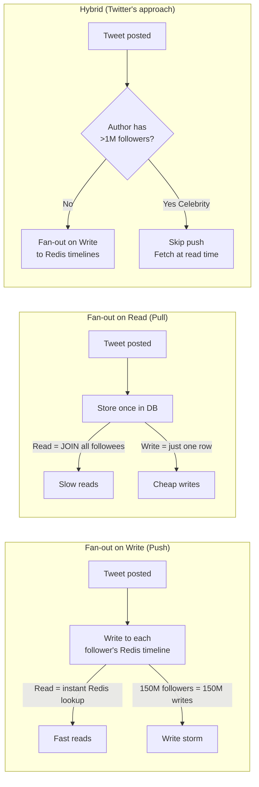
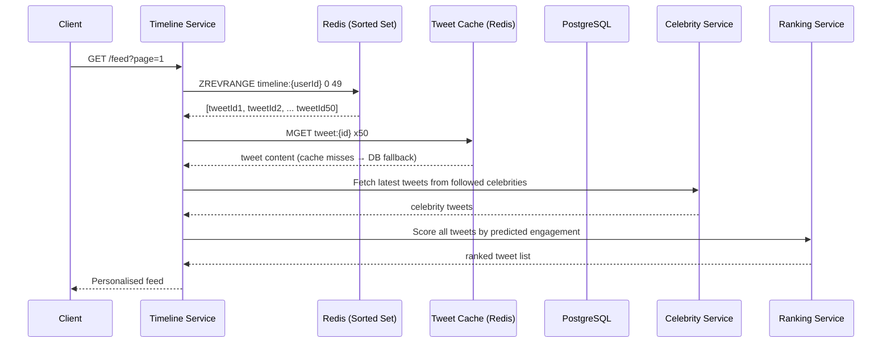

# Twitter Feed — System Design (News Feed / Timeline)

## TL;DR
* **Core problem**: Fan-out — when user posts, N followers must see it in their feed
* **Strategy**: Hybrid — push (fan-out on write) for normal users; pull (fan-out on read) for celebrities (>1M followers)
* **Timeline store**: Redis sorted set per user — O(log N) insert, O(1) range read
* **Async fan-out**: Kafka → Fan-out Service writes to follower Redis timelines in background
* **Tweet IDs**: Snowflake — time-sortable, globally unique, no central bottleneck
* **Feed ranking**: ML re-ranking layered on top of the chronological base at read time
* **Key insight**: The write path (fan-out) is the hard problem. The read path is just a Redis sorted set lookup.

---

## Step 1: Clarify Requirements

### Functional Requirements
- User posts a tweet (text + optional media)
- User sees a feed of tweets from people they follow (reverse-chronological or ranked)
- Follow / unfollow
- Like, retweet, reply
- Trending topics

### Non-Functional Requirements
| Requirement | Target |
|---|---|
| Scale | 250M DAU, 500M tweets/day |
| Read:Write ratio | ~100:1 (feeds read far more than tweets posted) |
| Feed load latency | < 200ms (p99) |
| Fan-out lag | Tweet appears in follower feeds < 5s |
| Availability | 99.99% |
| Consistency | Eventual — feed lagging seconds is acceptable |

### Out of Scope
- Direct messages (separate system — see WhatsApp design)
- Twitter Spaces / live audio
- Ad targeting

---

## Step 2: Capacity Estimation

| Metric | Estimate |
|---|---|
| Tweets/day | 500 million |
| Tweets/sec | ~6,000/sec |
| Avg followers | 200 |
| Fan-out writes/day | 500M × 200 = **100 billion Redis writes/day** |
| Feed reads/day | 250M × 10 opens = 2.5 billion |
| Redis memory for timelines | 250M users × 1000 tweetIds × 8B = **~2 TB** |

---

## Step 3: High-Level Architecture


---

## Step 4: Deep Dive

### The Fan-out Problem




### Timeline Data Structure (Redis Sorted Set)
```
Key  : timeline:{userId}
Type : Sorted Set
Score: unix timestamp (for ordering newest-first)
Value: tweetId (Snowflake ID)

Operations:
  Post tweet  : ZADD timeline:123 1714900000 tweetId  → O(log N)
  Read feed   : ZREVRANGE timeline:123 0 49            → O(log N + 50)
  Trim memory : ZREMRANGEBYRANK timeline:123 0 -1001   → keep only 1000 latest
```

### Snowflake Tweet ID
```
[ 41 bits: Timestamp (ms) ][ 10 bits: Machine ID ][ 12 bits: Sequence ]
  ~69 years of IDs           1024 machines           4096 IDs/ms/machine
```

> Time-sortable without DB query. Globally unique without a central counter. Fits in a 64-bit integer.

### Read Path (Timeline Assembly)


### Background Jobs
| Job | Trigger | Action |
|---|---|---|
| Fan-out | tweet.posted Kafka event | Write tweetId to follower Redis timelines |
| Timeline backfill | User follows new account | Add recent tweets from new followee |
| Trending topics | Cron every 5 min | Count hashtags in sliding window |
| Media processing | tweet.posted with media | Resize, compress, push to CDN |
| Spam detection | tweet.posted Kafka event | Run ML classifier before fan-out |

---

## Step 5: Key Design Decisions

| Decision | Choice | Alternative | Why |
|---|---|---|---|
| Fan-out strategy | Hybrid push/pull | Pure push or pull | Avoids celebrity write storm AND expensive reads |
| Timeline storage | Redis sorted set | DB table | O(log N) insert, O(1) range, in-memory speed |
| Tweet IDs | Snowflake | UUID / DB auto-increment | Time-sortable, no central bottleneck |
| Async fan-out | Kafka | Sync in-process | Decoupled, retryable, absorbs posting spikes |
| Feed ranking | ML at read time | Chronological only | Personalised; signals change frequently |

---

## Common Interview Follow-ups

**Q: What is the celebrity problem?**
A user with 150M followers triggers 150M Redis writes simultaneously on one tweet — saturates the fan-out fleet. Solution: don't pre-push celebrity tweets. Fetch and merge at read time.

**Q: What happens on follow/unfollow?**
Follow: Fan-out Service backfills recent N tweets from new followee into the follower's Redis timeline.
Unfollow: Lazily handled at read time — filter out unfollowed user's tweets rather than rewriting timeline.

**Q: How do you paginate the feed?**
Use `ZREVRANGEBYSCORE timeline:{userId} lastScore -inf LIMIT 0 50` where lastScore = score (timestamp) of last seen tweet. Avoids OFFSET-based pagination which slows with depth.
