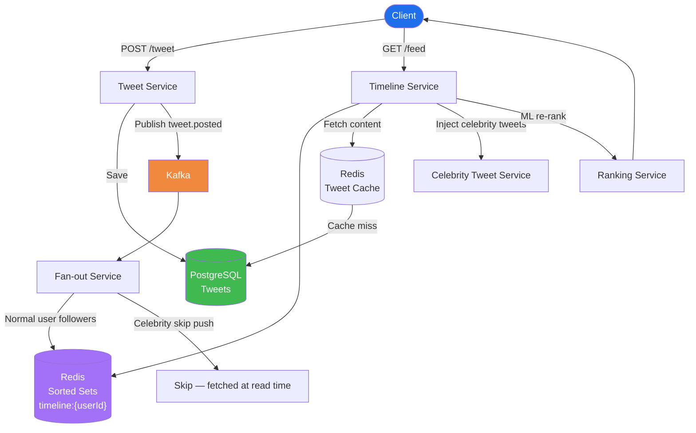
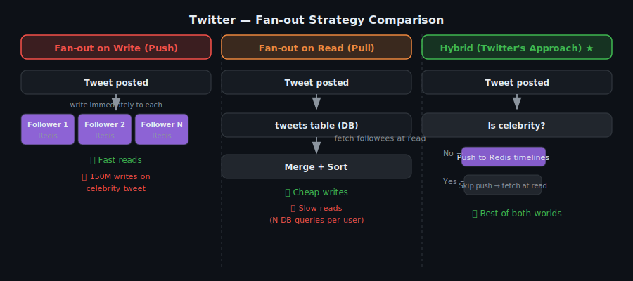
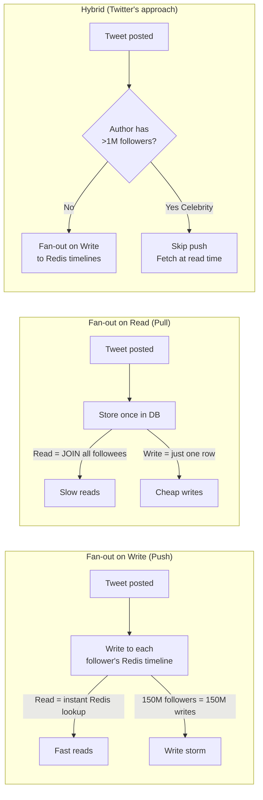
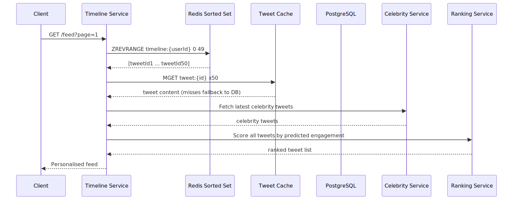
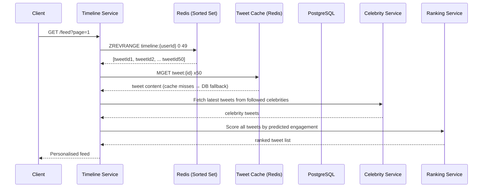

# Twitter Feed — System Design (News Feed / Timeline)

## TL;DR
* **Core problem**: Fan-out — when user posts, N followers must see it in their feed
* **Strategy**: Hybrid — push (fan-out on write) for normal users; pull (fan-out on read) for celebrities (>1M followers)
* **Timeline store**: Redis sorted set per user — O(log N) insert, O(1) range read
* **Async fan-out**: Kafka → Fan-out Service writes to follower Redis timelines in background
* **Tweet IDs**: Snowflake — time-sortable, globally unique, no central bottleneck
* **Feed ranking**: ML re-ranking layered on top of the chronological base at read time
* **Key insight**: The write path (fan-out) is the hard problem. The read path is just a Redis sorted set lookup.

---

## Fan-out and Fan-in — Definitions

These two patterns are the heart of any feed system. Understanding them before everything else makes the rest of the design obvious.

### Fan-out — One → Many

**Fan-out** means one event triggers writes or notifications to **many targets**. In Twitter, when a user posts a tweet, that single event must be delivered to every follower's feed. The "fan-out" is the act of spreading that one write across N destinations.



> One tweet posted → Fan-out Service → written into 200 (or 200M) follower timelines.

**Used in Twitter when:**
- A normal user (< 1M followers) posts a tweet
- The Fan-out Service consumes the `tweet.posted` Kafka event and writes the tweet ID into every follower's Redis sorted set
- This happens **asynchronously in the background** — the tweet is saved first, fan-out happens after

**Not used when:**
- The author is a celebrity (> 1M followers) — 150M Redis writes from one tweet would saturate the fleet. Celebrity tweets are skipped at write time and fetched at read time instead.

---

### Fan-in — Many → One

**Fan-in** is the opposite: **many sources are merged into one output**. When you open your Twitter feed, the Timeline Service pulls tweets from all the people you follow and merges them into a single ranked list. That merging is fan-in.



> Tweets from User B, User C, celebrities, User N → merged + ranked → your personalised feed.

**Used in Twitter when:**
- You request your feed (`GET /feed`)
- The Timeline Service reads your Redis sorted set (which already has most tweets pre-merged by fan-out), then **additionally fetches celebrity tweets** at read time and merges them in
- The Ranking Service then re-scores the merged list for personalisation

**The key insight:**
- **Fan-out on write** (push) = fast reads, expensive writes
- **Fan-in on read** (pull) = cheap writes, slow reads
- Twitter uses **both**: fan-out for normal users (fast reads), fan-in for celebrities (avoids write storms)

---

## Step 1: Clarify Requirements

### Functional Requirements
- User posts a tweet (text + optional media)
- User sees a feed of tweets from people they follow (reverse-chronological or ranked)
- Follow / unfollow
- Like, retweet, reply
- Trending topics

### Non-Functional Requirements
| Requirement | Target |
|---|---|
| Scale | 250M DAU, 500M tweets/day |
| Read:Write ratio | ~100:1 (feeds read far more than tweets posted) |
| Feed load latency | < 200ms (p99) |
| Fan-out lag | Tweet appears in follower feeds < 5s |
| Availability | 99.99% |
| Consistency | Eventual — feed lagging seconds is acceptable |

### Out of Scope
- Direct messages (separate system — see WhatsApp design)
- Twitter Spaces / live audio
- Ad targeting

---

## Step 2: Capacity Estimation

| Metric | Estimate |
|---|---|
| Tweets/day | 500 million |
| Tweets/sec | ~6,000/sec |
| Avg followers | 200 |
| Fan-out writes/day | 500M × 200 = **100 billion Redis writes/day** |
| Feed reads/day | 250M × 10 opens = 2.5 billion |
| Redis memory for timelines | 250M users × 1000 tweetIds × 8B = **~2 TB** |

---

## Step 3: High-Level Architecture

### Write Path — POST /tweet



#### How the write path works — step by step

**1. Client → Tweet Service**
The user hits `POST /tweet` with text (and optionally media URLs after upload). The Tweet Service is a stateless REST service behind a load balancer.

**2. Tweet Service → PostgreSQL**
The tweet is written synchronously to PostgreSQL first. This is the source of truth. The tweet row contains: `tweet_id` (Snowflake), `author_id`, `text`, `created_at`, `media_urls`. The Snowflake ID encodes the timestamp inside it — no separate `ORDER BY created_at` needed.

**3. Tweet Service → Kafka**
After the DB write succeeds, the Tweet Service publishes a `tweet.posted` event to Kafka topic `tweets`. The event payload is just `{ tweet_id, author_id, created_at }`. The Tweet Service does NOT wait for fan-out — it returns HTTP 201 to the client immediately. Fan-out is fully async.

**4. Kafka → Fan-out Service**
The Fan-out Service is a Kafka consumer group. Each consumer reads `tweet.posted` events from its assigned partitions. For each event it:
- Looks up the author's follower list from the **Followers DB** (a graph store or a simple `follows` table in Postgres)
- Iterates over all followers

**5. Fan-out Service → Redis (the core write)**
For each follower (excluding celebrities' followers — explained below), the Fan-out Service runs:
```
ZADD timeline:{followerId}  <tweet_created_at_unix_ms>  <tweet_id>
```
The **key** is `timeline:{userId}` — one sorted set per user.
The **score** is the tweet's creation timestamp in milliseconds. Redis sorts by score, so `ZREVRANGE` always returns newest first.
After writing, it trims the timeline to keep only the latest 1000 entries:
```
ZREMRANGEBYRANK timeline:{followerId} 0 -1001
```
This caps Redis memory usage per user.

**6. What about celebrities (> 1M followers)?**
If the author has more than 1M followers, the Fan-out Service **skips Redis writes entirely**. Writing to 150M Redis keys from a single tweet would take hours and saturate the cluster. Instead, celebrity tweets sit in PostgreSQL and are injected at read time (see Read Path step 5).

---

### Read Path — GET /feed



#### How the read path works — step by step

**1. Client → Timeline Service**
User opens the app. The client calls `GET /feed?page=1`. The Timeline Service is a stateless service — it assembles the feed from multiple sources on every request.

**2. Timeline Service → Redis Sorted Set**
```
ZREVRANGE timeline:{userId}  0  49
```
This returns the 50 most recent tweet IDs for this user, in reverse-chronological order (newest first), purely from memory — sub-millisecond. Each value is a Snowflake tweet ID; the score is the posting timestamp.

**How Redis is structured for timelines:** One Redis key per user, and the value is a sorted set of tweet IDs.

```
Key    : timeline:9923711          ← one key per user
Type   : Sorted Set
Score  : 1714900000000             ← unix timestamp in ms (newest = highest score)
Value  : 1923456789012345678       ← Snowflake tweet ID
Max    : 1000 entries per key      ← trimmed on every write
```

**3. Timeline Service → Tweet Cache (Redis)**
The sorted set only has tweet IDs — not the tweet content. The Timeline Service now calls:
```
MGET tweet:1923456789012345678  tweet:...  tweet:...   (up to 50 keys in one call)
```
Each `tweet:{tweetId}` key stores the full tweet JSON: author name, avatar, text, like count, etc. This cache is populated on first read and has a TTL of ~24 hours.

**Cache miss → PostgreSQL fallback:**
If a tweet isn't in the cache (older tweet, cold start, TTL expired), the Timeline Service fetches it from PostgreSQL and backfills the cache. On a warm system this is rare — recent tweets are almost always cached.

**4. Timeline Service → Celebrity Service**
For every celebrity that this user follows, the Celebrity Service fetches their latest N tweets directly from the Tweet Cache (or PostgreSQL if cold). These tweets were **never written to the user's Redis timeline** during fan-out — they are injected here at read time.

**5. Timeline Service → Ranking Service**
The merged list (pre-fanout tweets + celebrity tweets) is passed to the ML Ranking Service. It re-scores each tweet based on predicted engagement signals (likes, replies, time since post, your history with this author). The output is a re-ordered list — this is what you actually see.

**6. Response**
The ranked list of hydrated tweet objects is returned to the client. Total time: < 200ms p99. Redis lookups dominate (< 5ms). DB fallback is the only slow path.

---

#### What happens to Redis when you follow someone new?

A background **Timeline Backfill Job** is triggered. It fetches the last 50 tweets from the new followee and runs `ZADD timeline:{yourId} ...` for each one. Your feed is updated without you having to reload.

#### What happens to Redis when you unfollow?

**Nothing immediately.** Unfollow is handled lazily at read time — the Timeline Service filters out tweets from unfollowed users before returning the feed. A separate cleanup job eventually purges their tweet IDs from your sorted set.

---

### Follow Path — POST /follow



#### How the follow path works — step by step

**1. Client → Follow Service**
User taps "Follow" on a profile. The client calls `POST /follow` with `{ followee_id }`. The Follow Service handles this synchronously up to the DB write, then returns `200 OK` immediately — timeline backfill happens async.

**2. Follow Service → Followers DB**
A row is inserted into the `follows` table:
```
INSERT INTO follows (follower_id, followee_id, created_at)
VALUES (myUserId, targetUserId, NOW())
```
This is the source of truth for the social graph. The Followers DB is queried by the Fan-out Service on every tweet post — it needs to be fast and horizontally scalable (often sharded by `follower_id` or kept in a graph store).

**3. Follow Service → Kafka**
After the DB write, a `follow.created` event is published to Kafka:
```json
{ "follower_id": 9923711, "followee_id": 4412099, "created_at": 1714900000000 }
```
The Follow Service does NOT wait for timeline backfill. The client already has their `200 OK`.

**4. Kafka → Timeline Backfill Service**
The Timeline Backfill Service consumes `follow.created` events. Its job is to seed the follower's Redis timeline with recent tweets from the new followee so the feed feels fresh immediately.

**5. Backfill Service → Tweet Cache → PostgreSQL**
The service fetches the last ~50 tweets from the new followee:
```
MGET tweet:{id1}  tweet:{id2}  ...   ← from Tweet Cache (Redis)
```
Cache misses fall back to PostgreSQL. Only recent tweets are backfilled — not the entire history.

**6. Backfill Service → Redis Sorted Set**
For each fetched tweet, it runs:
```
ZADD timeline:{followerId}  <tweet_created_at_ms>  <tweet_id>
```
Same write pattern as the Fan-out Service. After all inserts, the timeline is trimmed:
```
ZREMRANGEBYRANK timeline:{followerId} 0 -1001
```

**What the user sees:**
The next time the user opens their feed (even seconds after following), the new followee's recent tweets are already in their Redis sorted set and appear in the feed — no delay, no "reload to see tweets".

**What if the new followee is a celebrity?**
No backfill happens. Celebrity tweets are never written to the Redis timeline — they are fetched live by the Celebrity Service at read time. The follower will see the celebrity's tweets on their very next feed load without any backfill step.

---



---

## Step 4: Deep Dive

### The Fan-out Problem





### Timeline Data Structure (Redis Sorted Set)
```
Key  : timeline:{userId}
Type : Sorted Set
Score: unix timestamp (for ordering newest-first)
Value: tweetId (Snowflake ID)

Operations:
  Post tweet  : ZADD timeline:123 1714900000 tweetId  → O(log N)
  Read feed   : ZREVRANGE timeline:123 0 49            → O(log N + 50)
  Trim memory : ZREMRANGEBYRANK timeline:123 0 -1001   → keep only 1000 latest
```

### Snowflake Tweet ID
```
[ 41 bits: Timestamp (ms) ][ 10 bits: Machine ID ][ 12 bits: Sequence ]
  ~69 years of IDs           1024 machines           4096 IDs/ms/machine
```

> Time-sortable without DB query. Globally unique without a central counter. Fits in a 64-bit integer.

### Read Path (Timeline Assembly)





### Background Jobs
| Job | Trigger | Action |
|---|---|---|
| Fan-out | tweet.posted Kafka event | Write tweetId to follower Redis timelines |
| Timeline backfill | User follows new account | Add recent tweets from new followee |
| Trending topics | Cron every 5 min | Count hashtags in sliding window |
| Media processing | tweet.posted with media | Resize, compress, push to CDN |
| Spam detection | tweet.posted Kafka event | Run ML classifier before fan-out |

---

## Step 5: Key Design Decisions

| Decision | Choice | Alternative | Why |
|---|---|---|---|
| Fan-out strategy | Hybrid push/pull | Pure push or pull | Avoids celebrity write storm AND expensive reads |
| Timeline storage | Redis sorted set | DB table | O(log N) insert, O(1) range, in-memory speed |
| Tweet IDs | Snowflake | UUID / DB auto-increment | Time-sortable, no central bottleneck |
| Async fan-out | Kafka | Sync in-process | Decoupled, retryable, absorbs posting spikes |
| Feed ranking | ML at read time | Chronological only | Personalised; signals change frequently |

---

## Common Interview Follow-ups

**Q: What is the celebrity problem?**
A user with 150M followers triggers 150M Redis writes simultaneously on one tweet — saturates the fan-out fleet. Solution: don't pre-push celebrity tweets. Fetch and merge at read time.

**Q: What happens on follow/unfollow?**
Follow: Fan-out Service backfills recent N tweets from new followee into the follower's Redis timeline.
Unfollow: Lazily handled at read time — filter out unfollowed user's tweets rather than rewriting timeline.

**Q: How do you paginate the feed?**
Use `ZREVRANGEBYSCORE timeline:{userId} lastScore -inf LIMIT 0 50` where lastScore = score (timestamp) of last seen tweet. Avoids OFFSET-based pagination which slows with depth.
