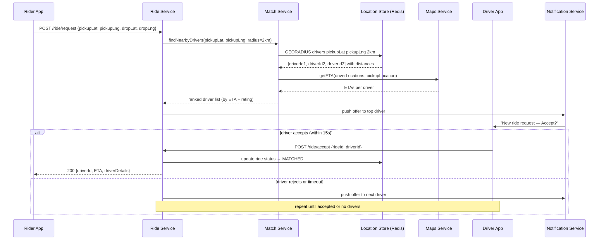

# Uber — System Design

## TL;DR
* **Core challenge**: Match a rider to the nearest available driver in real-time, across millions of concurrent users and drivers
* **Location at scale**: Drivers send GPS every 5 seconds — Redis `GEORADIUS` queries nearby drivers in sub-millisecond time using geospatial indexing
* **Matching**: Match Service ranks nearby drivers by ETA (from Maps Service) + rating, then offers the ride sequentially — top driver first, fallback to next on reject/timeout
* **Live tracking**: Once matched, driver location updates flow through Kafka → Trip Service → WebSocket → Rider App
* **Key insight**: Redis is the heartbeat of the system — it stores every driver's live location with a 30s TTL. If a driver stops sending updates, they automatically disappear from the pool.

---

## Step 1: Requirements

### Functional Requirements
| Priority | Requirement |
|---|---|
| ✅ Core | Riders can request a ride from their location |
| ✅ Core | System matches rider to the nearest available driver |
| ✅ Core | Rider and driver can see each other's live location during the trip |
| 🔲 Out of scope | Payments and fare calculation |
| 🔲 Out of scope | Surge pricing |
| 🔲 Out of scope | Ride history and receipts |
| 🔲 Out of scope | Driver onboarding and background checks |

### Non-Functional Requirements
| Requirement | Target |
|---|---|
| Matching latency | < 1 second to find and offer a driver |
| Location update frequency | Driver sends GPS every 5 seconds |
| Location query latency | < 100ms for nearby driver lookup |
| Scale | 10 million concurrent riders, 3 million active drivers |
| Availability | High — a rider should always get a response (even if no drivers available) |
| Consistency | Eventual — slight staleness in driver location is acceptable |

---

## Step 2: Capacity Estimation

| Metric | Estimate |
|---|---|
| Active drivers globally | 3 million |
| GPS updates per second | 3M drivers × (1 update / 5s) = **600,000 writes/sec** |
| Ride requests per second | ~5,000/sec at peak |
| Location queries per ride request | 1 GEORADIUS query per request |
| Storage per driver location | ~50 bytes (lat, lng, heading, timestamp) |
| Total location storage | 3M × 50B = **~150 MB** — fits entirely in Redis RAM |

The 600K writes/sec to Redis is the dominant load. This is why driver location lives in Redis (in-memory, microsecond writes) and not a relational DB.

---

## Step 3: High-Level Architecture



### What each component does

**Rider App**
Sends ride requests via HTTP. Receives driver match details and then connects via WebSocket (or polling) to track the driver's live location during the trip.

**Driver App**
Two responsibilities: sends GPS location every 5 seconds via `PATCH /driver/location`, and receives ride offers via push notifications. The driver accepts or rejects within a 15-second window.

**Load Balancer**
Routes requests to the appropriate service. Location updates → Location Service. Ride requests → Ride Service. Trip updates → Trip Service.

**Location Service**
Receives every GPS ping from every driver. Does two things:
1. Writes the location to Redis using `GEOADD` (geospatial index) with a 30s TTL
2. Publishes a `location.updated` event to Kafka for any active trip consumers

**Redis — Location Store**
The core of driver discovery. Stores every active driver's position as a geospatial point. Supports `GEORADIUS` — "give me all drivers within 2km of this coordinate" — in O(N+log M) time. The 30s TTL means drivers who stop sending updates (app closed, phone dead) are automatically removed from the pool.

**Match Service**
Called by Ride Service when a ride is requested. Queries Redis for nearby drivers, calls Maps Service for ETAs, ranks drivers, and returns the sorted list. Does not directly notify drivers — that's Notification Service's job.

**Maps Service**
External (or internal) service for routing. Given a driver's location and a pickup point, returns estimated time of arrival. Used to rank drivers not just by raw distance but by actual travel time (accounting for traffic, road network).

**Ride Service**
Orchestrates the ride request flow. Receives the request, calls Match Service, then sequentially offers the ride to drivers (top-ranked first). Stores ride state in the Ride DB. Publishes `ride.requested` and `ride.matched` events to Kafka.

**Trip Service**
Active only during an ongoing trip. Consumes `location.updated` events from Kafka (filtered to drivers on active trips) and pushes the driver's live coordinates to the rider's WebSocket connection.

**Notification Service**
Consumes from Kafka and sends push notifications to driver apps (ride offers) and rider apps (driver matched, driver arriving, etc.).

**Ride DB / Trip DB (PostgreSQL)**
Ride DB stores ride requests, statuses, and match history. Trip DB stores the full trip record — start time, end time, route taken, fare. Separate databases so trip writes (less frequent, more complex) don't compete with ride state reads (high frequency).

---

## Step 4: Ride Request Flow



### Step-by-step: From tap to matched driver

**Step 1 — Rider requests a ride**
```
POST /ride/request
{ "pickupLat": 51.5074, "pickupLng": -0.1278, "dropLat": 51.5155, "dropLng": -0.0922 }
```
Ride Service receives this and kicks off the matching flow.

**Step 2 — Query nearby drivers from Redis**
```
GEORADIUS drivers -0.1278 51.5074 2 km ASC COUNT 20 WITHCOORD WITHDIST
```
Redis returns up to 20 driver IDs within 2km of the pickup, sorted by distance, with their coordinates. This is a single Redis command — sub-millisecond.

If no drivers found within 2km, expand to 5km. If still none, return "no drivers available" to the rider.

**Step 3 — Get ETAs from Maps Service**
Match Service calls Maps Service with the candidate driver locations and pickup point. Maps Service returns an ETA for each driver accounting for real traffic conditions, not just straight-line distance.

A driver 1.2km away on a one-way street might have a 6-minute ETA while a driver 1.8km away on a clear road has a 3-minute ETA. ETA beats raw distance.

**Step 4 — Rank and offer to top driver**
Match Service ranks drivers by ETA (primary) and driver rating (secondary). Ride Service sends a push notification to the top-ranked driver:
```
"New ride request — 0.8km away — Accept?"
```
A 15-second countdown starts.

**Step 5a — Driver accepts**
Driver app sends `POST /ride/accept { rideId, driverId }`.
- Ride status updated to `MATCHED` in Ride DB
- Rider notified with driver details (name, car, ETA)
- Redis key `ride:{rideId}:driver` set so Trip Service knows which driver to track
- Kafka event `ride.matched` published

**Step 5b — Driver rejects or timeout**
If the driver taps "Reject" or 15 seconds pass with no response:
- That driver is marked as offered (won't be re-offered the same ride)
- Ride Service offers to the next driver in the ranked list
- This repeats until someone accepts or the list is exhausted
- If exhausted, expand radius and re-query Redis

---

## Step 5: Location Tracking



### How driver GPS reaches the rider in real-time

**Driver side — sending location**
Every 5 seconds, the Driver App sends:
```
PATCH /driver/location
{ "lat": 51.5080, "lng": -0.1265, "heading": 142, "speed": 28 }
```

Location Service processes this:
```
GEOADD drivers -0.1265 51.5080 driver_u456
EXPIRE driver:u456 30
```

The `EXPIRE 30` is critical — if a driver goes offline (app crash, phone dies, end of shift), their entry vanishes from Redis after 30 seconds. They stop appearing in match queries automatically. No cleanup job needed.

**During an active trip — streaming to rider**
Location Service also publishes every update to Kafka:
```json
{ "driverId": "u456", "lat": 51.5080, "lng": -0.1265, "tripId": "t789", "ts": 1715000000 }
```

Trip Service consumes from Kafka but **only processes events for drivers on active trips** (filters by `tripId`). For each relevant update:
1. Looks up the rider's WebSocket connection
2. Pushes the coordinates to the rider's app
```json
{ "type": "DRIVER_LOCATION", "lat": 51.5080, "lng": -0.1265 }
```

The rider's map updates in real-time showing the driver moving toward them.

**Why Kafka in the middle?**
Location Service writes 600K events/sec. Not all of them need to go to riders — only drivers on active trips. Kafka decouples the write path from the delivery path. Trip Service can scale independently and filter out irrelevant events cheaply.

---

## Step 6: Geospatial Driver Discovery



### How Redis finds nearby drivers instantly

Redis has a native **geospatial data type** built on sorted sets. Under the hood it uses **geohashing** — encoding a (lat, lng) pair into a single 52-bit integer that represents a cell on the earth's surface.

**Storing a driver location:**
```
GEOADD drivers <lng> <lat> <driverId>
```
Internally Redis converts (lng, lat) → geohash integer and stores it as the score in a sorted set.

**Querying nearby drivers:**
```
GEORADIUS drivers <lng> <lat> 2 km ASC COUNT 20
```
Redis finds all members whose geohash integer falls within the circular radius. Because geohashes encode spatial proximity — nearby points have similar hash prefixes — this is efficient even with millions of drivers.

**Why not just query a SQL DB with a distance formula?**
```sql
-- Haversine formula in SQL — works but doesn't scale
SELECT driver_id FROM drivers
WHERE (6371 * acos(cos(radians(lat1)) * cos(radians(lat)) * cos(radians(lng) - radians(lng1)) + sin(radians(lat1)) * sin(radians(lat)))) < 2
```
This full-table scan on millions of rows, with no index support for the formula, is far too slow at 5,000 ride requests/sec. Redis `GEORADIUS` does the same query in microseconds because the geohash is the index.

**Geohash precision:**
| Precision | Cell size | Use case |
|---|---|---|
| 4 chars | ~40km × 20km | City-level |
| 5 chars | ~5km × 5km | Neighbourhood |
| 6 chars | ~1km × 1km | Street block |
| 7 chars | ~150m × 150m | Building-level |

For Uber, precision 6 (~1km cells) is a good starting point for grouping drivers. The actual `GEORADIUS` query finds drivers across cell boundaries correctly — the cell grouping is just for understanding, Redis handles the math.

---

## Step 7: Trip State Machine

A ride moves through well-defined states. Each transition is stored in the Ride DB and triggers events.

```
REQUESTED → MATCHING → MATCHED → DRIVER_EN_ROUTE → RIDER_PICKED_UP → COMPLETED
                                                                  ↘ CANCELLED
```

| State | Meaning | Trigger |
|---|---|---|
| `REQUESTED` | Rider submitted request | Rider taps "Book" |
| `MATCHING` | System searching for driver | Ride Service starts matching loop |
| `MATCHED` | Driver accepted | Driver taps "Accept" |
| `DRIVER_EN_ROUTE` | Driver moving to pickup | Driver app confirms navigation started |
| `RIDER_PICKED_UP` | Trip started | Driver taps "Start Trip" |
| `COMPLETED` | Trip ended | Driver taps "End Trip" |
| `CANCELLED` | Rider or driver cancelled | Cancel button |

Each state change publishes a Kafka event. Notification Service consumes these and sends the right push notification at each step ("Your driver is arriving", "Trip started", etc.).

---

## Deep Dives

### Why does driver location live in Redis and not PostgreSQL?

600,000 writes per second is the answer. PostgreSQL can handle ~50,000 simple writes/sec under ideal conditions. At 600K/sec you'd need a massive Postgres cluster with careful partitioning, and each write involves disk I/O.

Redis handles this on a single node:
- All data in RAM — no disk I/O on writes
- Single-threaded event loop — no lock contention
- `GEOADD` is O(log N) — fast even with millions of drivers

PostgreSQL still exists in this design — for trips, rides, driver profiles — but not for the hot location data.

### What if a driver is between two geohash cells?

Geohash cells have edges. A driver sitting exactly on the boundary of two cells could be missed if you only query one cell. `GEORADIUS` handles this correctly — it's a radius query on the actual coordinates, not a cell lookup. The cell-based mental model is useful for understanding, but the query is mathematically precise. No driver on the boundary is missed.

### What happens if Location Service goes down?

Drivers keep sending GPS pings. With a load balancer in front, requests are routed to healthy Location Service instances. Redis TTLs handle the rest — if Location Service is down for 30 seconds, all driver entries expire and they're treated as offline. When Location Service recovers, drivers start re-appearing in Redis as their pings come in. Self-healing, no manual cleanup.

### How does WebSocket scaling work for live tracking?

During a trip, the rider's WebSocket is held open on one specific WebSocket Server instance. Trip Service must push location updates to that specific instance. This is the same problem as WhatsApp — solved the same way: Redis Pub/Sub with a channel per active trip (`trip:{tripId}`). Trip Service publishes to that channel; the WebSocket Server subscribed to it forwards to the rider's socket.

### Why does the driver use HTTP and not WebSocket for sending location?

You could open a persistent WebSocket from the driver app to Location Service, but HTTP is the better choice here. The key reason is the **direction and nature of the data**:

Driver location is **periodic and clock-driven** — the app sends a ping every 5 seconds on a timer, regardless of what the server is doing. The server never needs to push anything back to the driver on this connection.

WebSockets are designed for connections where the server needs to push to the client unpredictably. Holding **3 million persistent WebSocket connections** open on Location Service for zero benefit is a huge waste:

| | HTTP (every 5s) | WebSocket |
|---|---|---|
| Server connections | Stateless, short-lived | 3M persistent sockets held open |
| Load balancing | Any instance, no state | Sticky sessions needed |
| Reconnect on drop | Automatic (next ping just works) | Must implement reconnect logic |
| Server pushes back? | No | No — so why pay the cost? |

The rule of thumb: use WebSocket when the connection is **bidirectional** or when client→server is **too frequent / latency-sensitive** for HTTP. A 5-second GPS ping is neither.

WebSockets are used on the **rider side** because the server is pushing unpredictable location updates to the rider — that's exactly what WebSockets are for.

```
Driver App  →  HTTP POST every 5s  →  Location Service   (periodic, one direction)
Rider App   ←  WebSocket push      ←  Trip Service       (unpredictable, server-driven)
```

### How do we prevent two drivers accepting the same ride?

In the normal path this can't happen because rides are offered **sequentially** — only one driver has an active offer at any moment. But network retries can cause the same driver to send two accept requests, and in edge cases two drivers could both be in the accept window simultaneously. Three layers handle this:

**Layer 1 — Sequential offering (primary prevention)**
Ride Service offers to one driver, waits 15 seconds, then moves to the next. Only one driver ever has an active offer. The race condition can't occur in the happy path.

**Layer 2 — Redis distributed lock (fast guard)**
When a driver accepts, Ride Service acquires a lock:
```
SET lock:ride:{rideId} {driverId} NX EX 30
```
`NX` means "only set if not exists". The first accept request wins and sets the key. Any duplicate or concurrent accept request gets `nil` back and is rejected immediately — no DB hit needed.

**Layer 3 — DB optimistic lock (defence in depth)**
Even if Redis fails, the DB is the final guard:
```sql
UPDATE rides
SET status = 'MATCHED', driver_id = 'u456'
WHERE ride_id = 'r123'
AND status = 'MATCHING'
```
`AND status = 'MATCHING'` is a Compare-And-Swap. Only one `UPDATE` can flip `MATCHING → MATCHED`. The second concurrent update matches 0 rows — Ride Service returns `409 Ride Already Taken`.

This is the same pattern as Ticketmaster's seat booking: Redis lock is the fast path, DB constraint is the safety net.
