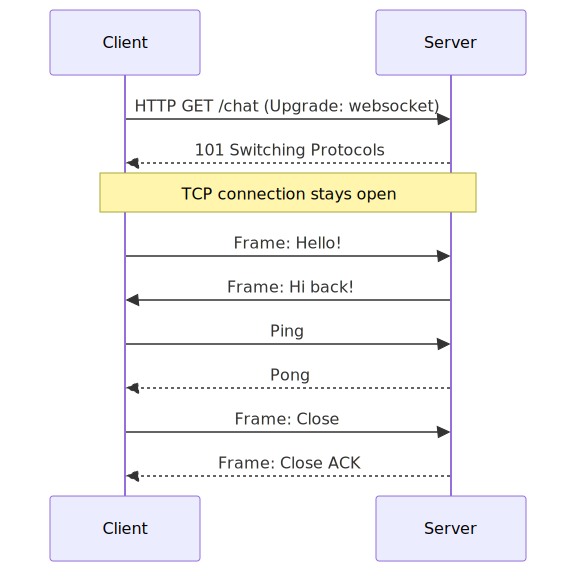
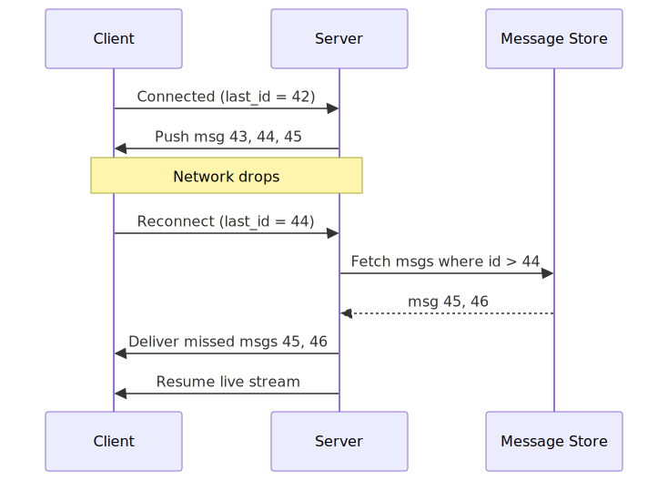

# WebSockets — Deep Dive

## TL;DR
* **What it is**: A persistent, full-duplex TCP connection — both client and server can send frames at any time
* **How it starts**: Begins as an HTTP request, server upgrades it to WebSocket — same port (80/443), no firewall issues
* **Why it exists**: HTTP is request-response only — the server can never push data unless the client asks first. WebSocket removes that constraint.
* **Where it's used**: Chat, live notifications, real-time tracking, collaborative editing, video call signalling, JIT messaging, live scores, stock tickers
* **Key insight**: WebSocket is just a persistent TCP pipe with a lightweight framing protocol on top. The hard problems are scaling (stateful connections) and resilience (reconnection + missed messages).

---

## Step 1: How WebSocket Works

### The Handshake

WebSocket starts as a normal HTTP/1.1 request with a special `Upgrade` header. The server responds with `101 Switching Protocols` and the connection is promoted — from that point, HTTP is gone and raw WebSocket frames flow over the same TCP socket.



**The upgrade request headers:**
```
GET /chat HTTP/1.1
Host: example.com
Upgrade: websocket
Connection: Upgrade
Sec-WebSocket-Key: dGhlIHNhbXBsZSBub25jZQ==
Sec-WebSocket-Version: 13
```

**The server response:**
```
HTTP/1.1 101 Switching Protocols
Upgrade: websocket
Connection: Upgrade
Sec-WebSocket-Accept: s3pPLMBiTxaQ9kYGzzhZRbK+xOo=
```

After this exchange — the TCP socket is theirs. No more HTTP. Just raw frames.

### WebSocket Frame Structure
```
 0                   1                   2                   3
 0 1 2 3 4 5 6 7 8 9 0 1 2 3 4 5 6 7 8 9 0 1 2 3 4 5 6 7 8 9 0 1
+-+-+-+-+-------+-+-------------+-------------------------------+
|F|R|R|R| opcode|M| Payload len |    Extended payload length    |
|I|S|S|S|  (4)  |A|     (7)    |             (16/64)           |
|N|V|V|V|       |S|             |                               |
| |1|2|3|       |K|             |                               |
+-+-+-+-+-------+-+-------------+-------------------------------+
```

Key fields:
- **FIN**: 1 if this is the final fragment
- **Opcode**: 0x1 = text, 0x2 = binary, 0x8 = close, 0x9 = ping, 0xA = pong
- **Mask**: client → server frames must be masked (XOR with a random key)
- **Payload**: your actual data

The overhead per frame is just **2–14 bytes** — vs 200–800 bytes of HTTP headers per request.

---

## Step 2: WebSocket vs Alternatives



| | Short Polling | Long Polling | SSE | WebSocket |
|---|---|---|---|---|
| Direction | Client → Server only | Client → Server only | Server → Client only | **Full duplex** |
| Latency | Up to poll interval | ~real-time | ~real-time | **Real-time** |
| Overhead | High (empty responses) | Medium | Low | **Lowest** |
| Server load | High (repeated requests) | Medium | Low | Low (persistent) |
| Reconnect | Automatic | Automatic | Automatic | **Manual** |
| Use when | Simple, infrequent updates | Fallback | Server push only | **Bidirectional real-time** |

**SSE (Server-Sent Events)** is underrated — it's simpler than WebSocket and sufficient for notification feeds, live scores, and dashboards where only the server sends data. Use WebSocket only when the client also sends data frequently (chat, collaborative editing, gaming).

---

## Step 3: Where WebSocket Is Used

### 1. Chat / Messaging (WhatsApp, Slack)

The classic use case. Both parties send and receive at any time.

```
User types → WS frame → Server → routes → WS frame → Recipient
```

Read delivery receipts (✓✓) and typing indicators (`User is typing...`) are also sent as WS frames — tiny, instant, no polling.

---

### 2. Real-time Tracking (Uber, Swiggy)

Driver's app sends GPS coordinates every 5 seconds over WebSocket. Server pushes updated location to the customer's open WebSocket connection.

```
Driver App ──WS──► Location Service ──SET location:driverId ──► Redis
                                                                    ↓
Customer App ◄──WS── Tracking Service ◄──GET location:driverId ───┘
```

Why WebSocket over HTTP polling here: 1M active deliveries × poll every 2s = **500k HTTP requests/sec** just for location. WebSocket: 1M persistent connections, server pushes only when location changes.

---

### 3. Video Call Signalling (WebRTC + WebSocket)

This is where people get confused. **WebRTC handles the actual video/audio** (peer-to-peer UDP streams). But before two peers can connect, they need to exchange metadata — ICE candidates, SDP offers/answers. This negotiation is called **signalling** and WebSocket is the standard transport for it.

```
Caller                  Signalling Server              Callee
  │                     (WebSocket)                      │
  │──── SDP Offer ─────────────►│                        │
  │                             │──── SDP Offer ────────►│
  │                             │◄─── SDP Answer ─────── │
  │◄─── SDP Answer ─────────────│                        │
  │──── ICE candidate ─────────►│──── ICE candidate ────►│
  │◄─── ICE candidate ──────────│◄─── ICE candidate ──── │
  │                                                       │
  └─────────── Direct P2P video/audio (UDP) ─────────────┘
```

Once both peers have each other's ICE candidates, the WebSocket signalling channel is no longer needed. The actual video bytes never touch your server — they go peer-to-peer. WebSocket just bootstraps the connection.

---

### 4. Just-in-Time (JIT) Messaging

JIT messaging means the message is only useful **right now** — if the recipient isn't online, discard it. Don't store it. Examples:
- Live auction bid updates ("current bid: ₹4,200")
- Live sports scores ("Goal! 2–1")
- Collaborative cursor positions in a shared doc
- Live stock price ticks

The pattern:
```
Event fires → Publish to WebSocket channel → Push to all connected clients
           → If no one is connected → DROP IT (no queuing needed)
```

This is fundamentally different from chat (where offline delivery matters). JIT systems use **Redis Pub/Sub** (fire-and-forget) rather than Kafka (durable, replayable). If you miss a live score update because you weren't connected — that's fine, the next update will correct it.

```
Score Service ──PUBLISH channel:match:42──► Redis Pub/Sub
                                                ↓
                                     All WS servers subscribed
                                                ↓
                              Push to all clients watching match 42
```

---

### 5. Collaborative Editing (Google Docs, Figma)

Every keystroke/change is a WebSocket frame. The server applies **Operational Transformation (OT)** or **CRDTs** to merge concurrent edits from multiple users and broadcast the resolved state back to all participants.

```
User A types "hello" ──WS──► Server applies OT ──WS──► User B sees "hello"
User B types "world" ──WS──►  (merge conflicts)  ──WS──► User A sees "world"
```

---

## Step 4: Scaling WebSocket Servers

This is the hardest problem. HTTP servers are stateless — any server can handle any request. WebSocket servers are **stateful** — a user's connection lives on one specific server. You can't just round-robin load balance.



**The problem**: User A is on WS Server 1. User D is on WS Server 2. When A sends a message to D, how does Server 1 deliver it to Server 2?

**The solution**: Every WS server subscribes to a shared pub/sub channel (Redis Pub/Sub or Kafka).

```
User A (on WS1) sends message to User D
  → WS1 publishes to Redis channel: dm:{userD}
  → WS2 is subscribed to dm:{userD}
  → WS2 pushes the message to User D's open connection
```

**Sticky sessions** at the load balancer ensure a user always reconnects to the same server (via IP hash or cookie). This reduces cross-server fan-out.

**Session registry in Redis**: Each WS server registers its connected users:
```
SET ws-session:{userId}  "server-2-ip"  EX 60
```
Any server can look up which server a user is on before routing.

---

## Step 5: Common Problems & How to Fix Them

### Problem 1 — Connection Drops

Mobile networks are unreliable. WebSocket connections drop constantly — switching from WiFi to 4G, backgrounding the app, going through a tunnel.

**The client never knows immediately** — TCP's keep-alive is slow (default 2 hours). Without application-level heartbeats, a dead connection looks alive for minutes.

**Fix — Heartbeat (Ping/Pong):**
```
Client sends PING every 30s over WebSocket
Server replies PONG within 5s
If no PONG → connection is dead → client reconnects
```
Server-side: if no PING received in 35s → close the socket. This cleans up zombie connections.

---

### Problem 2 — Missed Messages on Reconnect



**Fix**: The client tracks the last received message ID. On reconnect it sends `last_id`. The server fetches all messages after that ID from the durable store (Cassandra / PostgreSQL) and delivers them before resuming the live stream.

This is why **durable storage matters even for real-time systems** — the WebSocket is the fast path, but the DB is the safety net.

---

### Problem 3 — Backpressure (Slow Consumer)

The server is producing messages faster than the client can consume them (e.g., a slow mobile network). The server's send buffer fills up. If not handled, the server keeps queuing frames in memory → OOM crash.

**Fix**:
- Monitor the send buffer size per connection
- If buffer exceeds threshold → pause publishing to that connection
- Use flow control: only send next batch after receiving an ACK from the client
- For JIT messages (scores, prices) — drop old frames, only send the latest

---

### Problem 4 — Load Balancer Killing Long Connections

Most load balancers and proxies (nginx, AWS ALB) have idle connection timeouts (default: 60s). A WebSocket that's idle for 60s gets silently closed by the proxy — client thinks it's still connected.

**Fix**:
- Set load balancer timeout higher than your ping interval (e.g., LB timeout = 300s, ping every 30s)
- Or use the ping/pong heartbeat — activity on the connection resets the idle timer

---

### Problem 5 — Authentication

HTTP cookies and headers are sent only during the initial upgrade handshake — not on every frame. But you still need to authenticate the user.

**Fix**:
- Send JWT token in the handshake URL: `wss://api.example.com/chat?token=eyJ...`
- Or authenticate in the first message frame after connection
- Validate token on the server during handshake — reject with 401 if invalid before upgrading

**Never** rely on frame-level auth — authenticate once at handshake, store the user identity on the server-side session object.

---

### Problem 6 — Memory Leaks (Zombie Connections)

A client closes the browser tab. The TCP FIN is sent — but what if it's not? (Flaky network, sudden power-off). The server holds the socket open. At scale — thousands of zombie connections leak memory.

**Fix**:
- Heartbeat timeout (above) catches most of these
- Set `SO_KEEPALIVE` at the TCP level — OS sends keep-alive probes
- Monitor connections per server — alert if count grows unboundedly
- Set a max connection lifetime (e.g., force reconnect every 24h) to clean up stale state

---

### Problem 7 — Message Ordering

WebSocket is built on TCP which guarantees order within a single connection. But when messages are routed through a pub/sub layer (Redis / Kafka), ordering can break across server hops.

**Fix**:
- Assign a **sequence number** to every message at the source
- Client buffers out-of-order messages and delivers them in sequence
- For chat: sequence per conversation; for JIT: just discard older sequence numbers

---

### Problem 8 — WebSocket Behind Corporate Firewalls / Proxies

Some corporate proxies don't understand the `Upgrade` header and drop the connection, or downgrade it back to HTTP.

**Fix**:
- Use `wss://` (WebSocket over TLS on port 443) — it looks like HTTPS traffic to proxies, which pass it through
- Fall back to long polling (Socket.io does this automatically) when WebSocket upgrade fails

---

## Step 6: Key Design Decisions

| Decision | Choice | Alternative | Why |
|---|---|---|---|
| Transport | WebSocket | SSE / long polling | Full duplex needed for chat, gaming, collab |
| Heartbeat | Application-level ping every 30s | TCP keep-alive | TCP keep-alive is too slow (default 2h) |
| Scaling | Sticky sessions + Redis Pub/Sub | Pure stateless | Connections are inherently stateful |
| Missed messages | Client sends last_id on reconnect | Ignore | Must not lose messages on reconnect |
| JIT vs durable | Redis Pub/Sub | Kafka | JIT = no replay needed; fire-and-forget |
| Auth | JWT in handshake | Per-frame auth | Authenticate once, not on every frame |

---

## Common Interview Follow-ups

**Q: How is WebSocket different from HTTP/2 server push?**
HTTP/2 server push is server-initiated but still follows request-response semantics — the server pushes resources it predicts you'll need. WebSocket is a raw bidirectional pipe — either side sends at any time, any format, any volume.

**Q: Can you use WebSocket for video streaming?**
Not efficiently. WebSocket uses TCP — which retransmits lost packets and blocks delivery of later packets until the lost one arrives (head-of-line blocking). Video is latency-sensitive — a slightly blurry frame is better than a frozen video. WebRTC uses UDP for video/audio precisely to avoid this. WebSocket is only used for the signalling phase (exchanging SDP/ICE), not the media itself.

**Q: What happens to WebSocket connections during a server deploy?**
Connections on the old server drop. Clients reconnect to the new server (load balancer routes to healthy instances). They send their `last_id` and catch up on missed messages. This is why graceful shutdown matters — drain existing connections before killing the process.

**Q: How many WebSocket connections can one server handle?**
Each connection holds a file descriptor. Linux default is 1024 open files per process — increase with `ulimit -n 1000000`. Memory is the real limit: each idle connection uses ~10–50KB. A server with 4GB RAM can hold ~100k–400k connections depending on message volume. WhatsApp needs ~5,000 servers for 500M concurrent connections.
