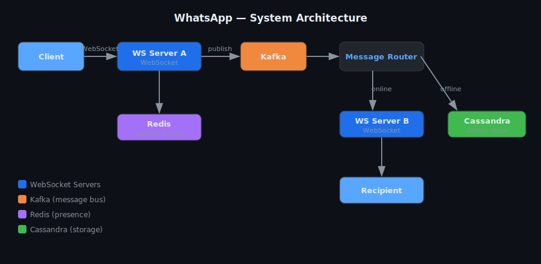
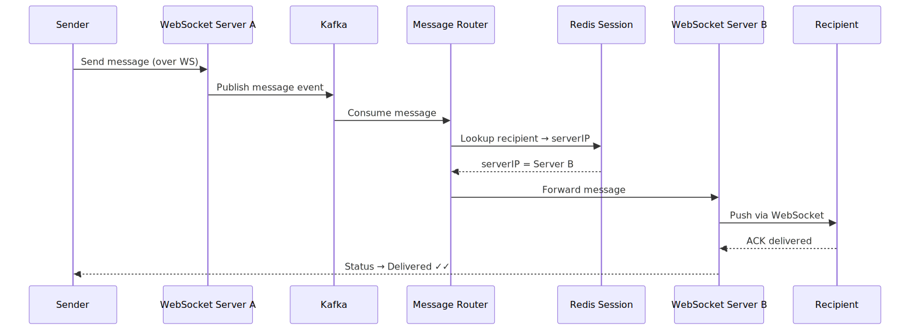
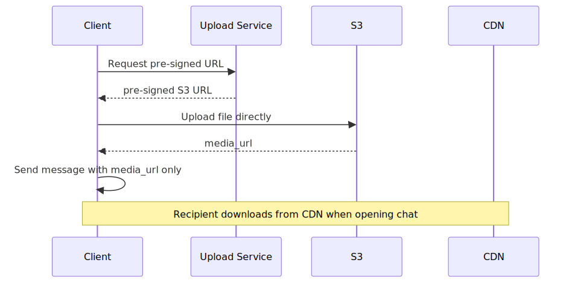
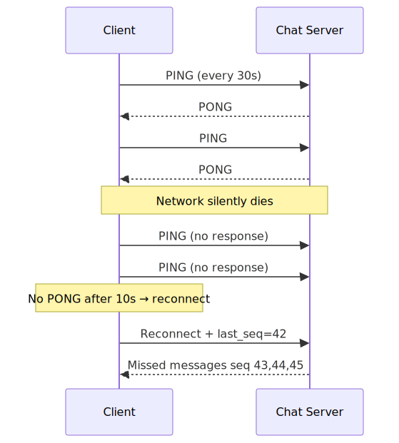

# WhatsApp — System Design

## TL;DR
* **Transport**: WebSocket — persistent TCP, true server push, no polling overhead
* **Routing**: Redis Pub/Sub — Chat Servers subscribe per-user channel; publish to deliver cross-server
* **Storage**: Cassandra partitioned by `conversation_id` — optimised for "fetch last N messages"
* **Presence**: Redis key with heartbeat TTL — expires automatically, no polling needed
* **Media**: Client uploads directly to S3 via pre-signed URL — chat servers never touch binary data
* **Groups**: Fan-out on write for small groups; fan-out on read for large groups (>500 members)
* **Key insight**: WebSocket servers are stateless routers. Cassandra is the durable store.

---

## Step 1: Clarify Requirements

### Functional Requirements
- 1:1 real-time messaging
- Message status: Sent ✓ / Delivered ✓✓ / Read ✓✓ (blue ticks)
- Offline delivery — messages queued and delivered on reconnect
- Group messaging (up to 1000 members)
- Media messages (images, video, voice notes)

### Non-Functional Requirements
| Requirement | Target |
|---|---|
| Scale | 2B DAU, ~100B messages/day |
| Latency | < 100ms delivery (p99) for online users |
| Availability | 99.99% — messaging cannot go down |
| Consistency | Eventual — slight reorder acceptable under partition |
| Durability | Messages must never be lost once acknowledged |

### Out of Scope
- Voice/video calls (WebRTC — separate protocol)
- End-to-end encryption internals
- Message search

---

## Step 2: Capacity Estimation

| Metric | Estimate |
|---|---|
| Messages/day | 100 billion |
| Messages/sec peak | ~2 million/sec |
| Avg message size | 200 bytes |
| Storage/day | ~20 TB/day |
| Media storage/day | ~500 TB (10% messages, avg 50KB) |
| Concurrent WebSocket connections | ~500 million |
| WebSocket servers (@ 100k conn each) | ~5,000 servers |

---

## Step 3: High-Level Architecture



#### Components and how they talk to each other

**Chat Servers**
The core of the system. Each Chat Server holds thousands of open WebSocket connections — one per connected user. Chat Servers are stateless in terms of routing: they don't know where other users are connected. They only do two things: receive WS frames from their connected users, and push WS frames to their connected users. All coordination happens through shared infrastructure (Redis + DB).

**PostgreSQL — Messages + Inbox table**
Every Chat Server writes directly to the database. There are two key tables:
- `messages` — the permanent record of every message ever sent, partitioned by `conversation_id`
- `inbox` — one row per (client, message) pair, tracking delivery state per device

**Redis Pub/Sub**
The message bus between Chat Servers. Every Chat Server subscribes to a channel for each user it currently has connected:
```
Chat Server B has Bob connected → subscribes to channel:user_bob
Chat Server C has Carol connected → subscribes to channel:user_carol
```
When any server needs to reach Bob, it publishes to `channel:user_bob`. Redis instantly broadcasts to all subscribers — Chat Server B receives it and pushes to Bob's socket.

---

#### How a message travels from sender to recipient — step by step

```
Alice (on Chat Server A) sends "Hey Bob" to Bob (on Chat Server B)
```

**Step 1 — Alice sends a WS frame to Chat Server A**
Alice's app sends a WebSocket frame containing the message payload: `{ to: bob_id, text: "Hey Bob", client_msg_id: uuid }`. Chat Server A receives it over Alice's open socket.

**Step 2 — Chat Server A writes to the database (FIRST, before anything else)**
```sql
INSERT INTO messages (id, conversation_id, sender_id, text, created_at) VALUES (...)
INSERT INTO inbox    (client_id, message_id, delivered) VALUES (bob_client_1, ..., false)
INSERT INTO inbox    (client_id, message_id, delivered) VALUES (bob_client_2, ..., false)
```
Both writes happen in one transaction. This is the durability guarantee — even if everything after this crashes, the message is safe. Bob will get it when he reconnects.

**Step 3 — Chat Server A returns ✓ to Alice**
Alice's app shows a single grey tick `✓` — meaning the server received and stored the message. This happens before any delivery to Bob. The sender's confirmation is purely about server receipt, not recipient delivery.

**Step 4 — Chat Server A publishes to Redis Pub/Sub**
```
PUBLISH channel:user_bob  <message_payload>
```
This is fire-and-forget. Chat Server A does not wait for a response. If Redis drops it — no problem, the Inbox entry in step 2 ensures Bob gets it eventually.

**Step 5 — Redis broadcasts to all subscribed Chat Servers**
Redis instantly delivers the published message to every Chat Server currently subscribed to `channel:user_bob`. In this case, only Chat Server B is subscribed (because Bob is connected there). Chat Servers A and C also receive the broadcast but ignore it since Bob is not on them.

**Step 6 — Chat Server B pushes to Bob's WebSocket**
Chat Server B receives the Pub/Sub message, finds Bob's open socket in its local connection map, and pushes the frame to Bob's device. Bob's app displays the message.

**Step 7 — Bob's device sends a delivered ACK**
Bob's app automatically sends back a WS frame: `{ type: "ack", message_id: "...", status: "delivered" }`. Chat Server B receives this ACK.

**Step 8 — Inbox marked delivered, Alice sees ✓✓**
Chat Server B:
```sql
UPDATE inbox SET delivered = true WHERE client_id = bob_client AND message_id = ...
```
Then publishes back to `channel:user_alice` — Alice's Chat Server receives it and pushes the `✓✓` (double tick) update to Alice's app.

---

#### What if Bob is offline?

At step 4, Chat Server A publishes to `channel:user_bob`. But no Chat Server is subscribed to that channel (Bob has no open connection). The Pub/Sub message is silently dropped.

That's fine — the Inbox entry from step 2 still exists with `delivered = false`.

When Bob comes back online:
```
1. Bob's app connects to any Chat Server (say, Server C)
2. Server C subscribes to channel:user_bob in Redis
3. Bob's app sends: { last_seq: 99 }
4. Server C queries: SELECT * FROM inbox WHERE client_id = bob AND seq > 99
5. Server C bulk-delivers all missed messages over Bob's new WebSocket
6. Bob's app sends ACKs → inbox rows marked delivered → Alice sees ✓✓
```

---

### Why WebSocket?

| Option | Problem |
|---|---|
| Short polling (every 5s) | 99% empty responses — wasteful at 2B users |
| Long polling | Half-duplex; high connection overhead |
| **WebSocket** | Persistent bidirectional TCP; server pushes instantly ✅ |

### Message Send Flow



### Cassandra Schema (Why This Partition Key?)
```
Table: messages
  Partition key : conversation_id   ← all msgs in one chat on same node
  Clustering key: created_at DESC   ← newest first for pagination

Query: "Give me last 50 messages for conversation X"
  → Single partition read, no joins, sub-millisecond
```

### Offline Delivery
```
Message Router: no Redis session for recipient
  → Write message to Cassandra offline queue

On reconnect:
  Client sends: last_received_message_id
  Server: SELECT * FROM messages WHERE conversation_id=X AND id > last_id
  → Bulk deliver missed messages in order
```

### Presence (Online / Last Seen)
```
Client sends heartbeat ping every 30s over WebSocket

Redis: SET presence:{userId} "online" EX 35

Heartbeat stops → TTL expires → user = offline
Last seen timestamp written to Cassandra on disconnect
```

### Group Fan-out Strategy



### Media Flow



---

## Step 4 (Deep Dive): Advanced Topics

---

### Topic 1 — Redis Pub/Sub vs Kafka for Message Routing

The architecture shown above uses Kafka for routing. But in production WhatsApp-style systems, **Redis Pub/Sub is often the better choice** for real-time delivery. Here's why, and how it works.

#### The core idea

Every Chat Server subscribes to a Redis Pub/Sub channel for each user currently connected to it. When a message needs to reach Bob, it's published to `channel:user_bob`. Redis instantly broadcasts it to all Chat Servers subscribed to that channel — and whichever server has Bob's WebSocket connection pushes it to him.



**The write path for every message:**
```
1. Sender's Chat Server receives WS frame
2. Write message to Message table (durable ✓)
3. Create Inbox entry for recipient (durable ✓)
4. Return success to sender (✓ tick shown)
5. Publish to Redis channel:user_bob (best-effort)
```

Step 5 is fire-and-forget. If Redis drops it — no problem, the message is already durably stored in steps 2–3. The recipient will get it on reconnect via the Inbox sync. This is the key insight: **durability and real-time delivery are separate concerns**.

#### Why Redis Pub/Sub over Kafka here?

| | Kafka | Redis Pub/Sub |
|---|---|---|
| Storage | Persists every message to disk | No storage — pure in-memory pass-through |
| Overhead per topic | High — disk space + consumer offsets | Tiny — just a hashmap of subscriber connections |
| Delivery guarantee | At-least-once | At-most-once |
| Best for | Durable event log, replay, audit | Real-time fan-out where durability is handled elsewhere |
| Latency | 5–50ms | < 1ms |

Kafka's durability is overkill here because messages are already written to the database before Pub/Sub publishes. You'd be paying Kafka's disk overhead for zero benefit.

**Canva benchmarked Redis Pub/Sub at 100,000 mouse-position updates/sec on a single Redis host at only 27% CPU utilisation.** For WhatsApp's message volumes, a small sharded Redis cluster handles it easily.

#### Sharding Redis Pub/Sub

You don't run all channels through one Redis instance. Shard by `user_id`:
```
channel for user_id X → Redis instance (X % N)
```
With N=10 Redis nodes, each handles 10% of channels. Adding nodes scales linearly.

---

### Topic 2 — Partitioning Channels: Per User vs Per Chat



A natural question: *"Why have a channel per user? Why not per chat?"*

#### Per-user channel (what WhatsApp uses)

```
channel:user_bob  ← Bob gets ALL messages for ALL his chats here
```

When a message is sent in any chat Bob is part of, it's published to `channel:user_bob`. Bob's Chat Server receives it and pushes it to his WebSocket.

**Pros:**
- Simple — one subscription per connected user, regardless of how many chats they're in
- Great for 1:1 chats (WhatsApp's dominant pattern)
- Low Redis memory — just one channel per online user

**Cons:**
- In a 1000-member group, the same message is published to 1000 separate user channels — 1000 Redis publish calls per group message

#### Per-chat channel

```
channel:chat_456  ← all servers with members of this chat subscribe
```

When a message is sent to group 456, it's published once to `channel:chat_456`. Every Chat Server that has at least one member of this group subscribed to it.

**Pros:**
- One publish regardless of group size — much more efficient for large groups

**Cons:**
- Each Chat Server must subscribe to a channel for every group its connected users are part of
- A user in 200 groups = 200 subscriptions per Chat Server for that user
- More total subscriptions overall for typical 1:1-heavy workloads

#### WhatsApp's hybrid approach

WhatsApp is dominated by 1:1 chats, so **per-user channels are the default**. But for large groups (> 25 members), switch to **per-chat channels** to avoid the publish storm:

```
if chat.member_count <= 25:
    publish to channel:user_{memberId}  for each member
else:
    publish to channel:chat_{chatId}  (one publish)
```

**Edge case to handle:** When a group crosses the threshold from 25 to 26 members, Chat Servers need time to subscribe to the new per-chat channel before the old per-user publishes stop. During the transition, publish to **both** channels briefly to avoid dropping messages.

---

### Topic 3 — Multiple Devices per User

Most users have a phone, a laptop, maybe a tablet. When you send a message from your phone, it must arrive on all your recipient's devices. And when your laptop wakes up after being off, it must catch up on everything it missed.



#### What changes in the data model

**New: Clients table**
```sql
CREATE TABLE clients (
    client_id   UUID PRIMARY KEY,
    user_id     UUID NOT NULL,
    device_type TEXT,          -- phone, tablet, desktop
    last_seen   TIMESTAMP,
    created_at  TIMESTAMP
);
```
Each device registers a unique `client_id` on first login. Maximum 3 clients per account to cap storage/throughput.

**Updated: Inbox table — per client, not per user**
```sql
-- Before: inbox per user
CREATE TABLE inbox (user_id, message_id, delivered, ...)

-- After: inbox per client
CREATE TABLE inbox (client_id, message_id, delivered, ...)
```

When a message is sent to Bob, an Inbox row is created for **each of Bob's registered clients**. Each client independently marks its own row as delivered when it receives the message.

#### How delivery works with multiple devices

On the Pub/Sub side — nothing changes. All of Bob's devices subscribe to `channel:user_bob`. When a message is published, it reaches **all Chat Servers** that have any of Bob's devices connected, and each server pushes the message to its respective connection.

On reconnect — each device sends its own `last_client_message_id`. The server queries the Inbox for that specific `client_id` and bulk-delivers only what that device missed. Phone and laptop can be at completely different sync points.

```
Bob's phone:  last_id = 150  → server delivers msgs 151–160
Bob's laptop: last_id = 120  → server delivers msgs 121–160
```

---

### Topic 4 — WebSocket Connection Failures

Mobile networks drop constantly — entering a tunnel, switching WiFi to 4G, backgrounding the app. The WebSocket frame is gone but the server may not know for minutes. TCP keepalive has a default timeout of **2 hours** — far too slow for a chat app.



#### Application-level heartbeat

```
Client sends PING frame every 30 seconds
Server must reply PONG within 10 seconds
If no PONG → connection is dead → client immediately reconnects
```

Server-side mirror:
```
If no PING received from client in 35 seconds → close the socket
```
This frees the server's file descriptor and removes the dead session from Redis.

**Why 30s?** Short enough to detect failures quickly. Long enough to not waste bandwidth. The PING/PONG frames are tiny (< 10 bytes) — negligible at scale.

#### Reconnect with sequence numbers

When the client reconnects, it doesn't just say "give me missed messages". It sends its **last received sequence number**:

```
Client reconnects → sends: { last_seq: 42 }
Server queries:   SELECT * FROM inbox WHERE client_id=X AND seq > 42
Server delivers:  msgs with seq 43, 44, 45 in order
Server resumes:   live stream from seq 46
```

Sequence numbers are assigned by the Chat Server when it receives a message — not by the client. This gives a consistent server-side ordering that all clients agree on.

---

### Topic 5 — Redis Pub/Sub Failure: At-Most-Once Delivery

Redis Pub/Sub guarantees **at-most-once** delivery. If there are no subscribers or Redis has a transient blip, the published message is silently dropped. This sounds scary — but it's fine because of how the write path is structured.

**Why it's acceptable:**

The message is written durably to the database **before** Pub/Sub publish:
```
Step 1: Write to Message table     ← durable, always happens
Step 2: Create Inbox entry         ← durable, always happens
Step 3: Return ✓ to sender         ← sender knows message is safe
Step 4: Publish to Pub/Sub         ← best-effort, may be dropped
```

If step 4 drops the message, the recipient still gets it — just not in real-time. Two fallback mechanisms ensure delivery:

**Fallback 1 — Reconnect sync:**
When the client reconnects (or the app comes to foreground), it always sends `last_seq` and fetches missed messages from the Inbox. This catches any Pub/Sub drops.

**Fallback 2 — Periodic polling:**
Even for connected clients, a background poll runs every 60 seconds:
```
GET /inbox?since=last_seq
```
This is a final backstop. If Pub/Sub dropped a message and the user never reconnected, the poll will catch it within 60 seconds.

In practice: most production systems use **heartbeats** (detect dead connections fast) + **sequence numbers** (detect gaps in delivery) + **periodic polling** (final backstop). All three together make the system robust.

---

### Topic 6 — Out-of-Order Messages

In a distributed system, messages sent at nearly the same time from different devices can arrive at the server in different orders. Strictly guaranteeing delivery order requires expensive coordination — buffering and waiting for late messages before delivering any of them (like Flink's bounded out-of-orderness watermark).

**WhatsApp's pragmatic approach: NTP timestamps, not strict ordering.**

```
All Chat Servers sync their clocks via NTP
When a message arrives at a Chat Server → stamp it with server receive time
Messages displayed to client ordered by this timestamp
```

This means a message sent slightly later might occasionally appear slightly above an earlier one — a "pop-in" effect. Users find this completely acceptable compared to the alternative of delaying all messages to wait for stragglers.

**Why not client timestamps?**
Client clocks are unreliable — users change timezone, have wrong time set, or spoof timestamps. Server timestamp is the canonical ordering source.

---

### Topic 7 — Last Seen

"Last seen today at 3:42 PM" — how is this implemented at 2B user scale?

**The naive approach (don't do this):**
Poll the DB for each user's `last_active` column. At 2B users with friends lists of ~200 people, that's hundreds of DB reads per page load. Doesn't scale.

**The right approach:**

**Step 1 — Write on disconnect:**
When a user's WebSocket closes (either cleanly or via heartbeat timeout), the Chat Server writes:
```sql
UPDATE users SET last_seen = NOW() WHERE user_id = X
```
This is one write per disconnect — rare and cheap.

**Step 2 — Redis for active presence:**
```
On connect:    SET presence:{userId}  "online"  EX 35
On heartbeat:  SET presence:{userId}  "online"  EX 35   ← refreshes TTL
On disconnect: DEL presence:{userId}  (or let TTL expire)
```

**Step 3 — Read path:**
When Alice opens a chat with Bob:
```
1. GET presence:{bobId}  → exists? → "online now"
2. Not found?            → SELECT last_seen FROM users WHERE id = bobId
```

Redis answers "online now" in sub-millisecond. The DB query only runs when the Redis key is absent — i.e., the user is offline. This limits DB load to only offline-user lookups, which is a small fraction of total queries.

**Privacy control:**
Users can turn off Last Seen. When disabled, the `last_seen` DB field is simply not returned in the API response. The Redis presence key still exists internally (used for routing) — it's just not exposed to other users.

---

| Decision | Choice | Alternative | Why |
|---|---|---|---|
| Transport | WebSocket | Long polling | True server push, bidirectional, lower overhead |
| Async routing | Kafka | Direct HTTP | Decoupled, retryable, absorbs write spikes |
| Message store | Cassandra | PostgreSQL | Write-heavy, partition by conversation, no joins |
| Presence | Redis + TTL | DB polling | O(1) expiry; DB can't handle 2B heartbeats/30s |
| Media | S3 + CDN | Store in DB | Binary not for message DBs; CDN = edge caching |
| Group fan-out | Hybrid | Pure push or pull | Avoids write storms; avoids expensive reads |

---

## Common Interview Follow-ups

**Q: What if a WebSocket server crashes?**
Client auto-reconnects. New server registers in Redis Session Service. Client sends `last_message_id` — server fetches missed messages from Cassandra.

**Q: How do you guarantee message ordering?**
Cassandra clustering key is timestamp. Client assigns a client-side sequence number. Server reconciles gaps on delivery.

**Q: How do you handle the 1000-member group at scale?**
Switch to fan-out on read beyond a threshold. Store one message copy; members fetch on open.

**Q: How do you scale to 500M concurrent WebSocket connections?**
WebSocket servers are stateless (session map in Redis). Add servers horizontally. Load balancer distributes new connections.
