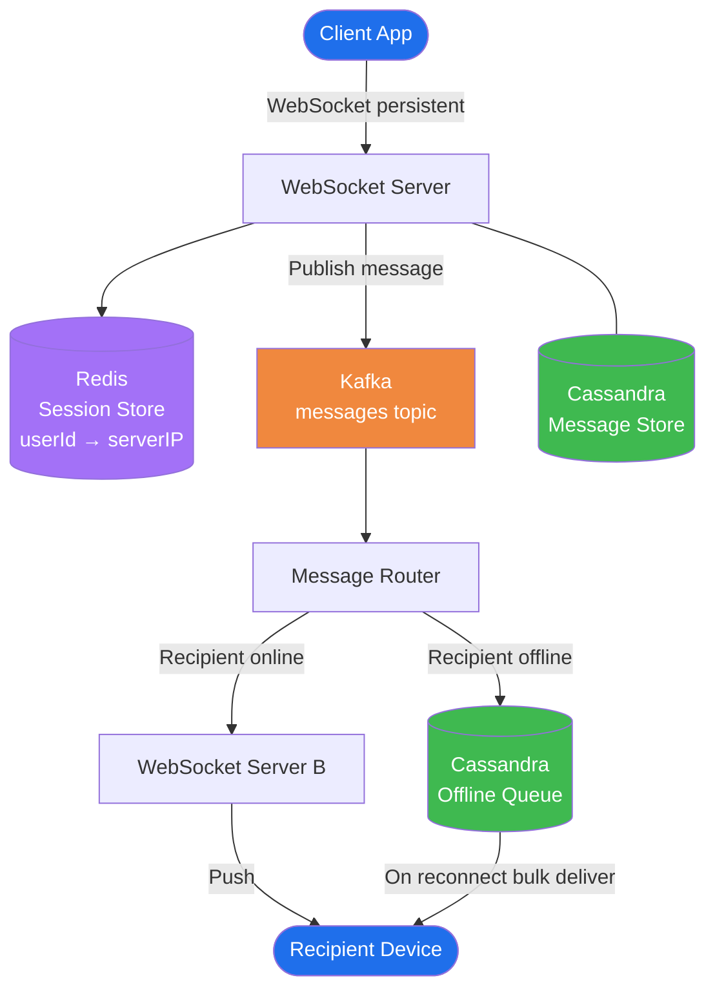
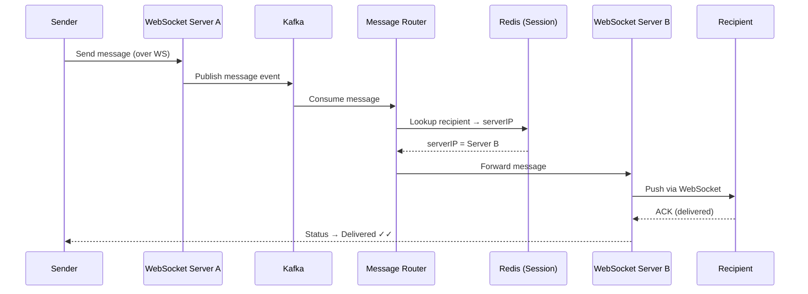
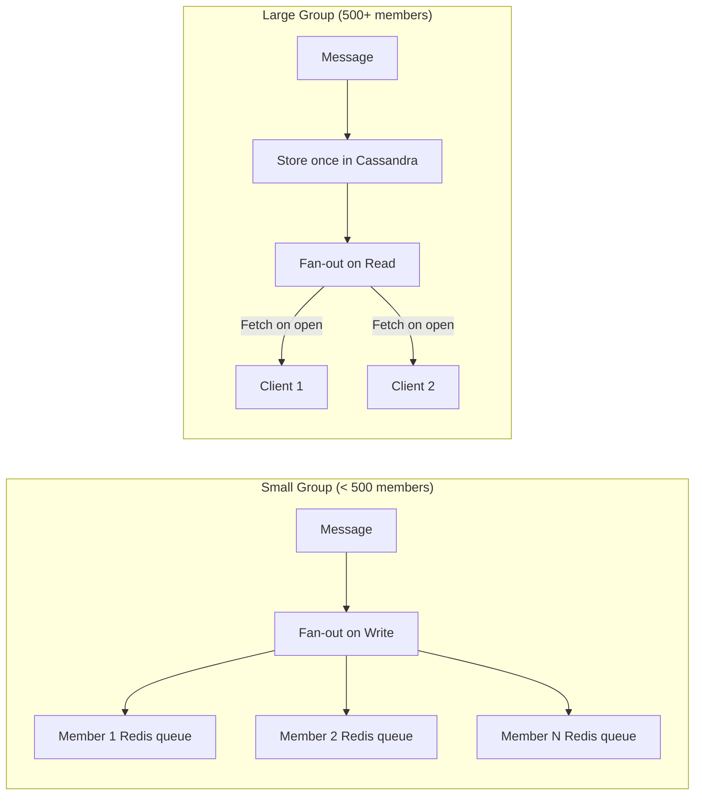
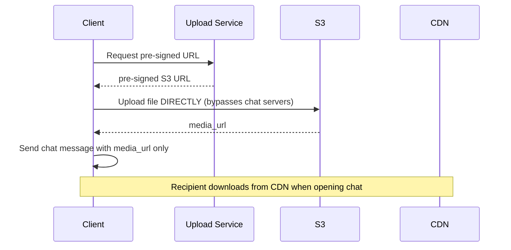

# WhatsApp — System Design

## TL;DR
* **Transport**: WebSocket — persistent TCP, true server push, no polling overhead
* **Routing**: Kafka decouples sender from recipient; handles offline delivery and backpressure
* **Storage**: Cassandra partitioned by `conversation_id` — optimised for "fetch last N messages"
* **Presence**: Redis key with heartbeat TTL — expires automatically, no polling needed
* **Media**: Client uploads directly to S3 via pre-signed URL — chat servers never touch binary data
* **Groups**: Fan-out on write for small groups; fan-out on read for large groups (>500 members)
* **Key insight**: WebSocket servers are stateless routers. Cassandra is the durable store.

---

## Step 1: Clarify Requirements

### Functional Requirements
- 1:1 real-time messaging
- Message status: Sent ✓ / Delivered ✓✓ / Read ✓✓ (blue ticks)
- Offline delivery — messages queued and delivered on reconnect
- Group messaging (up to 1000 members)
- Media messages (images, video, voice notes)

### Non-Functional Requirements
| Requirement | Target |
|---|---|
| Scale | 2B DAU, ~100B messages/day |
| Latency | < 100ms delivery (p99) for online users |
| Availability | 99.99% — messaging cannot go down |
| Consistency | Eventual — slight reorder acceptable under partition |
| Durability | Messages must never be lost once acknowledged |

### Out of Scope
- Voice/video calls (WebRTC — separate protocol)
- End-to-end encryption internals
- Message search

---

## Step 2: Capacity Estimation

| Metric | Estimate |
|---|---|
| Messages/day | 100 billion |
| Messages/sec peak | ~2 million/sec |
| Avg message size | 200 bytes |
| Storage/day | ~20 TB/day |
| Media storage/day | ~500 TB (10% messages, avg 50KB) |
| Concurrent WebSocket connections | ~500 million |
| WebSocket servers (@ 100k conn each) | ~5,000 servers |

---

## Step 3: High-Level Architecture




---

## Step 4: Deep Dive

### Why WebSocket?

| Option | Problem |
|---|---|
| Short polling (every 5s) | 99% empty responses — wasteful at 2B users |
| Long polling | Half-duplex; high connection overhead |
| **WebSocket** | Persistent bidirectional TCP; server pushes instantly ✅ |

### Message Send Flow



### Cassandra Schema (Why This Partition Key?)
```
Table: messages
  Partition key : conversation_id   ← all msgs in one chat on same node
  Clustering key: created_at DESC   ← newest first for pagination

Query: "Give me last 50 messages for conversation X"
  → Single partition read, no joins, sub-millisecond
```

### Offline Delivery
```
Message Router: no Redis session for recipient
  → Write message to Cassandra offline queue

On reconnect:
  Client sends: last_received_message_id
  Server: SELECT * FROM messages WHERE conversation_id=X AND id > last_id
  → Bulk deliver missed messages in order
```

### Presence (Online / Last Seen)
```
Client sends heartbeat ping every 30s over WebSocket

Redis: SET presence:{userId} "online" EX 35

Heartbeat stops → TTL expires → user = offline
Last seen timestamp written to Cassandra on disconnect
```

### Group Fan-out Strategy



### Media Flow


---

## Step 5: Key Design Decisions

| Decision | Choice | Alternative | Why |
|---|---|---|---|
| Transport | WebSocket | Long polling | True server push, bidirectional, lower overhead |
| Async routing | Kafka | Direct HTTP | Decoupled, retryable, absorbs write spikes |
| Message store | Cassandra | PostgreSQL | Write-heavy, partition by conversation, no joins |
| Presence | Redis + TTL | DB polling | O(1) expiry; DB can't handle 2B heartbeats/30s |
| Media | S3 + CDN | Store in DB | Binary not for message DBs; CDN = edge caching |
| Group fan-out | Hybrid | Pure push or pull | Avoids write storms; avoids expensive reads |

---

## Common Interview Follow-ups

**Q: What if a WebSocket server crashes?**
Client auto-reconnects. New server registers in Redis Session Service. Client sends `last_message_id` — server fetches missed messages from Cassandra.

**Q: How do you guarantee message ordering?**
Cassandra clustering key is timestamp. Client assigns a client-side sequence number. Server reconciles gaps on delivery.

**Q: How do you handle the 1000-member group at scale?**
Switch to fan-out on read beyond a threshold. Store one message copy; members fetch on open.

**Q: How do you scale to 500M concurrent WebSocket connections?**
WebSocket servers are stateless (session map in Redis). Add servers horizontally. Load balancer distributes new connections.
