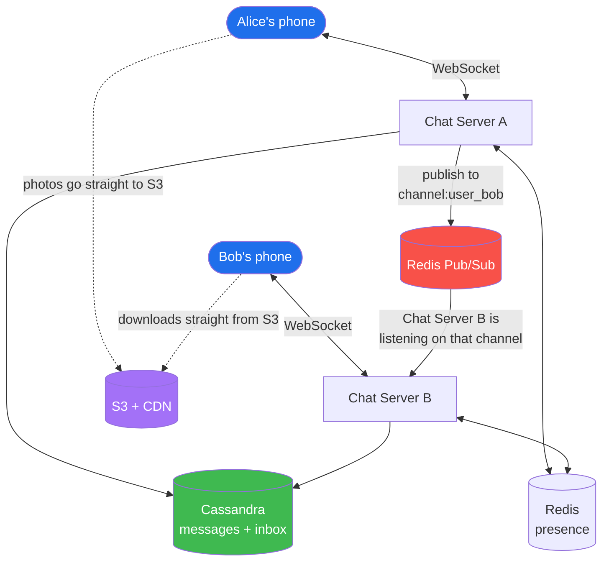
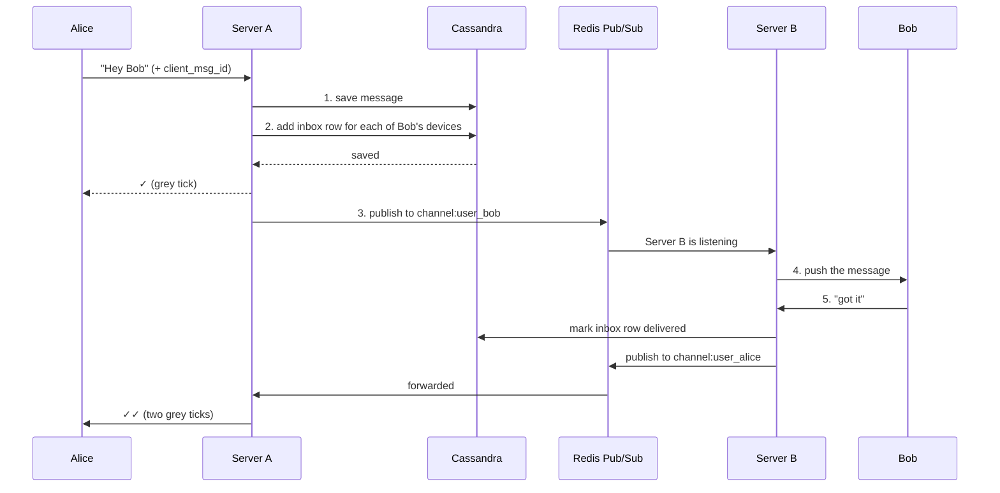
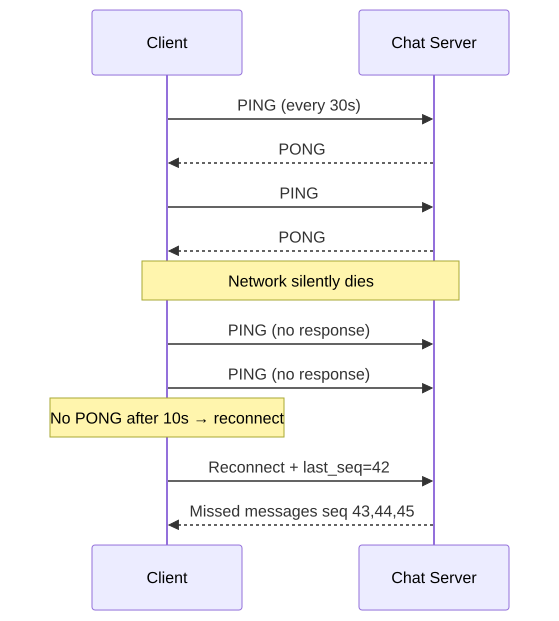
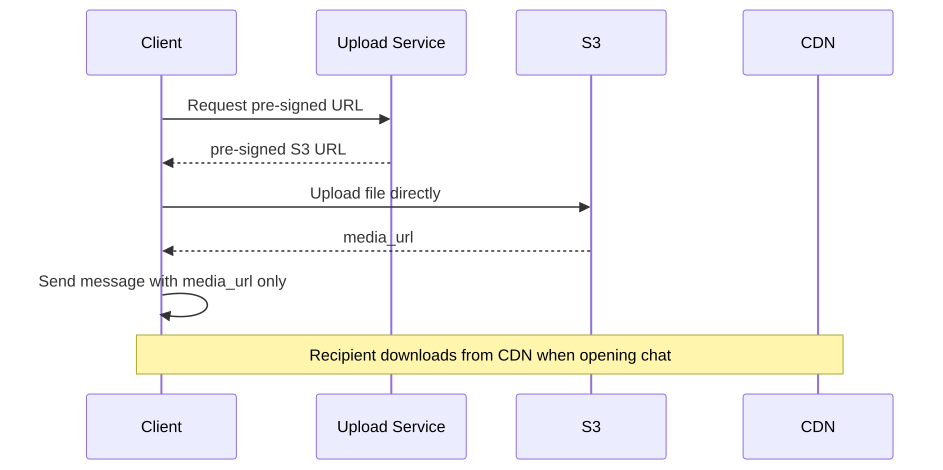

# WhatsApp — System Design

## TL;DR
* **Connection:** WebSocket — a phone line that stays open, so the server can push messages instantly.
* **Routing:** Redis Pub/Sub — how one chat server tells another server "this message is for your user".
* **Storage:** Cassandra — built for huge write volume.
* **The server is a post office, not a library.** It holds a message only until everyone has it, then deletes it.
* **Offline:** every message gets an **inbox row** per device. That row is the safety net.
* **`seq`:** each device has its own counter. On reconnect it says "I'm at 42" and gets everything after 42.
* **Key idea:** *saving* the message and *delivering* it fast are two separate jobs. Saving must never fail. Delivering fast is allowed to fail, because the inbox will catch it.

---

## Step 1: What We're Building

**Must have**
- 1:1 chat in real time
- Ticks: sent ✓, delivered ✓✓, read (blue)
- Messages wait for you if you're offline
- Group chat (up to 1000 people)
- Photos, videos, voice notes
- Works on phone + laptop at the same time

**Targets**

| Thing | Target |
|---|---|
| Users | 2 billion daily |
| Messages | 100 billion/day (~2 million/sec at peak) |
| Speed | under 100 ms if you're online |
| Uptime | 99.99% |
| Losing a message | never, once we've said ✓ |
| Message order | small reordering is OK |

**Not covering:** voice/video calls, encryption internals, search.

---

## Step 2: The Numbers

| Thing | Estimate |
|---|---|
| Messages per day | 100 billion |
| Peak per second | ~2 million |
| Average message | 200 bytes |
| Text per day | ~20 TB |
| Media per day | ~500 TB |
| Phones connected at once | ~500 million |
| Chat servers (100k connections each) | ~5,000 |

**20 TB a day sounds impossible to store forever.** It isn't a problem, because we don't store it forever — see the next step.

---

## Step 3: The Big Idea — A Post Office, Not a Library

This is the thing most people get wrong about WhatsApp.

| | Library | **Post office** ✅ |
|---|---|---|
| What it does | Keeps everything forever | Holds a letter until it's delivered, then drops it |
| Storage | Grows forever | Stays flat |
| Who keeps your history | The server | **Your phone** |

WhatsApp keeps a message **only until every device has confirmed it arrived.** Then the server deletes it. Your chat history lives on your phone, not on their servers. That's why restoring WhatsApp on a new phone needs *your own backup* — the server can't give your history back.

```
Message stored → all devices ACK → server deletes it
Nobody picked it up in 30 days → server deletes it anyway
```

**Why this matters in an interview:** it turns "20 TB per day, forever" into "20 TB of stuff currently in transit". Most of it is gone within seconds. Saying this out loud shows you know the actual product, not just a generic chat app.

---

## Step 4: The Architecture


```mermaid
flowchart TD
    A([Alice's phone]) <-->|WebSocket| CS1[Chat Server A]
    B([Bob's phone])   <-->|WebSocket| CS2[Chat Server B]

    CS1 --> DB[(Cassandra<br/>messages + inbox)]
    CS2 --> DB

    CS1 -->|"publish to<br/>channel:user_bob"| PS[(Redis Pub/Sub)]
    PS -->|"Chat Server B is<br/>listening on that channel"| CS2

    CS1 <--> PR[(Redis<br/>presence)]
    CS2 <--> PR

    A -.->|photos go straight to S3| S3[(S3 + CDN)]
    B -.->|downloads straight from S3| S3

    style A fill:#1f6feb,color:#fff
    style B fill:#1f6feb,color:#fff
    style DB fill:#3fb950,color:#fff
    style PS fill:#f85149,color:#fff
    style S3 fill:#a371f7,color:#fff
```

**Chat Server** — holds ~100,000 open WebSocket connections. It only does two things: take messages in from its users, and push messages out to its users. It has **no idea** where anyone else is connected.

**Cassandra** — the durable store. Chosen because we do enormous numbers of writes and almost no complicated queries.

**Redis Pub/Sub** — the intercom between chat servers. When Bob connects to Server B, Server B starts listening on `channel:user_bob`. Any server that needs to reach Bob just shouts into that channel.

**Redis (presence)** — who's online right now.

**S3 + CDN** — photos and videos. Chat servers never touch the actual files.

> **One design, stated once:** WebSocket + Redis Pub/Sub + Cassandra. No Kafka anywhere in the message path — the reason is in Step 11.

---

## Step 5: The Three Tables

```sql
-- The actual messages. Deleted once delivered.
messages (
  conversation_id   -- partition key: one chat = one place on disk
  message_id        -- clustering key: sorted, newest first
  sender_id
  body
  created_at
)

-- One row PER DEVICE per message. This is the safety net.
inbox (
  client_id         -- partition key: this specific device
  seq               -- clustering key: this device's own counter
  message_id
  delivered         -- has this device confirmed it?
)

-- Every device you've logged in on.
clients (
  client_id
  user_id
  device_type       -- phone / laptop / tablet
  last_seen
)
```

### What `seq` actually is

`seq` is the one thing that makes reconnecting work, so be precise about it:

> **`seq` is a counter that belongs to one device.** Every time we put a message in that device's inbox, its counter goes up by one: 1, 2, 3, 4…

It is **not** a global number, **not** a timestamp, and **not** chosen by the client.

| | Why not |
|---|---|
| Global counter | Would need every server to coordinate — a bottleneck at 2M/sec |
| Timestamp | Two messages can share a millisecond; you can't tell what you missed |
| Client-chosen | Phone clocks are wrong, and clients can lie |

Because it's per-device and has no gaps, "I'm at 42, what did I miss?" has exactly one correct answer: everything from 43 onward. Your phone and your laptop have completely separate counters, and that's fine — they're different devices at different points.

---

## Step 6: Sending a Message, Step by Step

Alice is on Server A. Bob is on Server B.


```mermaid
sequenceDiagram
    participant A as Alice
    participant SA as Server A
    participant DB as Cassandra
    participant R as Redis Pub/Sub
    participant SB as Server B
    participant B as Bob

    A->>SA: "Hey Bob" (+ client_msg_id)
    SA->>DB: 1. save message
    SA->>DB: 2. add inbox row for each of Bob's devices
    DB-->>SA: saved
    SA-->>A: ✓ (grey tick)
    SA->>R: 3. publish to channel:user_bob
    R->>SB: Server B is listening
    SB->>B: 4. push the message
    B->>SB: 5. "got it"
    SB->>DB: mark inbox row delivered
    SB->>R: publish to channel:user_alice
    R->>SA: forwarded
    SA->>A: ✓✓ (two grey ticks)
```

**The order here is the whole design:**

1. **Save first.** Message row + one inbox row per device. Nothing else happens until this succeeds.
2. **Then tell Alice ✓.** The grey tick means *"the server has it safely"* — nothing about Bob yet.
3. **Then try to deliver fast** via Redis. This step is allowed to fail. If it does, the inbox rows from step 1 still exist and Bob gets the message when he next connects.

> **Save, then confirm, then deliver.** Never deliver before saving — if the server crashes in between, the message is gone forever but Alice thinks it was sent.

### What the ticks mean

| Tick | Means | Written by |
|---|---|---|
| ✓ grey | Server saved it | Alice's server, after the DB write |
| ✓✓ grey | Bob's device confirmed it arrived | Bob's device sends "got it" |
| ✓✓ blue | Bob actually opened the chat | Bob's device sends "read" |

Delivered and read are **two separate confirmations from the device**, not something the server can figure out on its own.

### The dual-write problem (be honest about this)

Steps 1 and 2 are two writes. Cassandra has no multi-table transactions, so what if the first succeeds and the second fails?

- Write the **message first**, inbox rows second.
- If inbox writes fail, return an **error** to Alice — no ✓. Her app retries.
- The retry carries the same `client_msg_id`, so we don't create a duplicate (next step).
- A cleanup job finds messages with no inbox rows and either fills them in or drops them.

The alternative — one row per recipient with the body copied in — avoids the two-write problem but multiplies storage by the group size. For 1:1 chat either is fine; say which you picked and why.

---

## Step 7: Stopping Duplicates

Phones lose signal mid-send all the time. The app retries. Without protection, one message arrives twice.

**Fix:** the app makes an ID *before* sending and reuses it on every retry.

```
Alice's app: client_msg_id = "a3f9-..."   (made once, kept for all retries)
Server: have I seen this ID from this user before?
        yes → don't save again, just return ✓ for the original
        no  → save it
```

Enforce it in the database — a unique constraint on `(sender_id, client_msg_id)` — not just in code, because two retries can land on two different servers at the same time.

Same trick on the way back: if Bob's device gets the same `message_id` twice (Redis delivered it *and* the reconnect sync delivered it), the app shows it once.

> **Rule: any request a phone might retry needs an ID the phone made itself.**

---

## Step 8: When Bob Is Offline

Alice sends. Server A publishes to `channel:user_bob`. **Nobody is listening**, so Redis just throws it away.

That's fine — Bob's inbox rows still say `delivered = false`.

**When Bob reconnects:**

```
1. Bob connects to whichever server the load balancer picks (say Server C)
2. Server C starts listening on channel:user_bob
3. Bob's app says: "I'm at seq 99"
4. Server C reads:  inbox where client_id = bob_phone and seq > 99
5. Server C sends the backlog in order
6. Bob's app confirms each one → rows marked delivered → Alice sees ✓✓
```

**Do this in pages.** If Bob was away a week with 5,000 messages waiting, don't push 5,000 frames at once — send 100, wait for confirmation, send the next 100. Otherwise you flood a phone that just woke up on a weak connection.

**Give up eventually.** If nobody collects a message in 30 days, delete it. Otherwise abandoned accounts pile up forever.

---

## Step 9: Two Devices (Phone + Laptop)

Every device is its own `client_id` with its **own inbox and its own `seq`**. WhatsApp caps this at 3–4 devices.



When Alice sends to Bob, we write an inbox row for **every** device Bob owns.

```
Bob's phone:  at seq 150 → gets 151–160
Bob's laptop: at seq 120 → gets 121–160
```

Both listen on the same `channel:user_bob`, so live delivery needs no changes — every server holding one of Bob's devices gets the broadcast and pushes to whichever socket it has.

**Don't forget Alice's other devices.** When Alice sends from her phone, her laptop must show the message too. So her own devices get inbox rows as well.

---

## Step 10: Dropped Connections

Phones go into tunnels. WiFi switches to 4G. The app gets backgrounded.

The problem: **TCP won't tell you for 2 hours.** The server keeps thinking Bob is connected and keeps pushing into a dead socket.



**Fix — both sides check on each other:**

```
Phone:  send PING every 30 seconds
        no PONG within 10 seconds → assume dead, reconnect now

Server: no PING for 35 seconds → close the socket,
        free the memory, stop listening on that channel
```

**Reconnect politely.** If a 100,000-connection server dies, all 100,000 phones reconnect at once and can knock over the next server. So: wait a random 0–30 seconds, then retry, doubling the wait each failure.

---

## Step 11: Why Redis Pub/Sub Instead of Kafka



| | Kafka | Redis Pub/Sub ✅ |
|---|---|---|
| Saves to disk | Yes | No — passes it along and forgets |
| Delivery promise | At least once | At most once |
| Speed | 5–50 ms | under 1 ms |
| Cost per channel | Real (disk, offsets) | Tiny (a list of listeners) |

**Kafka's main feature is durability — and we already have that.** The message was written to Cassandra *before* we publish. Paying Kafka's disk cost again buys us nothing, and we'd need one topic per user, which Kafka handles badly.

Redis losing a message is fine. That's what the inbox is for.

**Scaling it:** don't put every channel on one Redis. Split by user — `user_id % 10` picks the Redis node. Ten nodes, each doing a tenth of the work.

---

## Step 12: One Channel Per User, or Per Chat?



| | Per user (`channel:user_bob`) | Per chat (`channel:chat_456`) |
|---|---|---|
| Listens to | 1 channel per online user | 1 channel per group they're in |
| Sending to a 1000-person group | **1000 publishes** ❌ | **1 publish** ✅ |
| A user in 200 groups | 1 subscription ✅ | 200 subscriptions ❌ |

Most WhatsApp traffic is 1:1, so **per-user is the default**. Groups above ~200 members switch to per-chat, because that's where the publish storm starts to hurt.

**When a group crosses the line,** publish to *both* for a minute or two. Servers need time to start listening on the new channel, and dropping messages during the switch would be unacceptable.

---

## Step 13: Groups



One message to a 1000-person group means 1000 inbox rows. Two approaches:

| | Copy to everyone (fan-out on write) | Store once, everyone fetches (fan-out on read) |
|---|---|---|
| Sending | Slow — 1000 writes | Fast — 1 write |
| Reading | Fast — it's already in your inbox | Slower — go find it |
| Best for | Small groups | Big groups |

**The rule:** small groups copy on write; groups over ~200 store once and let members pull.

### The read-receipt trap

This is the part interviewers push on.

In a 1000-person group, if everyone reads the message, that's **1000 read receipts × 1000 members = 1,000,000 notifications** for a single message.

**Fix: don't send them.**
- Groups over ~50: keep a **counter**, not individual receipts. Show "Read by 47".
- Only the sender can open the full list, and that's a direct query — not something we push to everybody.
- Batch the counter. Update every few seconds, not on every single read.

> A single message triggering a million events is the classic group-chat blow-up. Naming it unprompted is a strong signal.

---

## Step 14: Online / Last Seen

**Storing it is easy:**
```
Connect / every heartbeat:  SET presence:bob "online" EX 35
Stops heartbeating       →  key expires by itself → offline
Disconnect               →  write last_seen to the database
```

The 35-second expiry does the work for us. No cleanup job needed.

**Reading it:**
```
Is Bob online?  → check Redis
Not there?      → read last_seen from the database
```
Redis answers for online users instantly. The database is only touched for offline users.

### The part people miss: who do we tell?

When Bob comes online, do we notify all 200 of his contacts? At 2 billion users that's a catastrophe.

**No — we don't push presence at all.** Presence is **pulled, only when someone is looking:**

```
Alice opens her chat with Bob → now Alice's server watches Bob's presence
Alice closes the chat         → stops watching
```

Presence is only interesting when a chat is on screen. Nobody needs to know their 200 contacts' status while the app is in their pocket.

**Privacy:** if Bob turns off Last Seen, we still store it (routing needs it) — the API just doesn't return it.

---

## Step 15: Message Order

Two people typing at once will reach the server in some order. Guaranteeing a perfect global order means holding messages back to wait for stragglers — which makes chat feel slow.

**WhatsApp's choice: server clock, no waiting.**

```
Servers keep their clocks in sync (NTP)
Message arrives → stamp it with the server's time
Display in that order
```

Occasionally a message pops in slightly above another. Users don't mind. Users **do** mind delays.

**Why not the phone's clock?** Wrong timezones, wrong times, and clients can lie.

**Within one chat you get proper order anyway** — Cassandra sorts by the clustering key, so messages in a conversation come back in a consistent sequence.

---

## Step 16: Photos and Videos



Chat servers **never** touch file bytes. A 50 MB video would block a server that's juggling 100,000 connections.

```
1. Alice asks for permission to upload
2. Server returns a pre-signed S3 URL (a temporary, one-off upload link)
3. Alice's phone uploads straight to S3 — server not involved
4. Alice sends a normal message containing just the file's location
5. Bob receives that tiny message and downloads from the CDN
```

The message travelling through our system is a few hundred bytes. The 50 MB never goes near a chat server.

**Also:** make a thumbnail so previews load instantly, and give the link an expiry.

---

## Step 17: Encryption Changes One Thing

Encryption internals are out of scope, but **it constrains the design**, so mention it:

With end-to-end encryption, the message is locked for **specific devices** before it leaves the sender. The server can't read it and — crucially — **can't re-lock it for someone new.**

**So: a person added to a group cannot see older messages.** The server physically cannot produce them.

That also means big groups can't purely "store once and let people fetch later" — the sender must encrypt a copy per device up front. In practice: encrypt the small key per device, and share one encrypted body. It's why WhatsApp caps group size at all.

---

## Step 18: Connecting and Deploying

**Finding a server:** the phone hits a load balancer, which picks the least-busy chat server. No stickiness needed — any server works, because all the shared state is in Redis and Cassandra.

**Deploying without dropping 100,000 people:**
```
1. Stop giving the server new connections
2. Tell its clients "please reconnect" — they spread out over ~30 seconds
3. Wait for it to empty
4. Deploy
```
Kicking everyone at once creates the same stampede as a crash.

---

## Design Decisions

| Decision | Choice | Instead of | Why |
|---|---|---|---|
| Connection | WebSocket | Polling | Server can push instantly; polling is 99% empty replies |
| Routing | Redis Pub/Sub | Kafka | Cassandra already gives durability; Redis is faster and cheaper |
| Message store | Cassandra | PostgreSQL | Huge write volume, simple queries, no joins |
| Offline | Inbox row per device | Scan the conversation | Each device tracks its own progress with `seq` |
| Retention | Delete after delivery | Keep forever | It's a post office; history lives on your phone |
| Presence | Redis with 35s expiry | Database polling | Expires itself; no database could take 2B heartbeats |
| Presence updates | Pull when a chat is open | Push to all contacts | Pushing to 200 contacts × 2B users doesn't work |
| Media | Straight to S3 | Through the server | Big files would block a server holding 100k connections |
| Groups | Copy for small, share for large | One approach for both | Avoids both write storms and slow reads |
| Read receipts in big groups | A counter | One per reader | 1000 readers × 1000 members = 1M events |

---

## Common Interview Questions

**Does the server keep my chat history?**
No. It holds a message until every device confirms it, then deletes it. Your history is on your phone. This is the answer that shows you know WhatsApp specifically.

**A chat server dies — what happens?**
Its phones notice within ~30 seconds (no PONG) and reconnect elsewhere. Each says "I'm at seq N" and gets its backlog. Nothing is lost, because everything was saved before it was sent. Reconnects are staggered so the next server doesn't fall over.

**How do you avoid duplicates?**
The phone generates a `client_msg_id` before sending and reuses it on every retry. A unique constraint on `(sender_id, client_msg_id)` blocks the second copy.

**What is `seq`?**
A per-device counter with no gaps. It's how a device says exactly what it already has. Not global, not a timestamp, not client-chosen.

**What if Redis drops the message?**
Nothing breaks. The message was in Cassandra before Redis was involved. The recipient gets it on reconnect. Redis is a speed optimisation, not the source of truth.

**How do you handle a 1000-person group?**
Store once and let members pull, one publish to a per-chat channel, and read receipts as a counter instead of one event per reader.

**Why not Kafka?**
We're already durable. Kafka would add disk cost and latency for no gain, and it doesn't like one-topic-per-user.

**Can someone added to a group see old messages?**
No. With end-to-end encryption the server can't re-encrypt old messages for a new device — it can't read them in the first place.

**How do you get to 500 million connections?**
Chat servers hold no unique state, so add more of them. Each handles ~100k connections; that's ~5,000 servers. Shared state lives in Redis and Cassandra.
