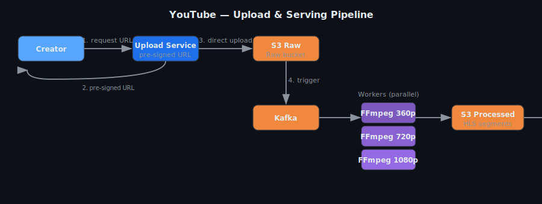
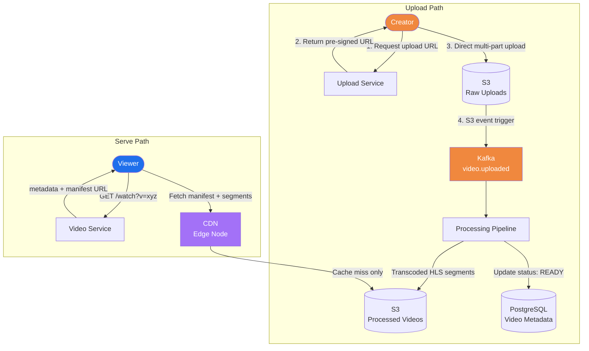
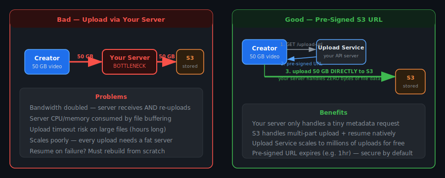
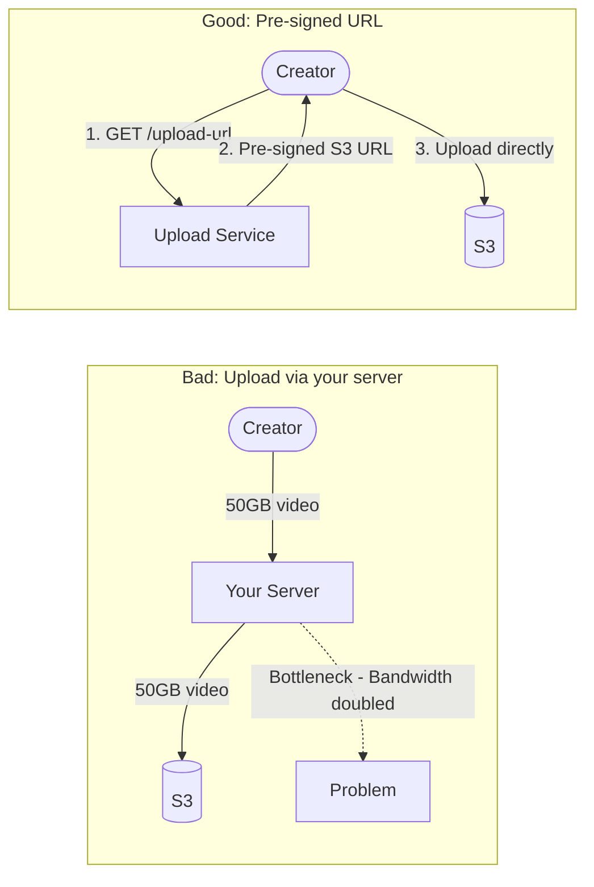
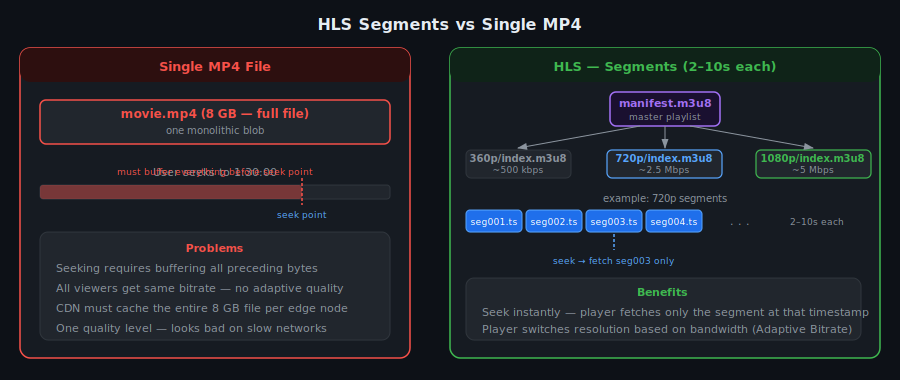
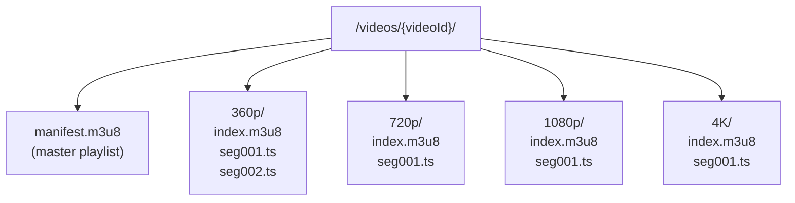
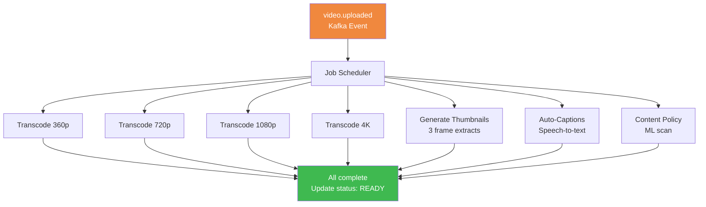

# YouTube — System Design (Video Storage & Streaming)

## TL;DR
* **Upload**: Pre-signed S3 URL — client uploads directly, your servers handle zero bytes of the file
* **Processing**: Async Kafka pipeline — FFmpeg workers transcode to HLS at multiple resolutions in parallel
* **Format**: HLS segments — adaptive bitrate, seekable, CDN-cacheable, no buffering the whole file
* **Serving**: CDN (CloudFront) — ~99% cache hit for popular videos; S3 only for first viewer per region
* **View counts**: Redis INCR → bulk DB flush every 30s — DB can't handle 1M writes/sec directly
* **Background jobs**: Transcode, thumbnail, captions, content policy check, analytics — all async
* **Key insight**: Upload → S3 directly. Process async. Serve from CDN. Your servers are just orchestrators.

---

## Step 1: Clarify Requirements

### Functional Requirements
- Creators upload videos (up to 12h, multi-GB)
- Videos stream in multiple resolutions (360p → 4K) with adaptive bitrate
- Seek to any point instantly, smooth playback on any device/network
- Search by title, description, tags
- Like, comment, subscribe
- Video recommendations

### Non-Functional Requirements
| Requirement | Target |
|---|---|
| Upload scale | 500 hours of video uploaded per minute |
| Streaming latency | Playback starts < 2s |
| Processing SLA | Video live < 5 min after upload |
| Availability | 99.99% for streaming |
| Storage | Exabyte scale — retain all videos |
| Consistency | Eventual — view count lags seconds is fine |

### Out of Scope
- Live streaming (different protocol — RTMP/HLS-LL)
- Ad serving
- Content ID / copyright matching internals

---

## Step 2: Capacity Estimation

| Metric | Estimate |
|---|---|
| Uploads/day | 500 hrs/min × 1440 min = **720k hours/day** |
| Storage/hour (all resolutions, HLS) | ~10 GB |
| New storage needed/day | 720k × 10 GB = **~7.2 PB/day** |
| DAV (viewers) | 2 billion |
| Avg watch time | 40 min/user/day |
| CDN bandwidth | 2B × 40min × ~5 Mbps = **massive** |

---

## Step 3: High-Level Architecture





---

## Step 4: Deep Dive

### Why Pre-Signed S3 URL (Direct Upload)?





### Resumable Multi-part Upload
```
Video split into 5MB chunks → upload independently
Connection drops? → Resume from last successful chunk

S3 Multi-part Upload:
  1. CreateMultipartUpload  → returns uploadId
  2. UploadPart × N        → each part returns an ETag
  3. CompleteMultipartUpload → S3 assembles the full file
```

### Why HLS Instead of a Single MP4?
```
Problem with single MP4:
  Seek to 45:00 → must buffer first 45 min
  All viewers get same quality regardless of bandwidth
  CDN cannot efficiently cache partial byte-range requests

HLS solution:
  Video split into 2–10 second .ts segments
  Manifest (.m3u8) maps time offsets → segment filenames
  Player fetches segments one at a time
  Monitors bandwidth → switches resolution dynamically (ABR)
  CDN caches individual segments → tiny objects, huge hit rate
```

### HLS Folder Structure in S3





### Processing Pipeline (Async, Parallel)



### View Count — The Write Problem
```
Naive: UPDATE videos SET views = views + 1 WHERE id = ?
Problem: 1M concurrent viewers = 1M DB writes/sec → DB melts

Solution:
  View event → INCR views:{videoId} in Redis   (atomic, ~1M ops/sec)

  Background job (Cron every 30s):
    Scan all view:{*} keys in Redis
    Bulk UPDATE videos SET views = views + delta WHERE id = ?
    Reset Redis counters

  Tradeoff: View count lags by up to 30s. Totally acceptable.
```

### Background Jobs
| Job | Trigger | Action |
|---|---|---|
| Transcode | video.uploaded Kafka event | FFmpeg → HLS at all resolutions (parallel workers) |
| Thumbnail generation | video.uploaded | Extract 3 frames → S3 |
| Auto-captions | video.uploaded | Speech-to-text → .vtt file |
| Content policy check | video.uploaded | ML scan — flag before publishing |
| View count flush | Cron every 30s | Bulk write Redis counters to DB |
| Search index update | video.ready Kafka event | Index title/description/tags in Elasticsearch |
| Raw file cleanup | Cron after processing | Delete raw S3 upload — keep only HLS segments |
| Thumbnail A/B test | Scheduled | Rotate thumbnails, measure CTR, promote winner |

---

## Step 5: Key Design Decisions

| Decision | Choice | Alternative | Why |
|---|---|---|---|
| Upload | Pre-signed S3 URL | Route through server | Zero server bandwidth for file data |
| Video format | HLS segments | Single MP4 | Seekable, adaptive bitrate, CDN-friendly |
| Processing | Async Kafka pipeline | Sync during upload | Upload returns fast; heavy work async |
| Serving | CDN (CloudFront) | Serve from S3 | Edge caching — ~99% hit rate for popular videos |
| View counts | Redis + async DB flush | Direct DB write | DB can't absorb 1M writes/sec |
| Search | Elasticsearch | DB LIKE query | Full-text, relevance scoring, typo tolerance |

---

## Common Interview Follow-ups

**Q: How does seeking to the middle of a 2-hour video work instantly?**
The HLS manifest maps time offsets to segment filenames. The player calculates which `.ts` segment contains the timestamp and fetches only that segment from CDN — already cached.

**Q: How do you handle a 50GB video upload?**
S3 Multi-part Upload. Client splits into 5MB chunks, uploads in parallel. If connection drops, resume from last chunk using the `uploadId`. No server timeouts, no re-upload from scratch.

**Q: What if a video goes viral right after upload (cold CDN)?**
First viewer per CDN region triggers a cache miss → CDN fetches from S3 → caches. All subsequent viewers in that region hit the cache. With 100+ CDN regions, only 100 users ever hit S3.

**Q: How do you transcode 720k hours of video per day?**
Horizontally scaled FFmpeg workers consuming from Kafka. Auto-scale on worker queue depth. Run on GPU spot instances (70% cheaper). 1 hour of video ≈ 10 min transcode → need massive parallel fleet.
